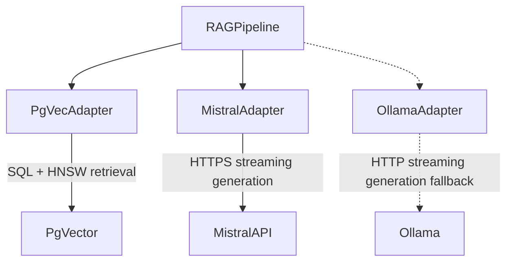
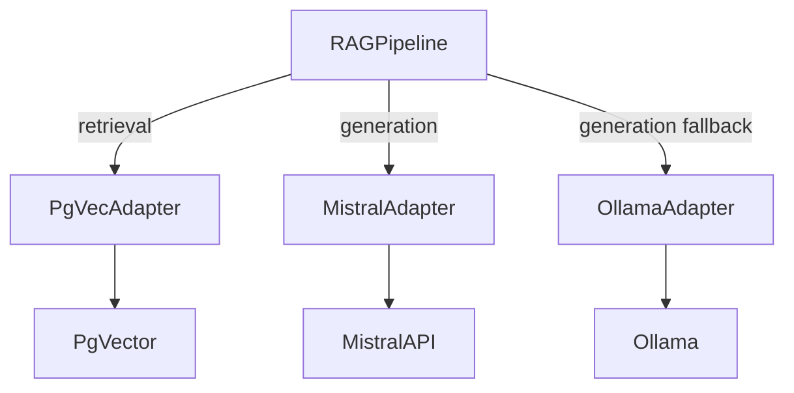
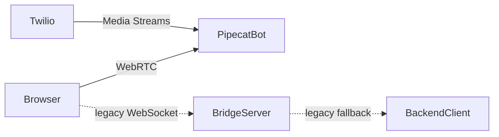

# Diagram Drawer

Use this skill to create or review diagrams for the Voice Support Bot project.

The goal is to produce diagrams that communicate the real architecture clearly,
not just syntactically valid visuals. Labels must sit on the edge that represents
the actual interaction, and connectors must stay visually attached to the boxes
they describe.

## When To Use

Use this skill for:

- Mermaid diagrams in Markdown documentation.
- Draw.io diagrams, `.drawio` XML, or diagrams opened through the Draw.io MCP.
- Architecture, flow, sequence, component, C4-style, integration, billing, voice,
  RAG, BSS, or deployment diagrams.
- Fixes to arrows, labels, layout, swimlanes, grouping, or readability.
- Reviews where a diagram might misrepresent target vs legacy architecture.

For documentation work, also use `technical-writer`. For raw Mermaid syntax
details, use `mermaid-diagrams`. For opening editable Draw.io diagrams, use
`drawio-diagrams`, while applying the project-specific rules in this skill.

## Repository Rules

- Documentation diagrams under `docs/` should use English labels.
- Preserve the V1 voice decision: Gradium + Pipecat is the target path;
  `bridge_server.py` is legacy/fallback.
- Show `billing-api` as the V1 billing source, not `billing-service`.
- Keep the LLM out of deterministic billing calculations. Diagrams may show the
  LLM formulating responses, but not calculating invoice amounts from PDFs.
- Mark assumptions and open questions in the surrounding text, not as hidden
  diagram semantics.

## Diagram Type Selection

Choose the medium before drawing:

| Need | Use |
|------|-----|
| Inline docs, reviewable in Markdown | Mermaid |
| Editable visual artifact, export to PNG/SVG/PDF, detailed layout | Draw.io |
| Quick architecture or data-flow sketch | Mermaid first |
| Complex containers, swimlanes, custom colors, precise anchors | Draw.io XML |
| User explicitly asks for Draw.io or export | Draw.io |

## Mermaid Workflow

1. Read the nearby documentation and any source-of-truth architecture notes.
2. Identify the real interaction each arrow represents: caller, callee, protocol,
   direction, and whether it is target or legacy.
3. Place labels on the edge where that interaction actually happens.
4. Use dashed edges for legacy, fallback, optional, or alternate flows.
5. Split large diagrams rather than compressing unrelated concerns into one view.
6. Validate that all labels remain in English for repository docs.

### Mermaid Label Placement

Labels must describe the edge they are attached to.

Use this pattern:



Avoid this pattern:



Why: the first version tells the reader where retrieval and generation actually
cross a boundary. The second version makes labels look attached to internal
backend handoffs and can visually point to the wrong box.

### Mermaid Target vs Legacy Paths

Represent target and legacy paths distinctly:

- Solid arrows: target V1 path.
- Dashed arrows: legacy, fallback, comparison, optional, or future path.
- Labels should include "legacy" or "fallback" when the path is not target V1.
- Do not present legacy and target paths as equal alternatives if the decision
  has already been made.

Example:



## Draw.io Workflow

1. Decide whether Draw.io XML, Mermaid-to-Draw.io, or CSV is the right input.
2. For simple diagrams, `open_drawio_mermaid` is acceptable.
3. For architecture diagrams with containers, swimlanes, or important connector
   placement, prefer `open_drawio_xml`.
4. Before calling any MCP tool, inspect the MCP tool schema as required by the
   project MCP rules.
5. Save versionable `.drawio` XML in the repository when the diagram is intended
   to be maintained.
6. Validate XML after editing a `.drawio` file:

```bash
python3 -c "import xml.dom.minidom as m; m.parse('path/to/file.drawio')"
```

### Draw.io Anchoring Rules

For project Draw.io XML, important edges should have explicit fixed anchors:

- Use `exitX`, `exitY`, `exitDx`, `exitDy` on the source side.
- Use `entryX`, `entryY`, `entryDx`, `entryDy` on the target side.
- Use fractions from `0` to `1` to attach to a precise side of the box.
- Use anchors especially for nested swimlanes, cross-container edges, and labeled
  edges that previously rendered as detached or floating.

Example edge style:

```xml
<mxCell id="edge_backend_pgvector"
        value="SQL + HNSW retrieval"
        style="edgeStyle=orthogonalEdgeStyle;html=1;rounded=0;exitX=1;exitY=0.5;exitDx=0;exitDy=0;entryX=0;entryY=0.5;entryDx=0;entryDy=0;"
        edge="1"
        source="pgvec_adapter"
        target="pgvector"
        parent="1">
  <mxGeometry relative="1" as="geometry"/>
</mxCell>
```

### Draw.io Swimlane Coordinates

Children of a swimlane use coordinates relative to the swimlane top-left and its
header area. When moving absolute nodes into a swimlane:

- subtract the swimlane x/y origin from each child position;
- account for the swimlane title/header area;
- re-check labels and anchors after nesting.

This prevents boxes from appearing offset and arrows from floating near, but not
on, the intended target.

## Review Checklist

Before finishing a diagram, check:

- The diagram communicates one clear purpose.
- Solid vs dashed arrows match target vs legacy semantics.
- Edge labels are attached to the edge where the interaction actually happens.
- External calls are labeled on external-boundary edges, not internal handoffs.
- Draw.io edges that need visual stability have explicit anchors.
- Swimlane child coordinates are relative to the swimlane.
- Labels and surrounding docs are in English under `docs/`.
- The diagram does not contradict known project decisions.
- Mermaid blocks still render and Draw.io XML is well formed when applicable.

## Common Fixes

| Problem | Fix |
|---------|-----|
| `retrieval` appears attached to an internal domain-to-adapter arrow | Move the label to the adapter-to-vector-store edge. |
| `generation` appears attached to an internal pipeline-to-adapter arrow | Move the label to the adapter-to-LLM-provider edge. |
| Pipecat and legacy bridge look like equal choices | Make Pipecat solid target path and bridge dashed legacy/fallback path. |
| Draw.io arrows look detached from boxes | Add fixed `exitX/exitY` and `entryX/entryY` anchors. |
| Swimlane children appear offset | Recompute child coordinates relative to the swimlane origin/header. |
| Diagram is too dense | Split into separate target, legacy, data-flow, or deployment diagrams. |
