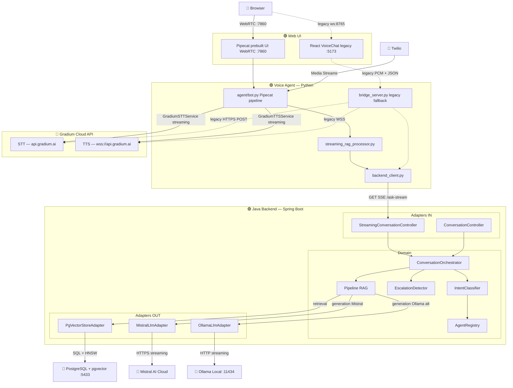

```mermaid
graph TB
    %% ─── Clients ───
    Browser["👤 Browser"]
    Twilio["👤 Twilio"]

    %% ─── Notre code : Frontend / UI ───
    subgraph frontend ["🟢 Web UI"]
        PipecatUI[Pipecat prebuilt UI WebRTC :7860]
        VoiceChat[React VoiceChat legacy :5173]
    end

    %% ─── Notre code : Voice Agent ───
    subgraph voiceAgent ["🟢 Voice Agent — Python"]
        PipecatBot[agent/bot.py Pipecat pipeline]
        StreamingRAG[streaming_rag_processor.py]
        BridgeServer[bridge_server.py legacy fallback]
        BackendClient[backend_client.py]
    end

    %% ─── Externe : Gradium (proche du voice agent qui l'appelle) ───
    subgraph gradium ["🔴 Gradium Cloud API"]
        GradiumSTT[STT — api.gradium.ai]
        GradiumTTS[TTS — wss://api.gradium.ai]
    end

    %% ─── Notre code : Java Backend ───
    subgraph backend ["🟢 Java Backend — Spring Boot"]
        subgraph adaptersIn [Adapters IN]
            ConvController[ConversationController]
            StreamController[StreamingConversationController]
        end
        subgraph domain [Domain]
            Orchestrator[ConversationOrchestrator]
            IntentClass[IntentClassifier]
            AgentReg[AgentRegistry]
            EscDetector[EscalationDetector]
            RAGPipeline["Pipeline RAG"]
        end
        subgraph adaptersOut [Adapters OUT]
            MistralAdapter[MistralLlmAdapter]
            OllamaAdapter[OllamaLlmAdapter]
            PgVecAdapter[PgVectorStoreAdapter]
        end
    end

    %% ─── Externes : LLM + DB (proches du backend qui les appelle) ───
    MistralAPI["🔴 Mistral AI Cloud"]
    Ollama["🔴 Ollama Local :11434"]
    PgVector["🔴 PostgreSQL + pgvector :5433"]

    %% ─── Flux entrants ───
    Browser -->|"WebRTC :7860"| PipecatUI
    PipecatUI --> PipecatBot
    Twilio -->|"Media Streams"| PipecatBot
    Browser -.->|"legacy ws:8765"| VoiceChat
    VoiceChat -.->|"legacy PCM + JSON"| BridgeServer

    %% ─── Voice Agent → Gradium (externe) ───
    PipecatBot -->|"GradiumSTTService streaming"| GradiumSTT
    BridgeServer -.->|"legacy HTTPS POST"| GradiumSTT

    %% ─── Voice Agent → Backend (interne) ───
    PipecatBot --> StreamingRAG
    StreamingRAG --> BackendClient
    BridgeServer -.-> BackendClient
    BackendClient -->|"GET SSE /ask-stream"| StreamController

    %% ─── Backend interne ───
    StreamController --> Orchestrator
    Orchestrator --> IntentClass
    IntentClass --> AgentReg
    Orchestrator --> EscDetector
    Orchestrator --> RAGPipeline
    ConvController --> Orchestrator

    %% ─── Pipeline RAG → Adapters ───
    RAGPipeline -->|"retrieval"| PgVecAdapter
    RAGPipeline -->|"generation Mistral"| MistralAdapter
    RAGPipeline -->|"generation Ollama alt"| OllamaAdapter

    %% ─── Voice Agent → TTS (externe) ───
    PipecatBot -->|"GradiumTTSService streaming"| GradiumTTS
    BridgeServer -.->|"legacy WSS"| GradiumTTS

    %% ─── Backend → Services externes ───
    MistralAdapter -->|"HTTPS streaming"| MistralAPI
    OllamaAdapter -->|"HTTP streaming"| Ollama
    PgVecAdapter -->|"SQL + HNSW"| PgVector
```
