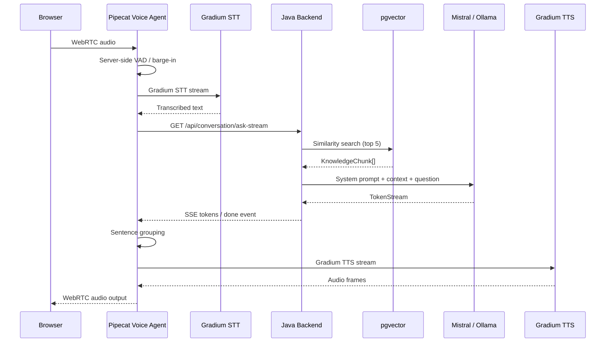

# Voice Support Bot (V2V)

**Voice-to-voice** customer support agent for the Telecom/ISP domain, powered by RAG (Retrieval-Augmented Generation) over a knowledge base, accessible through a **web browser** and **traditional telephony** (Twilio).

The bot listens to the customer's voice question, transcribes it, searches for
the answer in its knowledge base, generates a concise response, and speaks it
back to the customer — all streamed. The optimized V1 path targets a first
audible sentence around 700 ms, with `time_to_first_audio` p95 below 800 ms as
the current pilot validation criterion.

## Features

- **Natural voice conversation** — server-side Pipecat/Silero VAD automatically detects start/end of speech, with no click
- **Barge-in** — interrupting the bot by speaking instantly cuts off its response
- **Real-time streaming** — sentence-by-sentence response (text + audio), targeting a first audible sentence around 700 ms on the optimized path
- **Text chat** — text fallback for testing or non-voice contexts
- **Twilio telephony** — voice response on a traditional phone number
- **Knowledge-base RAG** — factual answers with sourced citations
- **Escalation detection** — automatic transfer to a human advisor (cancellation, complaint, GDPR)
- **Guardrails** — off-topic detection (patterns) + RAG confidence score (configurable threshold), with a visual badge when confidence is low
- **Admin dashboard** — KPIs (latency, resolution rate, escalations) + conversation history
- **Hybrid architecture** — Java for RAG/domain, Python for voice orchestration

## Technical Stack

| Layer | Technology | Role |
|--------|------------|------|
| Voice orchestration | **[Pipecat](https://pipecat.ai)** 1.4 (Python) | Real-time audio pipeline |
| STT (Speech-to-Text) | **[Gradium](https://gradium.ai)** (cloud API, WebSocket) | Ultra-low-latency transcription |
| TTS (Text-to-Speech) | **[Gradium](https://gradium.ai)** (cloud API, WebSocket) | Natural voice synthesis |
| Backend RAG | Java 21, Spring Boot 3.4, Spring AI 1.0 | Retrieval + LLM + domain logic |
| LLM | **Mistral AI** (API, default) or Ollama (local) | Answer generation |
| Embeddings | nomic-embed-text (Ollama) | Semantic vectorization |
| Vector Store | PostgreSQL 16 + pgvector (HNSW) | Similarity search |
| Telephony | Twilio Media Streams -> Pipecat | Phone calls |
| Frontend | React 19, TypeScript, Vite 6, TailwindCSS 4 | Web interface |
| VAD | Silero via Pipecat | Server-side voice detection for WebRTC and telephony |

## Architecture

### Dependency Diagram (Hexagonal)

> STT/TTS are **not** in the Java backend: they are handled by the Python voice
> agent (Gradium). The backend exposes only RAG/domain capabilities over HTTP.

```mermaid
classDiagram
    direction TB

    %% ─── DOMAIN LAYER (pure Java, no framework) ───
    namespace Domain {
        class AskQuestionUseCase {
            <<port in>>
            +ask(conversationId, question) ConversationResponse
        }
        class IngestKnowledgeUseCase {
            <<port in>>
            +ingest(content, source, domain) int
        }
        class SyncKnowledgeSourceUseCase {
            <<port in>>
            +syncAll() SyncReport
            +sync(sourceType) SyncReport
        }
        class LlmPort {
            <<port out>>
            +generateAnswer(question, context, history, systemPrompt) String
        }
        class LlmStreamingPort {
            <<port out>>
            +streamAnswer(question, context, history, systemPrompt) TokenStream
        }
        class VectorSearchPort {
            <<port out>>
            +searchRelevant(query, topK, domain) List~Citation~
        }
        class VectorStorePort {
            <<port out>>
            +storeChunk(doc, content, section, idx) void
            +deleteBySource(sourceType, sourceId) void
        }
        class KnowledgeSourceConnector {
            <<port out>>
            +sourceType() String
            +fetchAll() List~SourceDocument~
        }
        class KnowledgeSourceStatePort {
            <<port out>>
            sync ledger access
        }
        class ConversationStore {
            <<port out>>
        }
        class ConversationEventStore {
            <<port out>>
        }
        class ConversationOrchestrator {
            <<service>>
            RAG + multi-agent routing
            ask / askStream / seedAssistantMessage
        }
        class KnowledgeIngestionService {
            <<service>>
        }
        class KnowledgeSyncService {
            <<service>>
            idempotent multi-source sync
        }
        class TextChunker {
            <<service>>
        }
        class GuardrailService {
            <<service>>
        }
        class IntentClassifier {
            <<service>>
        }
        class SourceDocument {
            <<model>>
        }
        class SyncReport {
            <<model>>
        }
        class Citation {
            <<model>>
        }
    }

    %% ─── INFRASTRUCTURE: INBOUND ADAPTERS ───
    namespace Inbound {
        class ConversationController {
            <<REST>>
            POST /api/conversation/ask
        }
        class StreamingConversationController {
            <<REST/SSE>>
            GET /api/conversation/ask-stream
            POST /api/conversation/seed
        }
        class KnowledgeController {
            <<REST>>
            POST /api/knowledge/ingest
            POST /api/knowledge/sync
        }
        class AdminDashboardController {
            <<REST>>
            GET /api/admin/*
        }
        class HealthController {
            <<REST>>
            GET /api/health
        }
        class TwilioWebhookController {
            <<Twilio>>
        }
    }

    %% ─── INFRASTRUCTURE: OUTBOUND ADAPTERS ───
    namespace Outbound {
        class MistralLlmAdapter {
            <<adapter>>
            Mistral AI API
        }
        class OllamaLlmAdapter {
            <<adapter>>
            Ollama local
        }
        class PgVectorStoreAdapter {
            <<adapter>>
            PostgreSQL + pgvector
        }
        class MarkdownFolderConnector {
            <<adapter>>
            knowledge-base/*.md
        }
        class JpaKnowledgeSourceStateAdapter {
            <<adapter>>
            kb_source_state
        }
        class RedisConversationStore {
            <<adapter>>
        }
        class JpaConversationEventStore {
            <<adapter>>
        }
    }

    %% ─── SCHEDULER + CONFIGURATION ───
    namespace Config {
        class KnowledgeSyncScheduler {
            <<@Scheduled cron>>
        }
        class DomainServiceConfig {
            <<Spring @Configuration>>
            wires ports to adapters
        }
        class SchedulingConfig {
            <<Spring @Configuration>>
        }
    }

    %% ─── RELATIONSHIPS ───

    %% Services implement ports in
    ConversationOrchestrator ..|> AskQuestionUseCase
    KnowledgeIngestionService ..|> IngestKnowledgeUseCase
    KnowledgeSyncService ..|> SyncKnowledgeSourceUseCase

    %% Services depend on ports out
    ConversationOrchestrator --> LlmPort
    ConversationOrchestrator --> LlmStreamingPort
    ConversationOrchestrator --> VectorSearchPort
    ConversationOrchestrator --> ConversationStore
    ConversationOrchestrator --> ConversationEventStore
    ConversationOrchestrator --> GuardrailService
    ConversationOrchestrator --> IntentClassifier
    KnowledgeIngestionService --> VectorStorePort
    KnowledgeIngestionService --> TextChunker
    KnowledgeSyncService --> KnowledgeSourceConnector
    KnowledgeSyncService --> KnowledgeSourceStatePort
    KnowledgeSyncService --> VectorStorePort
    KnowledgeSyncService --> TextChunker

    %% Models
    ConversationOrchestrator --> Citation
    KnowledgeSyncService --> SyncReport
    KnowledgeSourceConnector --> SourceDocument

    %% Adapters implement ports out
    MistralLlmAdapter ..|> LlmPort
    MistralLlmAdapter ..|> LlmStreamingPort
    OllamaLlmAdapter ..|> LlmPort
    OllamaLlmAdapter ..|> LlmStreamingPort
    PgVectorStoreAdapter ..|> VectorStorePort
    PgVectorStoreAdapter ..|> VectorSearchPort
    MarkdownFolderConnector ..|> KnowledgeSourceConnector
    JpaKnowledgeSourceStateAdapter ..|> KnowledgeSourceStatePort
    RedisConversationStore ..|> ConversationStore
    JpaConversationEventStore ..|> ConversationEventStore

    %% Inbound adapters use ports in
    ConversationController --> AskQuestionUseCase
    StreamingConversationController --> ConversationOrchestrator
    KnowledgeController --> IngestKnowledgeUseCase
    KnowledgeController --> SyncKnowledgeSourceUseCase
    AdminDashboardController --> ConversationEventStore

    %% Scheduler + config
    KnowledgeSyncScheduler --> SyncKnowledgeSourceUseCase
    DomainServiceConfig ..> ConversationOrchestrator
    DomainServiceConfig ..> KnowledgeSyncService
    DomainServiceConfig ..> MarkdownFolderConnector
    SchedulingConfig ..> KnowledgeSyncScheduler
```



### Main Flow (sequence)



### Simplified View (ASCII)

```
Web voice / Phone voice
     │
     ▼ WebRTC or Twilio Media Streams
┌─────────────────────────────────┐
│ Pipecat Voice Agent             │
│ VAD / barge-in / STT / TTS      │
└─────────────────────────────────┘
                  │
                  ▼ shared Conversation API (SSE/POST)
           ┌─────────────┐
           │ Java Backend │
           │ RAG + rules  │
           │ pgvector/BSS │
           └─────────────┘

Legacy React/WebSocket mode (`ws://localhost:8765`, `ws://localhost:8766`) remains
available for fallback and comparison only.
```

## Documentation

| Document | Public | Contenu |
|----------|--------|---------|
| [`docs/architecture/architecture.md`](docs/architecture/architecture.md) | Dev / architecture | Full architecture, RAG pipeline, guardrails, multi-agent, ADRs |
| [`docs/engineering/development-guide.md`](docs/engineering/development-guide.md) | Dev | Conventions, adding providers/agents, useful commands, troubleshooting |
| [`docs/knowledge-base/knowledge-base-technical.md`](docs/knowledge-base/knowledge-base-technical.md) | Dev / architecture | Knowledge-base behavior and architecture (ingestion, sync, vector store, connector-based extension) |
| [`docs/knowledge-base/knowledge-base-guide.md`](docs/knowledge-base/knowledge-base-guide.md) | Contributors (non-dev) | How to write, add, and publish knowledge-base content |
| [`docs/architecture/diagrams/`](docs/architecture/diagrams/) | Everyone | Editable **draw.io** versions of architecture diagrams (overview, hexagonal, voice sequence) |
| [`docs/knowledge-base/diagrams/`](docs/knowledge-base/diagrams/) | Everyone | Editable **draw.io** version of the knowledge-base diagram |

## Quick Start

### Prerequisites

- Java 21+
- Python 3.11+ (for the voice agent)
- Node.js 20+
- Docker & Docker Compose
- Ollama installed locally
- **Gradium API key** (create an account at https://gradium.ai)

### 1. Start the Infrastructure

```bash
docker compose up -d
```

Starts PostgreSQL 16 + pgvector on port **5433**.

### 2. Install Ollama Models

```bash
ollama pull llama3.1:8b
ollama pull nomic-embed-text
```

Docker Compose points the backend to `http://host.docker.internal:11434` by
default. Keep Ollama running on the host when using local embeddings or the local
LLM provider.

### 3. Configure Environment Variables

```bash
cp .env.example .env
# Configure GRADIUM_API_KEY

cd voice-agent && cp .env.example .env
# Configure GRADIUM_API_KEY + GRADIUM_VOICE_ID
```

### 4. Start the Local Stack (recommended)

```bash
docker compose up --build
```

The stack starts:
- Postgres + pgvector (`localhost:5433`)
- Redis (`localhost:6379`)
- Java backend (`http://localhost:8081`)
- frontend React (`http://localhost:5173`)
- legacy custom bridge (`ws://localhost:8765`, `ws://localhost:8766`)
- Pipecat WebRTC UI (`http://localhost:7860`)

In Docker Compose, the backend uses `CONVERSATION_STORE=redis` for active
sessions and `CONVERSATION_EVENT_STORE=jpa` for admin events. The
`pipecat-agent` service starts the target WebRTC voice path; `voice-agent` keeps
the legacy WebSocket bridge as a fallback. The React frontend exposes both modes:
`Solution A · WebSocket` and `Solution B · WebRTC`.

### 4bis. Start the Java Backend Manually

```bash
cd backend
mvn spring-boot:run
```

The backend starts on http://localhost:8081. In manual mode, conversation storage
stays in memory by default; export `CONVERSATION_STORE=redis` and
`CONVERSATION_EVENT_STORE=jpa` to use Redis/Postgres.

### 5. Start the V1 Target Voice Agent (Pipecat + Gradium, manual mode)

```bash
cd voice-agent
python3 -m venv .venv && source .venv/bin/activate
pip install -e .
python -m agent.bot -t webrtc
```

The Pipecat bot exposes the prebuilt WebRTC UI at `http://localhost:7860`.

The historical custom bridge remains available for the React frontend POC:

```bash
python -u -m agent.bridge_server
# ws://localhost:8765
```

### 6. Start the Frontend

```bash
cd frontend
npm install
cp node_modules/@ricky0123/vad-web/dist/silero_vad_v5.onnx public/
cp node_modules/@ricky0123/vad-web/dist/vad.worklet.bundle.min.js public/
npm run dev
```

The application is available at http://localhost:5173.

### 7. Ingest the Knowledge Base

Recommended method — **multi-source synchronization** (reads `knowledge-base/*.md`, with `domain` coming from each file's YAML front-matter):

```bash
curl -X POST http://localhost:8081/api/knowledge/sync
# -> { "processed": 3, "ingested": 3, "skipped": 0, "deleted": 0 }
```

Sync is idempotent (running again = `skipped` if nothing changed) and also runs through a cron scheduler (`voice-support.knowledge.sync-cron`). One-shot file upload (still available):

```bash
curl -X POST http://localhost:8081/api/knowledge/ingest \
  -F "file=@knowledge-base/telecom-faq.md" \
  -F "source=telecom-faq.md" \
  -F "domain=support"
```

### 8. Test in Text Mode

```bash
curl -X POST http://localhost:8081/api/conversation/ask \
  -H "Content-Type: application/json" \
  -d '{"question": "My router no longer connects, what should I do?"}'
```

## API Reference

### Conversation (text)

```
POST /api/conversation/ask
Content-Type: application/json

Body: { "question": "...", "conversationId": "optional-session-id" }

Response: {
  "answer": "...",
  "citations": [{ "source", "section", "relevantText", "score" }],
  "conversationId": "..."
}
```

### Conversation (SSE streaming — used by voice mode)

```
GET /api/conversation/ask-stream?question=...&conversation_id=...
Accept: text/event-stream

Events: start (agent), chunk (token), done (answer + citations), error
```

### Conversation (seed — history initialization)

```
POST /api/conversation/seed
Content-Type: application/json

Body: { "message": "...", "conversation_id": "..." }
Response: 204 No Content
```

Stores an **assistant** message in a conversation's history. Used by the Pipecat
bot at connection time: the greeting is played client-side by TTS and therefore
does not reach the backend; without this initialization, the LLM treats the first
user message as the beginning of the conversation and **greets again**. The seed
fixes this behavior.

### Knowledge Ingestion

```
POST /api/knowledge/ingest
Content-Type: multipart/form-data

Params:
  file (MultipartFile) — Markdown or text file to ingest
  source (string, optional) — source name
  domain (string, optional) — domain tag (support|billing|commercial)

Response: { "status": "ingested", "source": "...", "domain": "...", "chunks_created": 17 }
```

### Multi-Source Synchronization

```
POST /api/knowledge/sync               — synchronizes all sources
POST /api/knowledge/sync/{sourceType}  — synchronizes one source (e.g. markdown)

Response: { "processed": 3, "ingested": 3, "skipped": 0, "deleted": 0 }
```

Connectors are plugged through the `KnowledgeSourceConnector` port (reference:
`MarkdownFolderConnector` reading `knowledge-base/*.md` with YAML front-matter
`domain:`). Idempotent via `content_hash` (`kb_source_state` table); scheduled
pull via cron.

### Admin Dashboard

```
GET /api/admin/stats          — KPIs (total conversations, latency, escalation rate)
GET /api/admin/events?limit=N — latest conversations
GET /api/admin/top-questions  — top 10 most frequent questions
```

### Voice agent

```
http://localhost:7860 — target V1 Pipecat WebRTC UI
ws://localhost:8765   — legacy browser WebSocket (custom bridge)
ws://localhost:8766   — legacy Twilio Media Streams WebSocket (custom bridge)
```

### Health

```
GET /api/health → { "status": "up", "service": "voice-support-bot" }
```

## Voice Pipeline

```
┌──────────┐   ┌────────────────┐   ┌─────────┐   ┌─────────────────┐
│  Voice   │──▶│ Pipecat Agent  │──▶│ Gradium │──▶│  Java Backend   │
│ channel  │   │ VAD / barge-in │   │  STT    │   │ RAG + business  │
└──────────┘   └────────────────┘   └─────────┘   └─────────────────┘
      ▲                                                    │
      │                                                    ▼
┌──────────┐   ┌────────────────┐   ┌─────────┐   ┌─────────────────┐
│  Audio   │◀──│ Pipecat Agent  │◀──│ Gradium │◀──│ SSE TokenStream │
│ output   │   │ transport out  │   │  TTS    │   │ shared API      │
└──────────┘   └────────────────┘   └─────────┘   └─────────────────┘
```

## Telephony (Twilio)

1. Create a Twilio account and buy a French number
2. Expose the Pipecat voice agent through a public URL or tunnel
3. Start the Pipecat Twilio transport: `python -m agent.bot -t twilio -x <public-host>`
4. Configure Twilio Media Streams to connect to the Pipecat endpoint
5. Call the number -> Pipecat answers, streams audio, calls the shared backend,
   and speaks the response

The legacy custom bridge can still expose `ws://localhost:8766` for comparison,
but the V1 telephony target goes through Pipecat.

## Escalation Detection

The bot automatically transfers to a human when the customer:
- Requests cancellation
- Files a complaint or asks for a refund
- Mentions a technician / on-site visit
- Talks about personal data / GDPR
- Reports account hacking
- Expresses frustration ("unacceptable", "outrageous")
- Explicitly asks for a "real advisor"

## Project Structure

```
voice-support-bot/
├── backend/                                # Java backend (RAG + LLM + domain)
│   └── src/main/java/com/voicesupport/
│       ├── domain/                         # Pure business logic (no Spring dependency)
│       │   ├── model/                      #   Conversation, Citation, SourceDocument, SyncReport, ContentHash
│       │   ├── port/in/                    #   AskQuestionUseCase, IngestKnowledgeUseCase, SyncKnowledgeSourceUseCase
│       │   ├── port/out/                   #   LlmPort, VectorSearchPort/StorePort, KnowledgeSourceConnector/StatePort
│       │   └── service/                    #   ConversationService, KnowledgeSyncService, TextChunker, EscalationDetector
│       └── infrastructure/                 # Technical implementations
│           ├── adapter/in/rest/            #   REST controllers (including KnowledgeController: /ingest + /sync)
│           ├── adapter/out/source/         #   MarkdownFolderConnector (KB connectors)
│           ├── adapter/out/                #   Ollama, pgvector, persistence (ledger kb_source_state)
│           ├── scheduler/                  #   KnowledgeSyncScheduler (scheduled cron pull)
│           └── config/                     #   DomainServiceConfig, SchedulingConfig
├── voice-agent/                            # Python Pipecat agent (voice orchestration)
│   ├── agent/
│   │   ├── bot.py                         #   Target V1 Pipecat pipeline
│   │   ├── streaming_rag_processor.py     #   Pipecat processor: STT text -> backend SSE -> TTS
│   │   ├── bridge_server.py               #   Legacy / fallback WebSocket bridge
│   │   ├── ws_server.py                   #   Legacy web WebSocket server
│   │   ├── twilio_server.py               #   Legacy / comparison Twilio server
│   │   ├── rag_processor.py               #   Legacy custom bridge processor
│   │   └── backend_client.py              #   HTTP client to the Java backend
│   ├── pyproject.toml                      #   Dependencies (pipecat-ai[gradium])
│   └── Dockerfile
├── frontend/                               # React 19 + TailwindCSS
│   ├── public/                            #   Assets VAD (silero_vad_v5.onnx, worklet)
│   └── src/features/voice-chat/           #   VoiceChat, useVAD, useAudioQueue, useVoiceWebSocket
├── knowledge-base/                         # Telecom FAQ documents to ingest
├── docs/                                   # Architecture + development guide
├── docker-compose.yml                      # PostgreSQL + pgvector + voice agents
└── .env.example
```

## Configuration

### Voice Agent (`voice-agent/.env`)

| Variable | Description | Default |
|----------|-------------|--------|
| `GRADIUM_API_KEY` | Gradium API key (required) | — |
| `GRADIUM_VOICE_ID` | Gradium voice ID (see catalog) | `b35yykvVppLXyw_l` (Elise, FR) |
| `BACKEND_URL` | Java backend URL | `http://localhost:8081` |
| `VOICE_AGENT_PORT` | Legacy browser WebSocket bridge port | `8765` |
| `TWILIO_WS_PORT` | Legacy Twilio WebSocket bridge port | `8766` |

### Java Backend (`backend/.env` or environment variables)

| Variable | Description | Default |
|----------|-------------|--------|
| `LLM_PROVIDER` | LLM provider (`mistral-api` or `ollama`) | `mistral-api` |
| `MISTRAL_API_KEY` | Mistral API key (required if provider=mistral-api) | — |
| `MISTRAL_MODEL` | Mistral model | `mistral-small-latest` |
| `OLLAMA_BASE_URL` | Ollama URL (if provider=ollama) | `http://localhost:11434` |
| `OLLAMA_MODEL` | Ollama LLM model | `llama3.1:8b` |
| `OLLAMA_EMBEDDING_MODEL` | Embedding model | `nomic-embed-text` |
| `GUARDRAIL_CONFIDENCE_THRESHOLD` | RAG confidence threshold (0.0 to 1.0) | `0.65` |
| `REDIS_HOST` | Redis host for active sessions | `localhost` |
| `REDIS_PORT` | Port Redis | `6379` |
| `CONVERSATION_STORE` | Active session storage (`memory` or `redis`) | `memory` |
| `CONVERSATION_EVENT_STORE` | Event/admin storage (`memory` or `jpa`) | `memory` |
| `CONVERSATION_TTL_SECONDS` | Redis session TTL | `86400` |

## Tests

```bash
# Backend — domain unit tests (manual fakes, no Mockito)
cd backend && mvn test

# Frontend — unit tests (Vitest)
cd frontend && npx vitest run

# Frontend — TypeScript check
cd frontend && npx tsc --noEmit

# Voice agent — Python tests
cd voice-agent && python -m pytest tests/
```

## Roadmap

> Detailed tracking of open items (priority, domain, leads): [`docs/operations/backlog.md`](docs/operations/backlog.md).

- [x] Inter-step streaming (sentence-by-sentence TTS during LLM generation)
- [x] Pipecat/Silero server-side VAD — natural conversation without a stop click
- [x] Barge-in — interrupt the bot by speaking
- [x] Shared conversational memory (Redis) + persistent events (JPA)
- [x] Multilingual support (FR + EN) with automatic Gradium voice selection
- [ ] Enhanced admin dashboard (latency charts, hourly heatmap)
- [x] Mistral API fallback when Ollama is too slow (configurable via `LLM_PROVIDER`)
- [x] Multi-source KB foundation (pivot `SourceDocument` format, idempotent sync, Markdown connector, scheduled pull)
- [ ] KB connectors for Confluence / PDF (Tika) / database
- [ ] PDF ingestion (structured extraction)
- [x] Guardrails: "off-topic" detection with confidence score
- [ ] Observability: OpenTelemetry traces over the pipeline
- [ ] Gradium voice cloning for custom brand voice
- [ ] Multi-agent Pipecat (routing to specialists: billing, technical support, sales)

## License

Private project — internal use.
