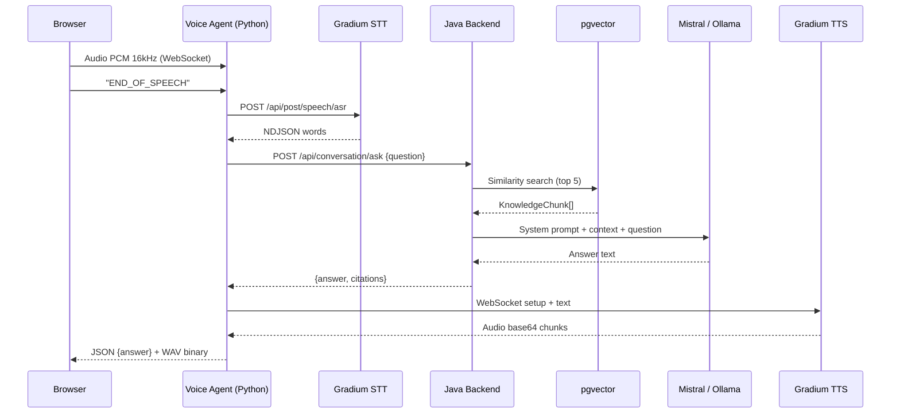

# Voice Support Bot (V2V)

Agent support client **voice-to-voice** pour le domaine Telecom/FAI, alimenté par RAG (Retrieval-Augmented Generation) sur une base de connaissance, accessible via **navigateur web** et **téléphonie classique** (Twilio).

Le bot écoute la question du client (voix), la transcrit, cherche la réponse dans sa base de connaissance, génère une réponse synthétique et la prononce au client — le tout en ~2 secondes.

## Fonctionnalités

- **Chat vocal web** — bouton micro dans le navigateur, réponse audio (voix Gradium, format WAV 16kHz)
- **Chat texte** — fallback texte pour tester ou pour les contextes non-vocaux
- **Téléphonie Twilio** — réponse vocale sur un numéro de téléphone classique
- **RAG sur base de connaissance** — réponses factuelles avec citations sourcées
- **Détection d'escalade** — transfert automatique vers un conseiller humain (résiliation, réclamation, RGPD)
- **Dashboard admin** — KPIs (latence, taux de résolution, escalades) + historique des conversations
- **Architecture hybride** — Java pour le RAG/domain, Python (Pipecat) pour l'orchestration vocale

## Stack technique

| Couche | Technologie | Rôle |
|--------|------------|------|
| Orchestration vocale | **[Pipecat](https://pipecat.ai)** 1.4 (Python) | Pipeline audio temps réel |
| STT (Speech-to-Text) | **[Gradium](https://gradium.ai)** (API cloud, WebSocket) | Transcription ultra-low latency |
| TTS (Text-to-Speech) | **[Gradium](https://gradium.ai)** (API cloud, WebSocket) | Synthèse vocale naturelle |
| Backend RAG | Java 21, Spring Boot 3.4, Spring AI 1.0 | Retrieval + LLM + domain logic |
| LLM | **Mistral AI** (API, défaut) ou Ollama (local) | Génération de réponses |
| Embeddings | nomic-embed-text (Ollama) | Vectorisation sémantique |
| Vector Store | PostgreSQL 16 + pgvector (HNSW) | Recherche de similarité |
| Téléphonie | Twilio Media Streams → Pipecat | Appels téléphoniques |
| Frontend | React 19, TypeScript, Vite 6, TailwindCSS 4 | Interface web |

## Architecture

### Diagramme de dépendances (Hexagonal)

```mermaid
classDiagram
    direction TB

    %% ─── DOMAIN LAYER (pure Java, no framework) ───
    namespace Domain {
        class AskQuestionUseCase {
            <<port in>>
            +ask(question, conversationId) ConversationResponse
        }
        class IngestKnowledgeUseCase {
            <<port in>>
            +ingest(content, source) int
        }
        class LlmPort {
            <<port out>>
            +generateAnswer(question, context, history) String
        }
        class VectorSearchPort {
            <<port out>>
            +search(query, topK) List~KnowledgeChunk~
        }
        class VectorStorePort {
            <<port out>>
            +store(chunks) void
        }
        class ConversationEventStore {
            <<port out>>
            +save(event) void
        }
        class SpeechToTextPort {
            <<port out>>
            +transcribe(audio) String
        }
        class TextToSpeechPort {
            <<port out>>
            +synthesize(text) byte[]
        }
        class ConversationService {
            <<service>>
        }
        class KnowledgeIngestionService {
            <<service>>
        }
        class EscalationDetector {
            <<service>>
        }
        class ConversationResponse {
            <<model>>
        }
        class Citation {
            <<model>>
        }
        class KnowledgeChunk {
            <<model>>
        }
    }

    %% ─── INFRASTRUCTURE: INBOUND ADAPTERS ───
    namespace Inbound {
        class ConversationController {
            <<REST>>
            POST /api/conversation/ask
        }
        class KnowledgeController {
            <<REST>>
            POST /api/knowledge/ingest
        }
        class AdminDashboardController {
            <<REST>>
            GET /api/admin/*
        }
        class HealthController {
            <<REST>>
            GET /api/health
        }
        class VoiceWebSocketHandler {
            <<WebSocket>>
        }
        class TwilioWebhookController {
            <<Twilio>>
        }
    }

    %% ─── INFRASTRUCTURE: OUTBOUND ADAPTERS ───
    namespace Outbound {
        class MistralLlmAdapter {
            <<adapter>>
            Mistral AI API
        }
        class OllamaLlmAdapter {
            <<adapter>>
            Ollama local
        }
        class PgVectorStoreAdapter {
            <<adapter>>
            PostgreSQL + pgvector
        }
        class InMemoryConversationEventStore {
            <<adapter>>
        }
        class DeepgramSttAdapter {
            <<adapter>>
        }
        class PiperTtsAdapter {
            <<adapter>>
        }
    }

    %% ─── CONFIGURATION ───
    namespace Config {
        class DomainServiceConfig {
            <<Spring @Configuration>>
            wires ports to adapters
        }
        class VoiceConfig {
            <<Spring @Configuration>>
        }
    }

    %% ─── RELATIONSHIPS ───

    %% Services implement ports in
    ConversationService ..|> AskQuestionUseCase
    KnowledgeIngestionService ..|> IngestKnowledgeUseCase

    %% Services depend on ports out
    ConversationService --> LlmPort
    ConversationService --> VectorSearchPort
    ConversationService --> ConversationEventStore
    ConversationService --> EscalationDetector
    KnowledgeIngestionService --> VectorStorePort

    %% Services produce domain models
    ConversationService --> ConversationResponse
    ConversationResponse --> Citation
    VectorSearchPort --> KnowledgeChunk

    %% Adapters implement ports out
    MistralLlmAdapter ..|> LlmPort
    OllamaLlmAdapter ..|> LlmPort
    PgVectorStoreAdapter ..|> VectorStorePort
    PgVectorStoreAdapter ..|> VectorSearchPort
    InMemoryConversationEventStore ..|> ConversationEventStore
    DeepgramSttAdapter ..|> SpeechToTextPort
    PiperTtsAdapter ..|> TextToSpeechPort

    %% Inbound adapters use ports in
    ConversationController --> AskQuestionUseCase
    KnowledgeController --> IngestKnowledgeUseCase
    AdminDashboardController --> ConversationEventStore

    %% Config wires everything
    DomainServiceConfig ..> ConversationService
    DomainServiceConfig ..> MistralLlmAdapter
    DomainServiceConfig ..> OllamaLlmAdapter
    DomainServiceConfig ..> PgVectorStoreAdapter
    VoiceConfig ..> DeepgramSttAdapter
    VoiceConfig ..> PiperTtsAdapter
```



### Flux principal (séquence)



### Vue simplifiée (ASCII)

```
Browser/Téléphone
     │
     ▼ WebSocket (audio PCM 16kHz ou μ-law 8kHz)
┌─────────────────────────────────┐
│     Voice Agent (Python)        │
│  ┌─────────┐  ┌────┐  ┌──────┐ │
│  │ Gradium │→ │RAG │→ │Gradium│ │
│  │  STT    │  │API │  │ TTS  │ │
│  └─────────┘  └────┘  └──────┘ │
└─────────────────────────────────┘
                  │
                  ▼ HTTP POST /api/conversation/ask
           ┌─────────────┐
           │ Java Backend │
           │ (Spring AI + │
           │  pgvector)   │
           └─────────────┘
```

## Démarrage rapide

### Prérequis

- Java 21+
- Python 3.11+ (pour l'agent vocal)
- Node.js 20+
- Docker & Docker Compose
- Ollama installé localement
- **Clé API Gradium** (créer un compte sur https://gradium.ai)

### 1. Démarrer l'infrastructure

```bash
docker compose up -d
```

Lance PostgreSQL 16 + pgvector sur le port **5433**.

### 2. Installer les modèles Ollama

```bash
ollama pull llama3.1:8b
ollama pull nomic-embed-text
```

### 3. Configurer les variables d'environnement

```bash
cp .env.example .env
# Configurer GRADIUM_API_KEY

cd voice-agent && cp .env.example .env
# Configurer GRADIUM_API_KEY + GRADIUM_VOICE_ID
```

### 4. Lancer le backend Java

```bash
cd backend
mvn spring-boot:run
```

Le backend démarre sur http://localhost:8081.

### 5. Lancer l'agent vocal (Pipecat + Gradium)

```bash
cd voice-agent
python3 -m venv .venv && source .venv/bin/activate
pip install -e .
python -u -m agent.bridge_server
```

L'agent vocal écoute sur `ws://localhost:8765`.

### 6. Lancer le frontend

```bash
cd frontend
npm install
npm run dev
```

L'application est accessible sur http://localhost:5173.

### 7. Ingérer la base de connaissance

```bash
curl -X POST http://localhost:8081/api/knowledge/ingest \
  -F "file=@knowledge-base/telecom-faq.md" \
  -F "source=telecom-faq"
```

### 8. Tester en mode texte

```bash
curl -X POST http://localhost:8081/api/conversation/ask \
  -H "Content-Type: application/json" \
  -d '{"question": "Ma box ne se connecte plus, que faire ?"}'
```

## API Reference

### Conversation (texte)

```
POST /api/conversation/ask
Content-Type: application/json

Body: { "question": "...", "conversationId": "optional-session-id" }

Response: {
  "answer": "...",
  "citations": [{ "source", "section", "relevantText", "score" }],
  "conversationId": "..."
}
```

### Ingestion de connaissance

```
POST /api/knowledge/ingest
Content-Type: multipart/form-data

Params:
  file (MultipartFile) — fichier Markdown ou texte à ingérer
  source (string, optional) — nom de la source

Response: { "status": "ingested", "source": "...", "chunks_created": 17 }
```

### Admin Dashboard

```
GET /api/admin/stats          — KPIs (total conversations, latence, escalation rate)
GET /api/admin/events?limit=N — dernières conversations
GET /api/admin/top-questions  — top 10 questions les plus fréquentes
```

### WebSocket (voice — agent Pipecat)

```
ws://localhost:8765   — WebSocket bidirectionnel (navigateur)
ws://localhost:8766   — WebSocket pour Twilio Media Streams (μ-law 8kHz)
```

### Health

```
GET /api/health → { "status": "up", "service": "voice-support-bot" }
```

## Pipeline vocal

```
┌──────────┐    ┌─────────┐    ┌─────────────────┐    ┌─────────┐    ┌──────────┐
│  Audio   │───▶│ Gradium │───▶│  Java Backend   │───▶│ Gradium │───▶│  Audio   │
│  (micro) │    │  STT    │    │ (RAG + Ollama)  │    │  TTS    │    │  (HP)    │
└──────────┘    └─────────┘    └─────────────────┘    └─────────┘    └──────────┘
                    ~200ms           ~1500ms               ~300ms
                                                                Total: ~2s
```

## Téléphonie (Twilio)

1. Créer un compte Twilio et acheter un numéro FR
2. Exposer le backend avec un tunnel : `ngrok http 8081`
3. Configurer le webhook Twilio : `POST https://<ngrok-url>/api/twilio/voice`
4. Appeler le numéro → le bot décroche, salue, et écoute

Le flux audio Twilio est en **mulaw 8kHz**, supporté nativement par Gradium.

## Détection d'escalade

Le bot transfère automatiquement vers un humain quand le client :
- Demande une résiliation
- Fait une réclamation ou demande un remboursement
- Mentionne un technicien / déplacement
- Parle de données personnelles / RGPD
- Signale un piratage de compte
- Exprime de la frustration ("inacceptable", "scandaleux")
- Demande explicitement un "vrai conseiller"

## Structure du projet

```
voice-support-bot/
├── backend/                                # Java backend (RAG + LLM + domain)
│   └── src/main/java/com/voicesupport/
│       ├── domain/                         # Logique métier pure (aucune dépendance Spring)
│       │   ├── model/                      #   Conversation, Citation, ConversationEvent
│       │   ├── port/in/                    #   AskQuestionUseCase, IngestKnowledgeUseCase
│       │   ├── port/out/                   #   LlmPort, VectorSearchPort, VectorStorePort
│       │   └── service/                    #   ConversationService, EscalationDetector
│       └── infrastructure/                 # Implémentations techniques
│           ├── adapter/in/rest/            #   Controllers REST
│           ├── adapter/out/               #   Ollama, pgvector, persistence adapters
│           └── config/                     #   DomainServiceConfig
├── voice-agent/                            # Python Pipecat agent (orchestration vocale)
│   ├── agent/
│   │   ├── bridge_server.py               #   Bridge WebSocket (protocole frontend ↔ Gradium)
│   │   ├── ws_server.py                   #   Pipecat pipeline (mode natif)
│   │   ├── twilio_server.py               #   Twilio Media Streams
│   │   ├── rag_processor.py               #   Pipecat processor: STT → RAG → TTS
│   │   └── backend_client.py              #   Client HTTP vers le backend Java
│   ├── pyproject.toml                      #   Dépendances (pipecat-ai[gradium])
│   └── Dockerfile
├── frontend/                               # React 19 + TailwindCSS
│   └── src/features/voice-chat/           #   VoiceChat, useAudioRecorder, useVoiceWebSocket
├── knowledge-base/                         # Documents FAQ Telecom à ingérer
├── docs/                                   # Architecture + guide développement
├── docker-compose.yml                      # PostgreSQL + pgvector + voice-agent
└── .env.example
```

## Configuration

### Agent vocal (`voice-agent/.env`)

| Variable | Description | Défaut |
|----------|-------------|--------|
| `GRADIUM_API_KEY` | Clé API Gradium (obligatoire) | — |
| `GRADIUM_VOICE_ID` | ID de la voix Gradium (voir catalogue) | `b35yykvVppLXyw_l` (Elise, FR) |
| `BACKEND_URL` | URL du backend Java | `http://localhost:8081` |
| `VOICE_AGENT_PORT` | Port WebSocket navigateur | `8765` |
| `TWILIO_WS_PORT` | Port WebSocket Twilio | `8766` |

### Backend Java (`backend/.env` ou variables d'environnement)

| Variable | Description | Défaut |
|----------|-------------|--------|
| `LLM_PROVIDER` | Provider LLM (`mistral-api` ou `ollama`) | `mistral-api` |
| `MISTRAL_API_KEY` | Clé API Mistral (obligatoire si provider=mistral-api) | — |
| `MISTRAL_MODEL` | Modèle Mistral | `mistral-small-latest` |
| `OLLAMA_BASE_URL` | URL d'Ollama (si provider=ollama) | `http://localhost:11434` |
| `OLLAMA_MODEL` | Modèle LLM Ollama | `llama3.1:8b` |
| `OLLAMA_EMBEDDING_MODEL` | Modèle d'embeddings | `nomic-embed-text` |

## Tests

```bash
# Backend — tests unitaires du domaine (fakes manuels, pas de Mockito)
cd backend && mvn test

# Frontend — vérification TypeScript
cd frontend && npx tsc --noEmit
```

## Roadmap

- [ ] Streaming inter-étapes (commencer le TTS avant la fin de la génération LLM)
- [ ] Mémoire conversationnelle persistante (JPA)
- [x] Multi-langues (FR + EN) avec sélection automatique de voix Gradium
- [ ] Dashboard admin enrichi (graphiques latence, heatmap horaire)
- [x] Fallback Mistral API quand Ollama est trop lent (configurable via `LLM_PROVIDER`)
- [ ] Ingestion PDF (extraction structurée)
- [ ] Guardrails : détection "hors sujet" avec score de confiance
- [ ] Observabilité : traces OpenTelemetry sur le pipeline
- [ ] Voice cloning Gradium pour voix de marque personnalisée
- [ ] Multi-agent Pipecat (routage vers spécialistes : facturation, technique, commercial)

## Licence

Projet privé — usage interne.
