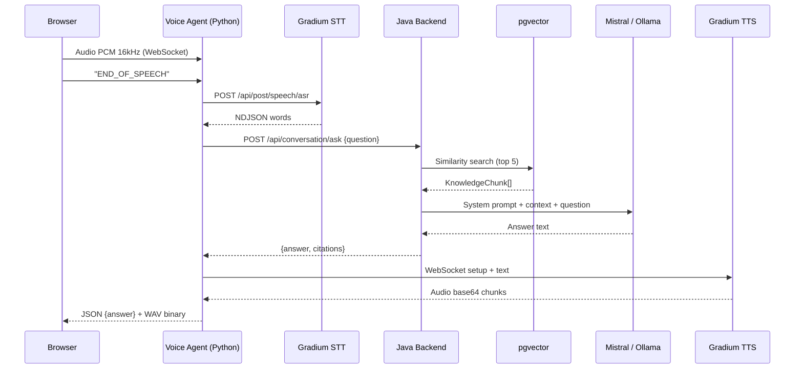

# Voice Support Bot (V2V)

Agent support client **voice-to-voice** pour le domaine Telecom/FAI, alimenté par RAG (Retrieval-Augmented Generation) sur une base de connaissance, accessible via **navigateur web** et **téléphonie classique** (Twilio).

Le bot écoute la question du client (voix), la transcrit, cherche la réponse dans sa base de connaissance, génère une réponse synthétique et la prononce au client — le tout en streaming avec la première phrase audible en ~700ms.

## Fonctionnalités

- **Conversation vocale naturelle** — VAD serveur Pipecat/Silero détecte automatiquement début/fin de parole, sans clic
- **Barge-in** — interrompre le bot en parlant coupe instantanément sa réponse
- **Streaming temps réel** — réponse phrase par phrase (texte + audio) en ~700ms
- **Chat texte** — fallback texte pour tester ou pour les contextes non-vocaux
- **Téléphonie Twilio** — réponse vocale sur un numéro de téléphone classique
- **RAG sur base de connaissance** — réponses factuelles avec citations sourcées
- **Détection d'escalade** — transfert automatique vers un conseiller humain (résiliation, réclamation, RGPD)
- **Guardrails** — détection hors-sujet (patterns) + score de confiance RAG (seuil configurable), badge visuel quand confiance faible
- **Dashboard admin** — KPIs (latence, taux de résolution, escalades) + historique des conversations
- **Architecture hybride** — Java pour le RAG/domain, Python pour l'orchestration vocale

## Stack technique

| Couche | Technologie | Rôle |
|--------|------------|------|
| Orchestration vocale | **[Pipecat](https://pipecat.ai)** 1.4 (Python) | Pipeline audio temps réel |
| STT (Speech-to-Text) | **[Gradium](https://gradium.ai)** (API cloud, WebSocket) | Transcription ultra-low latency |
| TTS (Text-to-Speech) | **[Gradium](https://gradium.ai)** (API cloud, WebSocket) | Synthèse vocale naturelle |
| Backend RAG | Java 21, Spring Boot 3.4, Spring AI 1.0 | Retrieval + LLM + domain logic |
| LLM | **Mistral AI** (API, défaut) ou Ollama (local) | Génération de réponses |
| Embeddings | nomic-embed-text (Ollama) | Vectorisation sémantique |
| Vector Store | PostgreSQL 16 + pgvector (HNSW) | Recherche de similarité |
| Téléphonie | Twilio Media Streams → Pipecat | Appels téléphoniques |
| Frontend | React 19, TypeScript, Vite 6, TailwindCSS 4 | Interface web |
| VAD | Silero via Pipecat | Détection vocale serveur pour WebRTC et téléphonie |

## Architecture

### Diagramme de dépendances (Hexagonal)

> STT/TTS ne sont **pas** dans le backend Java : ils sont assurés par l'agent
> vocal Python (Gradium). Le backend expose uniquement le RAG/domain via HTTP.


### Flux principal (séquence)



### Vue simplifiée (ASCII)

```
Browser/Téléphone
     │
     ▼ WebSocket (audio PCM 16kHz ou μ-law 8kHz)
┌─────────────────────────────────┐
│     Voice Agent (Python)        │
│  ┌─────────┐  ┌────┐  ┌──────┐ │
│  │ Gradium │→ │RAG │→ │Gradium│ │
│  │  STT    │  │API │  │ TTS  │ │
│  └─────────┘  └────┘  └──────┘ │
└─────────────────────────────────┘
                  │
                  ▼ HTTP POST /api/conversation/ask
           ┌─────────────┐
           │ Java Backend │
           │ (Spring AI + │
           │  pgvector)   │
           └─────────────┘
```

## Documentation

| Document | Public | Contenu |
|----------|--------|---------|
| [`docs/architecture/architecture.md`](docs/architecture/architecture.md) | Dev / archi | Architecture complète, pipeline RAG, guardrails, multi-agent, ADRs |
| [`docs/engineering/development-guide.md`](docs/engineering/development-guide.md) | Dev | Conventions, ajout de providers/agents, commandes utiles, troubleshooting |
| [`docs/knowledge-base/knowledge-base-technical.md`](docs/knowledge-base/knowledge-base-technical.md) | Dev / archi | Fonctionnement et architecture de la base de connaissance (ingestion, synchro, vector store, extension par connecteurs) |
| [`docs/knowledge-base/knowledge-base-guide.md`](docs/knowledge-base/knowledge-base-guide.md) | Contributeurs (non-dev) | Comment rédiger, ajouter et publier du contenu dans la base de connaissance |
| [`docs/architecture/diagrams/`](docs/architecture/diagrams/) | Tous | Versions **draw.io** éditables des diagrammes d'architecture (overview, hexagonal, séquence vocale) |
| [`docs/knowledge-base/diagrams/`](docs/knowledge-base/diagrams/) | Tous | Version **draw.io** éditable du diagramme de base de connaissance |

## Démarrage rapide

### Prérequis

- Java 21+
- Python 3.11+ (pour l'agent vocal)
- Node.js 20+
- Docker & Docker Compose
- Ollama installé localement
- **Clé API Gradium** (créer un compte sur https://gradium.ai)

### 1. Démarrer l'infrastructure

```bash
docker compose up -d
```

Lance PostgreSQL 16 + pgvector sur le port **5433**.

### 2. Installer les modèles Ollama

```bash
ollama pull llama3.1:8b
ollama pull nomic-embed-text
```

### 3. Configurer les variables d'environnement

```bash
cp .env.example .env
# Configurer GRADIUM_API_KEY

cd voice-agent && cp .env.example .env
# Configurer GRADIUM_API_KEY + GRADIUM_VOICE_ID
```

### 4. Lancer la stack locale (recommandé)

```bash
docker compose up --build
```

La stack lance :
- Postgres + pgvector (`localhost:5433`)
- Redis (`localhost:6379`)
- backend Java (`http://localhost:8081`)
- frontend React (`http://localhost:5173`)
- voice-agent (`ws://localhost:8765`, `ws://localhost:8766`)
- Pipecat WebRTC UI (`http://localhost:7860`)

En Docker Compose, le backend utilise `CONVERSATION_STORE=redis` pour les
sessions actives et `CONVERSATION_EVENT_STORE=jpa` pour les événements admin. Le
service `pipecat-agent` lance le chemin voix cible WebRTC ; `voice-agent` garde
le bridge WebSocket legacy en fallback. Le frontend React expose les deux modes :
`Solution A · WebSocket` et `Solution B · WebRTC`.

### 4bis. Lancer le backend Java manuellement

```bash
cd backend
mvn spring-boot:run
```

Le backend démarre sur http://localhost:8081. En mode manuel, le stockage
conversationnel reste en mémoire par défaut ; exporter `CONVERSATION_STORE=redis`
et `CONVERSATION_EVENT_STORE=jpa` pour utiliser Redis/Postgres.

### 5. Lancer l'agent vocal cible V1 (Pipecat + Gradium, mode manuel)

```bash
cd voice-agent
python3 -m venv .venv && source .venv/bin/activate
pip install -e .
python -m agent.bot -t webrtc
```

Le bot Pipecat expose l'UI WebRTC prebuilt sur `http://localhost:7860`.

Le bridge custom historique reste disponible pour le frontend React POC :

```bash
python -u -m agent.bridge_server
# ws://localhost:8765
```

### 6. Lancer le frontend

```bash
cd frontend
npm install
cp node_modules/@ricky0123/vad-web/dist/silero_vad_v5.onnx public/
cp node_modules/@ricky0123/vad-web/dist/vad.worklet.bundle.min.js public/
npm run dev
```

L'application est accessible sur http://localhost:5173.

### 7. Ingérer la base de connaissance

Méthode recommandée — **synchronisation multi-sources** (lit `knowledge-base/*.md`, le `domain` venant du front-matter YAML de chaque fichier) :

```bash
curl -X POST http://localhost:8081/api/knowledge/sync
# -> { "processed": 3, "ingested": 3, "skipped": 0, "deleted": 0 }
```

La synchro est idempotente (relancer = `skipped` si rien n'a changé) et tourne aussi via un scheduler cron (`voice-support.knowledge.sync-cron`). Upload ponctuel d'un fichier (toujours disponible) :

```bash
curl -X POST http://localhost:8081/api/knowledge/ingest \
  -F "file=@knowledge-base/telecom-faq.md" \
  -F "source=telecom-faq.md" \
  -F "domain=support"
```

### 8. Tester en mode texte

```bash
curl -X POST http://localhost:8081/api/conversation/ask \
  -H "Content-Type: application/json" \
  -d '{"question": "Ma box ne se connecte plus, que faire ?"}'
```

## API Reference

### Conversation (texte)

```
POST /api/conversation/ask
Content-Type: application/json

Body: { "question": "...", "conversationId": "optional-session-id" }

Response: {
  "answer": "...",
  "citations": [{ "source", "section", "relevantText", "score" }],
  "conversationId": "..."
}
```

### Conversation (streaming SSE — utilisé par le mode vocal)

```
GET /api/conversation/ask-stream?question=...&conversation_id=...
Accept: text/event-stream

Events: start (agent), chunk (token), done (answer + citations), error
```

### Conversation (seed — amorçage de l'historique)

```
POST /api/conversation/seed
Content-Type: application/json

Body: { "message": "...", "conversation_id": "..." }
Response: 204 No Content
```

Enregistre un message **assistant** dans l'historique d'une conversation. Utilisé
par le bot Pipecat au moment de la connexion : le message d'accueil est joué côté
client par le TTS et n'atteint donc pas le backend ; sans cet amorçage, le LLM
considère le premier message utilisateur comme le début de conversation et
**re-salue**. Le seed corrige ce comportement.

### Ingestion de connaissance

```
POST /api/knowledge/ingest
Content-Type: multipart/form-data

Params:
  file (MultipartFile) — fichier Markdown ou texte à ingérer
  source (string, optional) — nom de la source
  domain (string, optional) — tag de domaine (support|billing|commercial)

Response: { "status": "ingested", "source": "...", "domain": "...", "chunks_created": 17 }
```

### Synchronisation multi-sources

```
POST /api/knowledge/sync               — synchronise toutes les sources
POST /api/knowledge/sync/{sourceType}  — synchronise une source (ex: markdown)

Response: { "processed": 3, "ingested": 3, "skipped": 0, "deleted": 0 }
```

Connecteurs branchés via le port `KnowledgeSourceConnector` (référence : `MarkdownFolderConnector` lisant `knowledge-base/*.md` avec front-matter YAML `domain:`). Idempotent via `content_hash` (table `kb_source_state`) ; pull planifié via cron.

### Admin Dashboard

```
GET /api/admin/stats          — KPIs (total conversations, latence, escalation rate)
GET /api/admin/events?limit=N — dernières conversations
GET /api/admin/top-questions  — top 10 questions les plus fréquentes
```

### Voice agent

```
http://localhost:7860 — UI WebRTC Pipecat cible V1
ws://localhost:8765   — WebSocket legacy navigateur (bridge custom)
ws://localhost:8766   — WebSocket legacy Twilio Media Streams (bridge custom)
```

### Health

```
GET /api/health → { "status": "up", "service": "voice-support-bot" }
```

## Pipeline vocal

```
┌──────────┐    ┌─────────┐    ┌─────────────────┐    ┌─────────┐    ┌──────────┐
│  Audio   │───▶│ Gradium │───▶│  Java Backend   │───▶│ Gradium │───▶│  Audio   │
│  (micro) │    │  STT    │    │ (RAG + Ollama)  │    │  TTS    │    │  (HP)    │
└──────────┘    └─────────┘    └─────────────────┘    └─────────┘    └──────────┘
                    ~200ms           ~1500ms               ~300ms
                                                                Total: ~2s
```

## Téléphonie (Twilio)

1. Créer un compte Twilio et acheter un numéro FR
2. Exposer le backend avec un tunnel : `ngrok http 8081`
3. Configurer le webhook Twilio : `POST https://<ngrok-url>/api/twilio/voice`
4. Appeler le numéro → le bot décroche, salue, et écoute

Le flux audio Twilio est en **mulaw 8kHz**, supporté nativement par Gradium.

## Détection d'escalade

Le bot transfère automatiquement vers un humain quand le client :
- Demande une résiliation
- Fait une réclamation ou demande un remboursement
- Mentionne un technicien / déplacement
- Parle de données personnelles / RGPD
- Signale un piratage de compte
- Exprime de la frustration ("inacceptable", "scandaleux")
- Demande explicitement un "vrai conseiller"

## Structure du projet

```
voice-support-bot/
├── backend/                                # Java backend (RAG + LLM + domain)
│   └── src/main/java/com/voicesupport/
│       ├── domain/                         # Logique métier pure (aucune dépendance Spring)
│       │   ├── model/                      #   Conversation, Citation, SourceDocument, SyncReport, ContentHash
│       │   ├── port/in/                    #   AskQuestionUseCase, IngestKnowledgeUseCase, SyncKnowledgeSourceUseCase
│       │   ├── port/out/                   #   LlmPort, VectorSearchPort/StorePort, KnowledgeSourceConnector/StatePort
│       │   └── service/                    #   ConversationService, KnowledgeSyncService, TextChunker, EscalationDetector
│       └── infrastructure/                 # Implémentations techniques
│           ├── adapter/in/rest/            #   Controllers REST (dont KnowledgeController: /ingest + /sync)
│           ├── adapter/out/source/         #   MarkdownFolderConnector (connecteurs KB)
│           ├── adapter/out/                #   Ollama, pgvector, persistence (ledger kb_source_state)
│           ├── scheduler/                  #   KnowledgeSyncScheduler (pull planifié cron)
│           └── config/                     #   DomainServiceConfig, SchedulingConfig
├── voice-agent/                            # Python Pipecat agent (orchestration vocale)
│   ├── agent/
│   │   ├── bridge_server.py               #   Bridge WebSocket (protocole frontend ↔ Gradium)
│   │   ├── ws_server.py                   #   Pipecat pipeline (mode natif)
│   │   ├── twilio_server.py               #   Twilio Media Streams
│   │   ├── rag_processor.py               #   Pipecat processor: STT → RAG → TTS
│   │   └── backend_client.py              #   Client HTTP vers le backend Java
│   ├── pyproject.toml                      #   Dépendances (pipecat-ai[gradium])
│   └── Dockerfile
├── frontend/                               # React 19 + TailwindCSS
│   ├── public/                            #   Assets VAD (silero_vad_v5.onnx, worklet)
│   └── src/features/voice-chat/           #   VoiceChat, useVAD, useAudioQueue, useVoiceWebSocket
├── knowledge-base/                         # Documents FAQ Telecom à ingérer
├── docs/                                   # Architecture + guide développement
├── docker-compose.yml                      # PostgreSQL + pgvector + voice-agent
└── .env.example
```

## Configuration

### Agent vocal (`voice-agent/.env`)

| Variable | Description | Défaut |
|----------|-------------|--------|
| `GRADIUM_API_KEY` | Clé API Gradium (obligatoire) | — |
| `GRADIUM_VOICE_ID` | ID de la voix Gradium (voir catalogue) | `b35yykvVppLXyw_l` (Elise, FR) |
| `BACKEND_URL` | URL du backend Java | `http://localhost:8081` |
| `VOICE_AGENT_PORT` | Port WebSocket navigateur | `8765` |
| `TWILIO_WS_PORT` | Port WebSocket Twilio | `8766` |

### Backend Java (`backend/.env` ou variables d'environnement)

| Variable | Description | Défaut |
|----------|-------------|--------|
| `LLM_PROVIDER` | Provider LLM (`mistral-api` ou `ollama`) | `mistral-api` |
| `MISTRAL_API_KEY` | Clé API Mistral (obligatoire si provider=mistral-api) | — |
| `MISTRAL_MODEL` | Modèle Mistral | `mistral-small-latest` |
| `OLLAMA_BASE_URL` | URL d'Ollama (si provider=ollama) | `http://localhost:11434` |
| `OLLAMA_MODEL` | Modèle LLM Ollama | `llama3.1:8b` |
| `OLLAMA_EMBEDDING_MODEL` | Modèle d'embeddings | `nomic-embed-text` |
| `GUARDRAIL_CONFIDENCE_THRESHOLD` | Seuil de confiance RAG (0.0 à 1.0) | `0.65` |
| `REDIS_HOST` | Hôte Redis pour les sessions actives | `localhost` |
| `REDIS_PORT` | Port Redis | `6379` |
| `CONVERSATION_STORE` | Stockage sessions actives (`memory` ou `redis`) | `memory` |
| `CONVERSATION_EVENT_STORE` | Stockage événements/admin (`memory` ou `jpa`) | `memory` |
| `CONVERSATION_TTL_SECONDS` | TTL des sessions Redis | `86400` |

## Tests

```bash
# Backend — tests unitaires du domaine (fakes manuels, pas de Mockito)
cd backend && mvn test

# Frontend — tests unitaires (Vitest)
cd frontend && npx vitest run

# Frontend — vérification TypeScript
cd frontend && npx tsc --noEmit

# Voice agent — tests Python
cd voice-agent && python -m pytest tests/
```

## Roadmap

> Suivi détaillé des items ouverts (priorité, domaine, pistes) : [`docs/operations/backlog.md`](docs/operations/backlog.md).

- [x] Streaming inter-étapes (TTS phrase par phrase pendant la génération LLM)
- [x] VAD serveur Pipecat/Silero — conversation naturelle sans clic stop
- [x] Barge-in — interrompre le bot en parlant
- [x] Mémoire conversationnelle partagée (Redis) + événements persistants (JPA)
- [x] Multi-langues (FR + EN) avec sélection automatique de voix Gradium
- [ ] Dashboard admin enrichi (graphiques latence, heatmap horaire)
- [x] Fallback Mistral API quand Ollama est trop lent (configurable via `LLM_PROVIDER`)
- [x] Socle KB multi-sources (format pivot `SourceDocument`, synchro idempotente, connecteur Markdown, pull planifié)
- [ ] Connecteurs KB Confluence / PDF (Tika) / base de données
- [ ] Ingestion PDF (extraction structurée)
- [x] Guardrails : détection "hors sujet" avec score de confiance
- [ ] Observabilité : traces OpenTelemetry sur le pipeline
- [ ] Voice cloning Gradium pour voix de marque personnalisée
- [ ] Multi-agent Pipecat (routage vers spécialistes : facturation, technique, commercial)

## Licence

Projet privé — usage interne.
