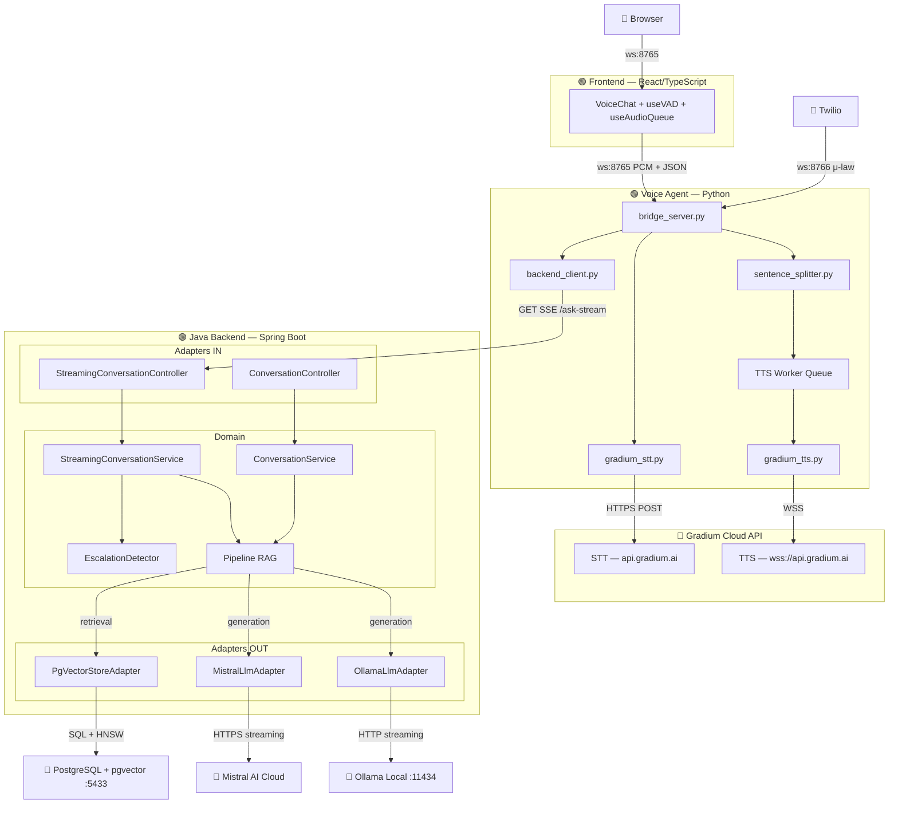
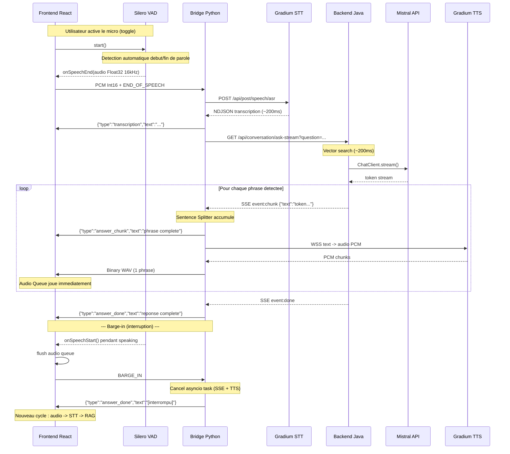

# Architecture — Voice Support Bot

## Vue d'ensemble

Voice Support Bot est un agent vocal intelligent qui répond aux questions de support client dans le domaine Telecom/FAI. Il utilise le pattern **RAG** (Retrieval-Augmented Generation) pour fournir des réponses factuelles basées sur une base de connaissance interne.

L'architecture est **hybride** :
- Un **backend Java** (hexagonal) gère la logique métier, le RAG, et l'administration
- Un **agent vocal Python** orchestre le pipeline audio temps réel avec Gradium (STT/TTS)
- Un **frontend React** fournit l'interface utilisateur avec VAD navigateur (détection automatique de parole), WebSocket audio + streaming texte, et barge-in (interruption du bot)

## Diagramme d'architecture



> **Légende** : 🟢 = notre code · 🔴 = service externe

## Flux sortants (Outbound)

Le système appelle les services externes suivants :

| Flux | Protocole | Source → Destination | Contenu |
|------|-----------|---------------------|---------|
| **LLM Generation** | HTTPS (streaming) | `MistralLlmAdapter` → Mistral API | Prompt + contexte RAG → tokens streamés |
| **LLM Generation (alt)** | HTTP (streaming) | `OllamaLlmAdapter` → Ollama local :11434 | Prompt + contexte → tokens streamés |
| **Vector Search** | SQL (TCP :5433) | `PgVectorStoreAdapter` → PostgreSQL/pgvector | Query embedding → top-K chunks HNSW |
| **Embedding Generation** | HTTP | Spring AI → Ollama (nomic-embed-text) | Texte → vecteur 768 dimensions |
| **STT Transcription** | HTTPS POST | `gradium_stt.py` → `api.gradium.ai/api/post/speech/asr` | Audio PCM → NDJSON words |
| **TTS Synthesis** | WSS | `gradium_tts.py` → `wss://api.gradium.ai/api/speech/tts` | Texte → PCM audio chunks |
| **RAG Query (streaming)** | HTTP SSE | `bridge_server.py` → Backend :8081 `/api/conversation/ask-stream` | Question → SSE token stream |
| **RAG Query (fallback)** | HTTP POST | `bridge_server.py` → Backend :8081 `/api/conversation/ask` | Question → JSON response |

## Séparation des responsabilités

| Composant | Langage | Responsabilité |
|-----------|---------|---------------|
| **Frontend React** | TypeScript | Interface utilisateur, VAD navigateur (Silero via `@ricky0123/vad-web`), barge-in, audio queue playback, streaming texte |
| **Voice Agent** | Python | Orchestration audio, STT/TTS via Gradium, sentence splitting, SSE consumer, gestion BARGE_IN (cancel async) |
| **Gradium** | API cloud | STT (transcription) et TTS (synthèse vocale) |
| **Backend Java** | Java (Spring Boot) | RAG, LLM streaming (SSE), logique métier, escalade, admin |
| **Mistral AI** | API cloud | LLM génération (provider par défaut, streaming) |
| **Ollama** | Local | LLM inférence locale (alternative configurable) |
| **PostgreSQL + pgvector** | — | Stockage vectoriel et recherche de similarité |

## Couche domaine (Pure Java)

Le domaine ne contient **aucune annotation Spring**. Il est testable avec de simples fakes.

> **Exception** : `LlmStreamingPort` utilise `Flux<String>` (Reactor) pour le streaming — compromis pragmatique accepté pour le POC.

### Modèles

| Classe | Rôle |
|--------|------|
| `Conversation` | Session de dialogue multi-tour (historique user/assistant) |
| `Citation` | Référence à un passage de la base de connaissance (source, section, score) |
| `ConversationResponse` | Réponse du bot (texte + citations) |
| `ConversationEvent` | Événement de tracking (question, réponse, latence, escalade) |
| `KnowledgeChunk` | Unité de connaissance indexée dans le vector store |
| `GuardrailResult` | Résultat d'évaluation guardrail (PASS, OFF_TOPIC, LOW_CONFIDENCE) |

### Services

| Service | Responsabilité |
|---------|---------------|
| `ConversationService` | Pipeline RAG synchrone : retrieval → génération blocking → tracking |
| `StreamingConversationService` | Pipeline RAG streaming : retrieval → `Flux<String>` token stream → tracking post-complétion |
| `KnowledgeIngestionService` | Découpe les documents en chunks et les indexe |
| `EscalationDetector` | Détecte les demandes nécessitant un transfert humain |
| `GuardrailService` | Filtre pré/post-recherche : off-topic (patterns) + low-confidence (score seuil) |

### Ports IN (cas d'usage)

| Port | Implémenté par |
|------|----------------|
| `AskQuestionUseCase` | `ConversationService` |
| `IngestKnowledgeUseCase` | `KnowledgeIngestionService` |

### Ports OUT (dépendances inversées)

| Port | Contrat | Adapters |
|------|---------|----------|
| `LlmPort` | Générer une réponse complète (blocking `.call()`) | `MistralLlmAdapter`, `OllamaLlmAdapter` |
| `LlmStreamingPort` | Streamer les tokens de réponse (`Flux<String>` via `.stream()`) | `MistralLlmAdapter`, `OllamaLlmAdapter` |
| `VectorSearchPort` | Chercher les chunks pertinents | `PgVectorStoreAdapter` |
| `VectorStorePort` | Stocker un chunk avec ses embeddings | `PgVectorStoreAdapter` |
| `ConversationEventStore` | Persister les événements de conversation | `InMemoryConversationEventStore` |

> **Note** : Chaque adapter LLM implémente **les deux ports** (`LlmPort` + `LlmStreamingPort`). Un seul bean Spring satisfait les deux interfaces.
> Les ports `SpeechToTextPort` et `TextToSpeechPort` ne sont plus utilisés côté Java — STT/TTS sont gérés par l'agent Python via Gradium.

## Pipeline de traitement

### Mode texte (REST — synchrone)

```
Client → POST /api/conversation/ask
         → ConversationService.ask()
           → EscalationDetector.shouldEscalate()  [court-circuit si oui]
           → GuardrailService.checkBeforeSearch()  [off-topic → court-circuit]
           → VectorSearchPort.searchRelevant()     [retrieval]
           → GuardrailService.checkAfterSearch()   [low-confidence → court-circuit]
           → LlmPort.generateAnswer()             [generation blocking]
           → ConversationEventStore.save()         [tracking]
         ← JSON { answer, citations, conversationId }
```

### Mode vocal (SSE streaming — pipeline optimisé)



**Gain de latence perçue :** L'utilisateur entend la première phrase en **~700ms** au lieu de ~2.2s dans le mode séquentiel.

### Protocole WebSocket (Frontend ↔ Bridge)

| Direction | Message | Format | Quand |
|-----------|---------|--------|-------|
| Client → | Audio | Binary (PCM 16kHz mono) | Après détection fin de parole (VAD) |
| Client → | Fin | Text `"END_OF_SPEECH"` | Après envoi du buffer audio |
| Client → | Interruption | Text `"BARGE_IN"` | L'utilisateur parle pendant que le bot répond |
| Client → | Langue | JSON `{"type":"set_language","language":"fr\|en"}` | Toggle langue |
| → Client | Transcription | JSON `{"type":"transcription","text":"..."}` | Après STT |
| → Client | Chunk texte | JSON `{"type":"answer_chunk","text":"..."}` | Chaque phrase (streaming) |
| → Client | Audio phrase | Binary (WAV 16kHz mono) | Après TTS de chaque phrase |
| → Client | Fin réponse | JSON `{"type":"answer_done","text":"..."}` | Fin génération complète |
| → Client | Langue ack | JSON `{"type":"language_changed","language":"..."}` | Après set_language |

### Mode téléphonie (Twilio → Pipecat + Gradium)

```
Appel téléphonique entrant
  → Twilio → POST /api/twilio/voice (webhook sur backend Java)
  ← TwiML <Response><Connect><Stream url="ws://voice-agent:8766"/></Connect></Response>

  → Twilio WebSocket → ws://localhost:8766 (agent Pipecat)
  → Pipecat reçoit μ-law 8kHz audio frames
  → Gradium STT (input_format: ulaw_8000) → transcription
  → HTTP POST /api/conversation/ask → réponse
  → Gradium TTS (output_format: ulaw_8000) → audio
  → Audio frames retournés à Twilio → diffusé à l'appelant
```

## Stratégie de chunking

Le `KnowledgeIngestionService` découpe les documents de manière sémantique :

1. **Découpage par paragraphes** (`\n\n`) — respecte les frontières logiques
2. **Taille cible : 500 caractères** — assez pour un contexte cohérent
3. **Chevauchement : 50 caractères** — assure la continuité entre chunks
4. **Extraction de section** — le heading Markdown `## ...` est propagé comme métadonnée

Chaque chunk est ensuite :
- Transformé en vecteur via `nomic-embed-text` (768 dimensions)
- Stocké dans pgvector avec index HNSW pour recherche rapide
- Annoté avec ses métadonnées (source, section, index)

## Détection d'escalade

L'`EscalationDetector` est un composant domaine pur qui court-circuite le pipeline RAG :

```
Question utilisateur
    │
    ▼
EscalationDetector.shouldEscalate()
    │
    ├─ OUI → message pré-défini + event escalated=true + STOP
    │
    └─ NON → pipeline RAG normal
```

Mots-clés déclencheurs : résiliation, réclamation, remboursement, technicien, RGPD, piratage, frustration explicite.

L'escalade est **instantanée** (<1ms) car elle ne passe ni par le vector store ni par le LLM.

## Gestion de la mémoire conversationnelle

Chaque `conversationId` a sa propre instance de `Conversation` en mémoire (map ConcurrentHashMap). L'historique des 6 derniers tours est injecté dans le prompt LLM pour assurer la cohérence multi-tour.

Limitation actuelle : la mémoire est volatile (in-memory). La persistence JPA est prévue en roadmap.

## Budget latence

### Mode streaming (pipeline optimisé — production)

| Étape | Temps | Composant | Impact perçu |
|-------|-------|-----------|-------------|
| Gradium STT (REST batch) | ~200ms | Voice Agent | Bloquant |
| Vector search (pgvector HNSW) | ~200ms | Java Backend | Bloquant |
| LLM first token (Mistral API) | ~150ms | Java Backend → Mistral | Bloquant |
| Sentence detection | ~100ms | Voice Agent (splitter) | Accumulation tokens |
| TTS première phrase | ~200ms | Voice Agent → Gradium | |
| **Première phrase audible** | **~700ms** | | |
| LLM complète (total) | ~1200ms | Java Backend → Mistral | En parallèle avec TTS |
| TTS toutes phrases | ~400ms | Voice Agent → Gradium | Séquentiel par phrase |

### Mode synchrone (fallback / mode texte)

| Étape | Temps | Composant |
|-------|-------|-----------|
| Gradium STT | ~200ms | Voice Agent |
| Vector search | ~200ms | Java Backend |
| LLM complète (Mistral API) | ~1200ms | Java Backend |
| Gradium TTS (texte complet) | ~300ms | Voice Agent |
| **Total** | **~1.9s** | |

## Configuration LLM

Le provider LLM est configurable via `voice-support.llm.provider` :

| Provider | Valeur | Streaming | Latence first token | Usage |
|----------|--------|-----------|--------------------|----|
| **Mistral API** (défaut) | `mistral-api` | Oui (SSE) | ~150ms | Production |
| Ollama local | `ollama` | Oui (SSE) | ~500ms | Développement offline |

Les deux adapters implémentent `LlmPort` (blocking) et `LlmStreamingPort` (reactive `Flux<String>`).

## Extensibilité

### Remplacer le LLM

Pour ajouter un nouveau provider LLM (ex: OpenAI) :

1. Créer `OpenAILlmAdapter implements LlmPort, LlmStreamingPort` dans `adapter/out/llm/`
2. Ajouter un `@Bean` conditionnel dans `DomainServiceConfig` (ex: `@ConditionalOnProperty`)
3. Ajouter la configuration dans `application.yml`
4. Aucune modification du domaine requise

### Remplacer Gradium (STT/TTS)

Modifier `voice-agent/agent/gradium_stt.py` et `gradium_tts.py` pour appeler un autre fournisseur. Le contrat interne (fonctions `transcribe_audio()` et `synthesize_speech()`) reste le même.

### Ajouter un transport

Le bridge server gère les clients navigateur (ws:8765) et Twilio (ws:8766). Pour ajouter un nouveau transport (ex: SIP, LiveKit), créer un nouveau handler WebSocket dans le bridge.

## Décisions d'architecture (ADR)

### ADR-001 : Pipeline modulaire plutôt que Realtime API

**Contexte** : OpenAI Realtime API et Gemini Live offrent du voice-to-voice en une seule API.

**Décision** : Pipeline STT → RAG → LLM → TTS.

**Raisons** :
- Contrôle total sur le RAG (coeur du produit)
- Pas de vendor-lock
- Local-first possible
- Coût 12x inférieur (~$0.005/min vs ~$0.06/min)

### ADR-002 : Gradium pour STT/TTS via Pipecat

**Contexte** : Le MVP initial utilisait Deepgram (STT cloud) et Piper (TTS local).

**Décision** : Migrer vers Gradium (STT + TTS) orchestré par Pipecat (Python).

**Raisons** :
- Gradium offre STT et TTS dans une seule API avec latence très basse (~200ms STT, ~300ms TTS)
- Support natif `ulaw_8000` (format téléphonie) — pas de conversion audio nécessaire
- Pipecat fournit le framework d'orchestration avec VAD intégrée, multiplexage, et transports pluggables
- La séparation Java (RAG) / Python (voix) suit le principe de responsabilité unique
- Pipecat a une intégration native Gradium (`pipecat-ai[gradium]`)

### ADR-003 : Architecture hybride Java + Python

**Contexte** : Le STT/TTS et l'orchestration audio sont mieux servis par Python, le RAG par Java.

**Décision** : Garder les deux : Java backend comme "cerveau" (RAG), Python comme "bouche/oreille" (voix).

**Raisons** :
- Le backend Java est mature (hexagonal, tests, Spring AI intégré)
- Python excelle dans l'orchestration audio temps réel
- Couplage lâche via HTTP/SSE (streaming) et HTTP POST (fallback)
- Chaque composant est déployable et scalable indépendamment
- Pas de réécriture nécessaire du code existant

### ADR-004 : In-memory event store plutôt que JPA

**Contexte** : Le tracking des conversations pourrait être en base.

**Décision** : `InMemoryConversationEventStore` (CopyOnWriteArrayList) pour le MVP.

**Raisons** :
- Simplicité de démarrage
- Pas de migration de schéma à gérer
- Suffisant pour le volume MVP
- Le port `ConversationEventStore` permet de basculer vers JPA sans toucher au domaine

### ADR-005 : Streaming inter-étapes (SSE + sentence splitting)

**Contexte** : Le pipeline séquentiel (STT → RAG complet → TTS complet) prenait ~2.2s avant la première syllabe audible.

**Décision** : Streamer les tokens LLM via SSE, les découper en phrases, et lancer le TTS par phrase en parallèle.

**Raisons** :
- Réduit la latence perçue de ~2.2s à ~700ms (première phrase)
- L'utilisateur perçoit une conversation naturelle (réponse quasi-immédiate)
- Le sentence splitting (`find_sentence_boundary`) produit des phrases TTS-friendly (≥20 chars, pas de coupure numérique)
- Le TTS worker concurrent (`asyncio.Queue`) permet de synthétiser la phrase N+1 pendant que la phrase N est jouée
- Le frontend `useAudioQueue` chaîne les chunks audio WAV sans gap audible
- Backward-compatible : fallback automatique vers POST /ask si SSE échoue

### ADR-006 : VAD navigateur (Silero) avec barge-in

**Contexte** : Le mode push-to-talk obligeait l'utilisateur à cliquer "stop" après chaque phrase. L'interaction était non-naturelle comparée à un appel téléphonique.

**Décision** : Remplacer le push-to-talk par un VAD (Voice Activity Detection) côté navigateur utilisant Silero v5 via `@ricky0123/vad-web`, avec support du barge-in.

**Raisons** :
- **Conversation naturelle** : le VAD détecte automatiquement début/fin de parole (~500ms de silence = fin)
- **Barge-in** : l'utilisateur peut interrompre le bot en parlant → flush audio + cancel SSE/TTS
- **Client-side** : le VAD tourne dans le navigateur (WebAssembly + AudioWorklet), zéro latence réseau pour la détection
- **Modèle Silero v5** : léger (~1.5MB ONNX), précis, et éprouvé dans la communauté
- **Pas de modification backend** : seul le bridge Python gère le nouveau message `BARGE_IN` via `asyncio.Task.cancel()`
- **Rétrocompatible** : le protocole WebSocket reste identique (PCM + END_OF_SPEECH), seul le déclencheur change (VAD au lieu de clic manuel)

### ADR-007 : Guardrails (off-topic + score de confiance)

**Contexte** : Sans protection, le bot répond à toute question même hors domaine, avec un risque d'hallucination quand la base de connaissances ne couvre pas le sujet.

**Décision** : Implémenter un `GuardrailService` avec deux niveaux de filtrage :
1. **Pré-recherche** : détection off-topic par patterns regex (météo, blagues, culture générale)
2. **Post-recherche** : évaluation du score de similarité vectorielle — si le meilleur score est sous le seuil configurable (défaut 0.65), réponse dégradée

**Raisons** :
- **Fail-safe** : plutôt que halluciner, le bot admet son ignorance et propose une escalade humaine
- **Configurable** : seuil externalisé via `voice-support.guardrails.confidence-threshold`
- **Deux étapes** : le filtre pré-recherche économise le coût d'embedding/vectorsearch pour les questions manifestement hors scope
- **Bilingue** : messages de fallback en FR et EN selon la langue détectée
- **Indicateur visuel** : badge ambre "⚠️ Confiance faible" côté frontend quand le guardrail déclenche
- **Pure domain** : pas de dépendance Spring, testable avec de simples fakes
