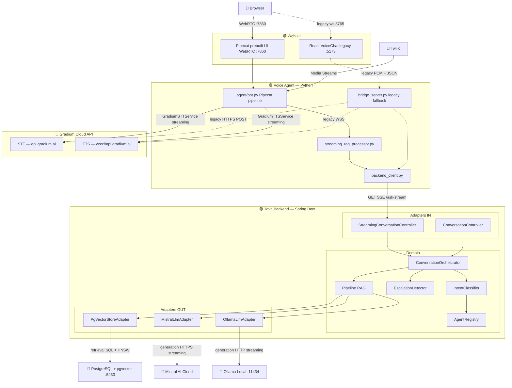
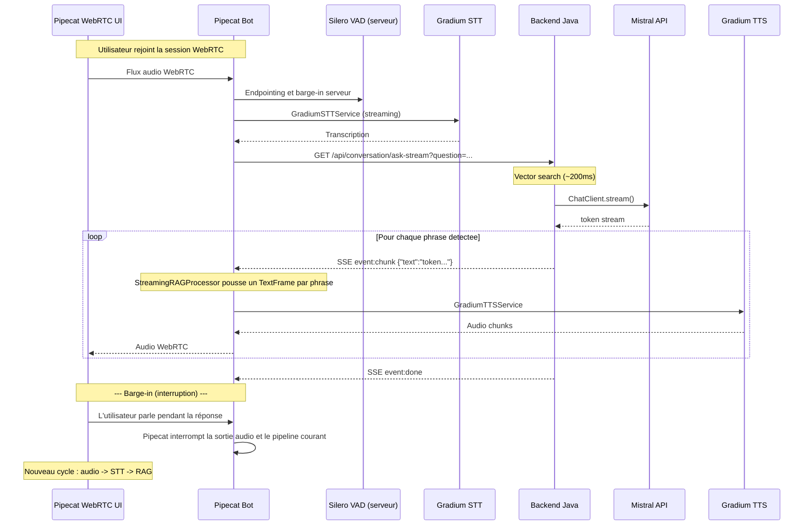
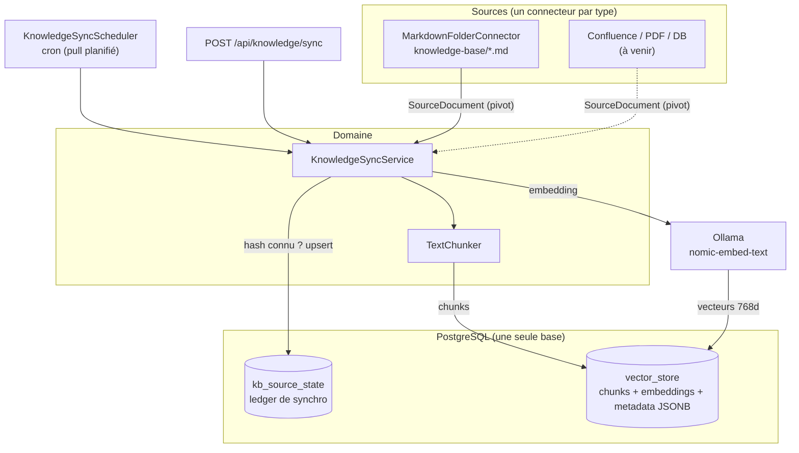

# Architecture — Voice Support Bot

## Vue d'ensemble

Voice Support Bot est un agent vocal intelligent qui répond aux questions de support client dans le domaine Telecom/FAI. Il utilise le pattern **RAG** (Retrieval-Augmented Generation) pour fournir des réponses factuelles basées sur une base de connaissance interne.

L'architecture est **hybride** :
- Un **backend Java** (hexagonal) gère la logique métier, le RAG, et l'administration
- Un **agent vocal Python Pipecat** orchestre le pipeline audio temps réel avec Gradium (STT/TTS)
- Un canal **WebRTC Pipecat** sert le parcours web cible V1, avec Twilio Media Streams pour la téléphonie
- Le **frontend React + bridge WebSocket custom** reste disponible comme POC historique / fallback, mais n'est plus le chemin cible V1

La cible machines/VM pour un pilote operateur V1 est detaillee dans
[`infra-v1.md`](infra-v1.md). Le plan d'integration BSS et du mock
contract-compatible est detaille dans
[`bss-integration-plan.md`](../integrations/galaxion/bss-integration-plan.md).
Les décisions structurantes sont suivies sous forme d'ADR dans
[`adrs/`](adrs/).

## Diagramme d'architecture



> **Légende** : 🟢 = notre code · 🔴 = service externe

## Flux sortants (Outbound)

Le système appelle les services externes suivants :

| Flux | Protocole | Source → Destination | Contenu |
|------|-----------|---------------------|---------|
| **LLM Generation** | HTTPS (streaming) | `MistralLlmAdapter` → Mistral API | Prompt + contexte RAG → tokens streamés |
| **LLM Generation (alt)** | HTTP (streaming) | `OllamaLlmAdapter` → Ollama local :11434 | Prompt + contexte → tokens streamés |
| **Vector Search** | SQL (TCP :5433) | `PgVectorStoreAdapter` → PostgreSQL/pgvector | Query embedding → top-K chunks HNSW |
| **Embedding Generation** | HTTP | Spring AI → Ollama (nomic-embed-text) | Texte → vecteur 768 dimensions |
| **STT Transcription** | Pipecat service / HTTPS | `agent/bot.py` → Gradium STT | Audio WebRTC/Twilio → transcription |
| **TTS Synthesis** | Pipecat service / WSS | `agent/bot.py` → Gradium TTS | Texte → audio stream |
| **RAG Query (streaming)** | HTTP SSE | `streaming_rag_processor.py` → Backend :8081 `/api/conversation/ask-stream` | Question → SSE token stream |
| **RAG Query (fallback legacy)** | HTTP POST | `bridge_server.py` → Backend :8081 `/api/conversation/ask` | Question → JSON response |
| **Greeting seed** | HTTP POST | `bot.py` → Backend :8081 `/api/conversation/seed` | Message d'accueil Pipecat enregistré dans l'historique pour éviter une re-salutation |

## Séparation des responsabilités

| Composant | Langage | Responsabilité |
|-----------|---------|---------------|
| **Pipecat Web UI** | TypeScript / prebuilt | Interface WebRTC cible V1 pour le parcours vocal web |
| **Frontend React legacy** | TypeScript | Interface POC WebSocket, VAD navigateur, audio queue playback, streaming texte |
| **Voice Agent Pipecat** | Python | Orchestration audio WebRTC/Twilio, STT/TTS via Gradium, VAD serveur, barge-in framework |
| **Bridge custom legacy** | Python | Chemin POC/fallback WebSocket, STT/TTS Gradium, sentence splitting, SSE consumer |
| **Gradium** | API cloud | STT (transcription) et TTS (synthèse vocale) |
| **Backend Java** | Java (Spring Boot) | RAG, LLM streaming (SSE), logique métier, escalade, admin |
| **Mistral AI** | API cloud | LLM génération (provider par défaut, streaming) |
| **Ollama** | Local | LLM inférence locale (alternative configurable) |
| **PostgreSQL + pgvector** | — | Stockage vectoriel et recherche de similarité |

## Couche domaine (Pure Java)

Le domaine ne contient **aucune annotation Spring**. Il est testable avec de simples fakes.

Le streaming LLM reste également dans le langage du domaine via `TokenStream`.
Les adapters Spring AI/Reactor convertissent leurs flux techniques vers cette
abstraction avant de revenir dans le domaine.

### Modèles

| Classe | Rôle |
|--------|------|
| `Conversation` | Session de dialogue multi-tour (historique user/assistant + agent courant) |
| `Citation` | Référence à un passage de la base de connaissance (source, section, score) |
| `ConversationResponse` | Réponse du bot (texte + citations) |
| `ConversationEvent` | Événement de tracking (question, réponse, latence, escalade) |
| `KnowledgeChunk` | Unité de connaissance indexée dans le vector store |
| `GuardrailResult` | Résultat d'évaluation guardrail (PASS, OFF_TOPIC, LOW_CONFIDENCE) |
| `AgentProfile` | Profil d'un agent spécialisé (id, nom, system prompt, domaine KB, mots-clés d'intent) |
| `AgentRegistry` | Registre des agents disponibles avec lookup par id et fallback par défaut |
| `SourceDocument` | Format **pivot** d'un document de source KB (sourceType, sourceId, title, url, content, domain, language, updatedAt, contentHash) — normalise toute source hétérogène avant ingestion |
| `ContentHash` | Utilitaire SHA-256 du contenu normalisé (clé d'idempotence de la synchro) |
| `SyncReport` | Résultat d'une synchro KB (processed, ingested, skipped, deleted) |

### Services

| Service | Responsabilité |
|---------|---------------|
| `ConversationOrchestrator` | Pipeline RAG unifié (sync + streaming) avec routing multi-agent : classification d'intent → recherche vectorielle filtrée par domaine → génération avec system prompt dynamique |
| `ConversationService` | Pipeline RAG synchrone legacy (toujours fonctionnel mais remplacé par l'orchestrateur) |
| `StreamingConversationService` | Pipeline RAG streaming legacy (remplacé par l'orchestrateur) |
| `IntentClassifier` | Classifie la question de l'utilisateur pour router vers l'agent approprié (scoring par mots-clés avec session stickiness) |
| `KnowledgeIngestionService` | Ingestion ponctuelle (upload `POST /ingest`) : délègue le découpage à `TextChunker` et indexe avec tag de domaine |
| `KnowledgeSyncService` | Synchro **multi-sources** idempotente : parcourt les connecteurs, compare le `contentHash` au ledger (skip si inchangé), ré-ingère les documents modifiés (delete + re-chunk), supprime les documents disparus (deletion-diff) |
| `TextChunker` | Découpage sémantique partagé (paragraphes, taille/chevauchement, extraction de section) — réutilisé par l'ingestion ponctuelle et la synchro |
| `EscalationDetector` | Détecte les demandes nécessitant un transfert humain |
| `GuardrailService` | Filtre pré/post-recherche : off-topic (patterns) + low-confidence (score seuil) |
| `QueryReformulator` | Reformule les questions de suivi en incluant le contexte conversationnel |

### Ports IN (cas d'usage)

| Port | Implémenté par |
|------|----------------|
| `AskQuestionUseCase` | `ConversationOrchestrator` |
| `IngestKnowledgeUseCase` | `KnowledgeIngestionService` |
| `SyncKnowledgeSourceUseCase` | `KnowledgeSyncService` |

### Ports OUT (dépendances inversées)

| Port | Contrat | Adapters |
|------|---------|----------|
| `LlmPort` | Générer une réponse complète (blocking `.call()`) + variante avec system prompt dynamique | `MistralLlmAdapter`, `OllamaLlmAdapter` |
| `LlmStreamingPort` | Streamer les tokens de réponse (`TokenStream`) + variante avec system prompt dynamique | `MistralLlmAdapter`, `OllamaLlmAdapter` |
| `VectorSearchPort` | Chercher les chunks pertinents (global ou filtré par domaine) | `PgVectorStoreAdapter` |
| `VectorStorePort` | Stocker un chunk (`store` legacy + `storeChunk` avec métadonnées enrichies depuis un `SourceDocument`) et supprimer par source (`deleteBySource`) | `PgVectorStoreAdapter` |
| `KnowledgeSourceConnector` | Lister les `SourceDocument` d'une source (`sourceType()` + `fetchAll()`) — un connecteur par type de source | `MarkdownFolderConnector` (référence) ; Confluence/PDF/DB à venir |
| `KnowledgeSourceStatePort` | Ledger de synchro : hash connu, upsert, liste des ids, suppression | `JpaKnowledgeSourceStateAdapter` (table `kb_source_state`) |
| `ConversationEventStore` | Persister les événements de conversation | `JpaConversationEventStore` en runtime Docker ; `InMemoryConversationEventStore` pour local/dev/tests |
| `ConversationStore` | Charger/sauver l'état d'une session (`load`/`save`) | `RedisConversationStore` en runtime Docker ; `InMemoryConversationStore` pour local/dev/tests |

> **Note** : Chaque adapter LLM implémente **les deux ports** (`LlmPort` + `LlmStreamingPort`). Un seul bean Spring satisfait les deux interfaces.
> Les ports `SpeechToTextPort` et `TextToSpeechPort` ne sont plus utilisés côté Java — STT/TTS sont gérés par l'agent Python via Gradium.

## Pipeline de traitement

### Routing multi-agent

```
Question utilisateur
    │
    ▼
IntentClassifier.classify(question, currentAgentId)
    │
    ├─ Score mots-clés ≥ 1 → route vers l'agent avec le meilleur score
    │
    ├─ Score = 0 + agent courant en session → reste sur l'agent courant (stickiness)
    │
    └─ Score = 0 + pas d'agent courant → fallback vers agent par défaut (support)
```

**Agents disponibles :**

| Agent | Domaine KB | Mots-clés déclencheurs (extrait) |
|-------|-----------|------|
| **Support technique** | `support` | connexion, wifi, box, débit, panne, voyant, reset... |
| **Facturation** | `billing` | facture, paiement, prélèvement, prix, abonnement, résilier... |
| **Commercial** | `commercial` | souscrire, fibre, déménagement, portabilité, option, TV, parrainage... |

### Mode texte (REST — synchrone)

```
Client → POST /api/conversation/ask
         → ConversationOrchestrator.ask()
           → EscalationDetector.shouldEscalate()  [court-circuit si oui]
           → GuardrailService.checkBeforeSearch()  [greeting → réponse directe]
                                                   [off-topic → court-circuit]
           → IntentClassifier.classify()           [routing vers agent]
           → QueryReformulator.reformulate()       [contexte conversationnel]
           → VectorSearchPort.searchRelevant(domain) [retrieval filtré par domaine]
           → GuardrailService.checkAfterSearch()   [low-confidence → court-circuit]
           → LlmPort.generateAnswer(systemPrompt)  [generation avec prompt agent]
           → ConversationEventStore.save()         [tracking]
         ← JSON { answer, citations, conversationId }
```

### Mode vocal cible V1 (Pipecat WebRTC — pipeline optimisé)



**Gain de latence perçue :** L'utilisateur entend la première phrase en **~700ms** au lieu de ~2.2s dans le mode séquentiel.

### Protocole legacy WebSocket (Frontend React ↔ Bridge)

Ce protocole reste documenté pour le POC historique et les tests de fallback. La
cible V1 web est le transport WebRTC Pipecat.

| Direction | Message | Format | Quand |
|-----------|---------|--------|-------|
| Client → | Audio | Binary (PCM 16kHz mono) | Après détection fin de parole (VAD) |
| Client → | Fin | Text `"END_OF_SPEECH"` | Après envoi du buffer audio |
| Client → | Interruption | Text `"BARGE_IN"` | L'utilisateur parle pendant que le bot répond |
| Client → | Langue | JSON `{"type":"set_language","language":"fr\|en"}` | Toggle langue |
| → Client | Transcription | JSON `{"type":"transcription","text":"..."}` | Après STT |
| → Client | Chunk texte | JSON `{"type":"answer_chunk","text":"..."}` | Chaque phrase (streaming) |
| → Client | Audio phrase | Binary (WAV 16kHz mono) | Après TTS de chaque phrase |
| → Client | Fin réponse | JSON `{"type":"answer_done","text":"..."}` | Fin génération complète |
| → Client | Langue ack | JSON `{"type":"language_changed","language":"..."}` | Après set_language |

### Mode téléphonie cible V1 (Twilio Media Streams → Pipecat + Gradium)

La cible V1 sert la téléphonie via `agent/bot.py` et le transport Twilio créé par
Pipecat (`create_transport`). WebRTC et Twilio partagent le même pipeline :
transport input → VAD serveur → Gradium STT → RAG SSE → Gradium TTS → transport
output.

```
Appel téléphonique entrant
  → Twilio → POST /api/twilio/voice (webhook sur backend Java)
  ← TwiML <Response><Connect><Stream url="wss://.../ws/twilio"/></Connect></Response>

  → Twilio Media Streams → Pipecat Twilio transport
  → Silero VAD serveur
  → Gradium STT streaming → transcription
  → GET /api/conversation/ask-stream (SSE) → réponse en streaming par phrase
  → Gradium TTS streaming
  → Pipecat Twilio transport → audio diffusé à l'appelant
```

Les modules `telephony.py`, `audio_codec.py`, `turn_detector.py`,
`stt_streaming.py` et `bridge_server.py` restent utiles pour le chemin legacy /
fallback et les tests bas niveau, mais ils ne portent plus la cible V1.

## Stratégie de chunking

Le `KnowledgeIngestionService` découpe les documents de manière sémantique :

1. **Découpage par paragraphes** (`\n\n`) — respecte les frontières logiques
2. **Taille cible : 500 caractères** — assez pour un contexte cohérent
3. **Chevauchement : 50 caractères** — assure la continuité entre chunks
4. **Extraction de section** — le heading Markdown `## ...` est propagé comme métadonnée
5. **Tag de domaine** — chaque chunk est tagué avec le domaine de l'agent (`support`, `billing`, `commercial`)

Chaque chunk est ensuite :
- Transformé en vecteur via `nomic-embed-text` (768 dimensions)
- Stocké dans pgvector avec index HNSW pour recherche rapide
- Annoté avec ses métadonnées (source, section, index, **domain**)
- Filtrable par domaine lors de la recherche vectorielle (via `FilterExpression`)

## Deux modèles d'IA distincts : LLM (génération) vs Embedding (vectorisation)

Le système utilise **deux modèles d'IA séparés**, à ne pas confondre :

| Rôle | Modèle (défaut) | Fournisseur | Quand |
|------|-----------------|-------------|-------|
| **LLM / chat** (rédige la réponse) | `mistral-small-latest` | **Mistral AI** (API cloud) | À chaque génération de réponse |
| **Embedding** (texte → vecteur) | `nomic-embed-text` (768 dim) | **Ollama** (local) | À l'ingestion (chaque chunk) ET à chaque requête (la question) |

> Le provider LLM est configurable (`voice-support.llm.provider` : `mistral-api` par défaut, `ollama` en alternative). L'embedding est aujourd'hui **toujours** servi par Ollama : `MistralAiEmbeddingAutoConfiguration` est exclu dans `VoiceSupportApplication`. Confier les embeddings à Mistral (`mistral-embed`, 1024 dim) impliquerait de changer `pgvector.dimensions` et de recréer la table `vector_store` + re-synchroniser.

## Base de connaissance multi-sources (synchronisation)

> Documentation dédiée : [`knowledge-base-technical.md`](../knowledge-base/knowledge-base-technical.md)
> (architecture détaillée + extension par connecteurs) et
> [`knowledge-base-guide.md`](../knowledge-base/knowledge-base-guide.md) (rédaction/publication de
> contenu pour les contributeurs non-dev).

Au-delà de l'upload ponctuel (`POST /api/knowledge/ingest`), la KB est alimentée par des **connecteurs de source** synchronisés vers un format **pivot** unique (`SourceDocument`). Cela permet d'ajouter des sources hétérogènes (Markdown, Confluence, PDF, base de données) sans toucher au cœur.



**Boucle de synchro (idempotente) par source :**

1. Le connecteur retourne tous ses `SourceDocument` (`fetchAll()`), chacun portant un `contentHash` (SHA-256).
2. Pour chaque document : si le hash est identique à celui du ledger → **skip** (aucun re-embed). Sinon → `deleteBySource` puis re-chunk + re-store, et mise à jour du ledger.
3. **Deletion-diff** : tout `sourceId` présent dans le ledger mais absent de la source est supprimé du vector store et du ledger.

**Connecteur de référence — `MarkdownFolderConnector` :** lit `knowledge-base/*.md`, résout le `domain` depuis un **front-matter YAML** (`domain: billing`), `sourceId` = nom de fichier, `updatedAt` = date de modification du fichier. Il remplace le seeding `curl` manuel.

**Stockage :** tout vit dans **un seul Postgres** (image `pgvector/pgvector`). La table `vector_store` (gérée par Spring AI) stocke contenu + embeddings + métadonnées en **JSONB** (donc enrichir les métadonnées ne demande aucun `ALTER`). La table `kb_source_state` (JPA, Hibernate `ddl-auto: update`) ne stocke que la comptabilité de synchro (hash, compteurs), pas le contenu.

**Planification :** `KnowledgeSyncScheduler` exécute `syncAll()` via cron (`voice-support.knowledge.sync-cron`, défaut horaire). Mettre `KB_SYNC_CRON=-` désactive la synchro planifiée.

## Détection d'escalade

L'`EscalationDetector` est un composant domaine pur qui court-circuite le pipeline RAG :

```
Question utilisateur
    │
    ▼
EscalationDetector.shouldEscalate()
    │
    ├─ OUI → message pré-défini + event escalated=true + STOP
    │
    └─ NON → pipeline RAG normal
```

Mots-clés déclencheurs : résiliation, réclamation, remboursement, technicien, RGPD, piratage, frustration explicite.

L'escalade est **instantanée** (<1ms) car elle ne passe ni par le vector store ni par le LLM.

## Gestion de la mémoire conversationnelle

L'état de session est accédé via le port `ConversationStore` (`load(id)` / `save(id, conversation)`), ce qui rend l'`ConversationOrchestrator` **sans état JVM** : il ne conserve plus de map interne. L'historique des 6 derniers tours est injecté dans le prompt LLM pour assurer la cohérence multi-tour.

En local/dev/test, les adapters mémoire restent disponibles par défaut pour
démarrer sans infrastructure. En runtime Docker, `CONVERSATION_STORE=redis` et
`CONVERSATION_EVENT_STORE=jpa` activent respectivement `RedisConversationStore`
pour les sessions actives et `JpaConversationEventStore` pour les événements
durables. Le pattern explicite `load` → mutation → `save` reste compatible avec
un store distribué, sans dépendre de l'identité de référence en mémoire.

## Budget latence

### Mode streaming (pipeline optimisé — production)

| Étape | Temps | Composant | Impact perçu |
|-------|-------|-----------|-------------|
| Gradium STT (REST batch) | ~200ms | Voice Agent | Bloquant |
| Vector search (pgvector HNSW) | ~200ms | Java Backend | Bloquant |
| LLM first token (Mistral API) | ~150ms | Java Backend → Mistral | Bloquant |
| Sentence detection | ~100ms | Voice Agent (splitter) | Accumulation tokens |
| TTS première phrase | ~200ms | Voice Agent → Gradium | |
| **Première phrase audible** | **~700ms** | | |
| LLM complète (total) | ~1200ms | Java Backend → Mistral | En parallèle avec TTS |
| TTS toutes phrases | ~400ms | Voice Agent → Gradium | Séquentiel par phrase |

### Mode synchrone (fallback / mode texte)

| Étape | Temps | Composant |
|-------|-------|-----------|
| Gradium STT | ~200ms | Voice Agent |
| Vector search | ~200ms | Java Backend |
| LLM complète (Mistral API) | ~1200ms | Java Backend |
| Gradium TTS (texte complet) | ~300ms | Voice Agent |
| **Total** | **~1.9s** | |

## Configuration LLM

Le provider LLM est configurable via `voice-support.llm.provider` :

| Provider | Valeur | Streaming | Latence first token | Usage |
|----------|--------|-----------|--------------------|----|
| **Mistral API** (défaut) | `mistral-api` | Oui (SSE) | ~150ms | Production |
| Ollama local | `ollama` | Oui (SSE) | ~500ms | Développement offline |

Les deux adapters implémentent `LlmPort` (blocking) et `LlmStreamingPort`.
Le domaine expose un `TokenStream`; les adapters peuvent utiliser Reactor ou
l'API streaming du provider en interne, mais cette dépendance ne traverse pas le port.

## Extensibilité

### Remplacer le LLM

Pour ajouter un nouveau provider LLM (ex: OpenAI) :

1. Créer `OpenAILlmAdapter implements LlmPort, LlmStreamingPort` dans `adapter/out/llm/`
2. Ajouter un `@Bean` conditionnel dans `DomainServiceConfig` (ex: `@ConditionalOnProperty`)
3. Ajouter la configuration dans `application.yml`
4. Aucune modification du domaine requise

### Remplacer Gradium (STT/TTS)

Modifier `voice-agent/agent/gradium_stt.py` et `gradium_tts.py` pour appeler un autre fournisseur. Le contrat interne (fonctions `transcribe_audio()` et `synthesize_speech()`) reste le même.

### Ajouter un transport

Le bridge server gère les clients navigateur (ws:8765, PCM 16kHz) et la téléphonie Twilio Media Streams (ws:8766, μ-law 8kHz) via deux serveurs WebSocket lancés ensemble dans `main()`. Les deux canaux partagent le même pipeline (turn-detector + STT streaming + RAG SSE + TTS) ; seuls le format audio (`pcm_16000` vs `ulaw_8000`) et le protocole d'enveloppe (binaire WAV vs frames média Twilio JSON) diffèrent. Pour ajouter un nouveau transport (ex: SIP natif, LiveKit), créer un handler WebSocket dédié réutilisant `create_stt_session(...)`, `TurnDetector`, et `synthesize_speech(...)` avec le bon `output_format`.

## Décisions d'architecture

Les décisions d'architecture canoniques sont les ADRs formels dans
[`adrs/`](adrs/). Cette page ne maintient plus d'ADRs inline pour éviter les
conflits de numérotation et les décisions contradictoires.

Les anciens ADRs inline de cette page ont été migrés comme suit :

| Ancien inline | Statut dans le registre formel |
|---|---|
| ADR-001 Pipeline modulaire plutôt que Realtime API | Couvert par [ADR-0012](adrs/ADR-0012-modular-voice-pipeline-over-realtime-api.md) |
| ADR-002 Gradium pour STT/TTS via Pipecat | Couvert par [ADR-0002](adrs/ADR-0002-pipecat-gradium-target-voice-path.md) |
| ADR-003 Architecture hybride Java + Python | Couvert par [ADR-0001](adrs/ADR-0001-java-backend-owns-conversation-domain.md), [ADR-0002](adrs/ADR-0002-pipecat-gradium-target-voice-path.md), et [ADR-0012](adrs/ADR-0012-modular-voice-pipeline-over-realtime-api.md) |
| ADR-004 In-memory event store plutôt que JPA | Supersedé par [ADR-0008](adrs/ADR-0008-redis-active-sessions-postgres-durable-events.md) |
| ADR-005 Streaming inter-étapes | Couvert par [ADR-0013](adrs/ADR-0013-tokenstream-and-backend-sse-streaming-contract.md) |
| ADR-006 VAD navigateur legacy | Couvert comme chemin legacy par [ADR-0016](adrs/ADR-0016-legacy-bridge-is-fallback-and-comparison-path.md) |
| ADR-007 Guardrails | Couvert par [ADR-0014](adrs/ADR-0014-domain-guardrails-before-and-after-rag.md) |
| ADR-008 Multi-agent routing | Couvert par [ADR-0015](adrs/ADR-0015-keyword-routing-with-session-stickiness.md) |
| ADR-009 Optimisation latence bridge custom | Couvert comme chemin legacy par [ADR-0016](adrs/ADR-0016-legacy-bridge-is-fallback-and-comparison-path.md) |
| ADR-010 Cible V1 Pipecat | Couvert par [ADR-0002](adrs/ADR-0002-pipecat-gradium-target-voice-path.md) |
| ADR-011 Ingestion KB multi-sources | Couvert par [ADR-0007](adrs/ADR-0007-source-document-knowledge-sync.md) |
