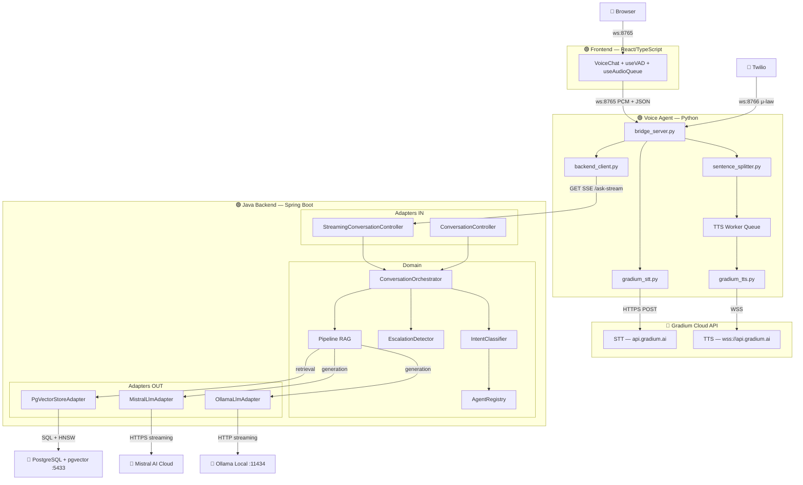
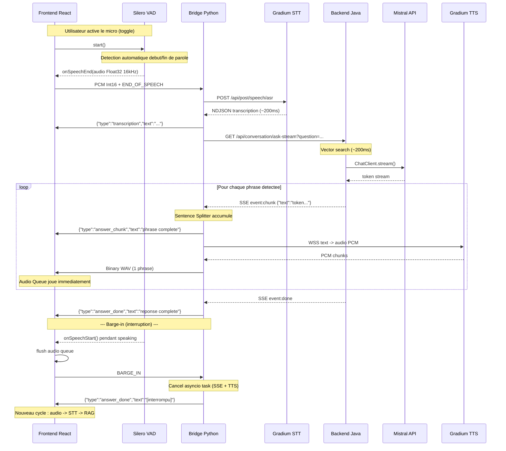
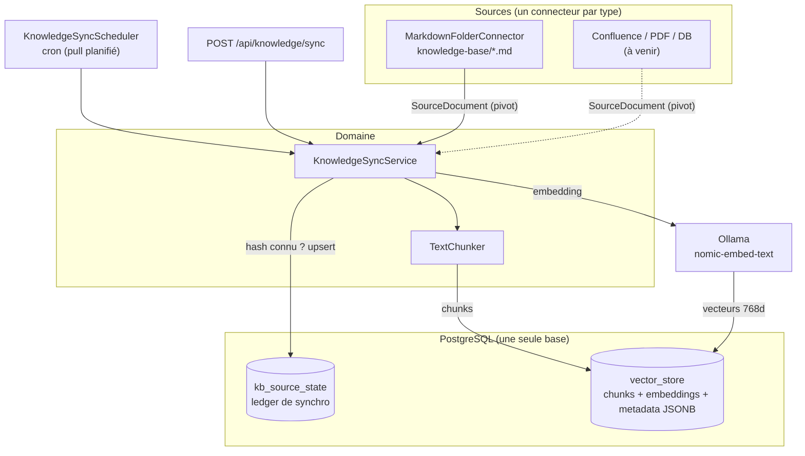

# Architecture — Voice Support Bot

## Vue d'ensemble

Voice Support Bot est un agent vocal intelligent qui répond aux questions de support client dans le domaine Telecom/FAI. Il utilise le pattern **RAG** (Retrieval-Augmented Generation) pour fournir des réponses factuelles basées sur une base de connaissance interne.

L'architecture est **hybride** :
- Un **backend Java** (hexagonal) gère la logique métier, le RAG, et l'administration
- Un **agent vocal Python** orchestre le pipeline audio temps réel avec Gradium (STT/TTS)
- Un **frontend React** fournit l'interface utilisateur avec VAD navigateur (détection automatique de parole), WebSocket audio + streaming texte, et barge-in (interruption du bot)

La cible machines/VM pour un pilote operateur V1 est detaillee dans
[`infra-v1.md`](infra-v1.md). Le plan d'integration BSS et du mock
contract-compatible est detaille dans
[`bss-integration-plan.md`](../integrations/galaxion/bss-integration-plan.md).

## Diagramme d'architecture



> **Légende** : 🟢 = notre code · 🔴 = service externe

## Flux sortants (Outbound)

Le système appelle les services externes suivants :

| Flux | Protocole | Source → Destination | Contenu |
|------|-----------|---------------------|---------|
| **LLM Generation** | HTTPS (streaming) | `MistralLlmAdapter` → Mistral API | Prompt + contexte RAG → tokens streamés |
| **LLM Generation (alt)** | HTTP (streaming) | `OllamaLlmAdapter` → Ollama local :11434 | Prompt + contexte → tokens streamés |
| **Vector Search** | SQL (TCP :5433) | `PgVectorStoreAdapter` → PostgreSQL/pgvector | Query embedding → top-K chunks HNSW |
| **Embedding Generation** | HTTP | Spring AI → Ollama (nomic-embed-text) | Texte → vecteur 768 dimensions |
| **STT Transcription** | HTTPS POST | `gradium_stt.py` → `api.gradium.ai/api/post/speech/asr` | Audio PCM → NDJSON words |
| **TTS Synthesis** | WSS | `gradium_tts.py` → `wss://api.gradium.ai/api/speech/tts` | Texte → PCM audio chunks |
| **RAG Query (streaming)** | HTTP SSE | `bridge_server.py` → Backend :8081 `/api/conversation/ask-stream` | Question → SSE token stream |
| **RAG Query (fallback)** | HTTP POST | `bridge_server.py` → Backend :8081 `/api/conversation/ask` | Question → JSON response |
| **Greeting seed** | HTTP POST | `bot.py` → Backend :8081 `/api/conversation/seed` | Message d'accueil (strategy B) enregistré dans l'historique pour éviter une re-salutation |

## Séparation des responsabilités

| Composant | Langage | Responsabilité |
|-----------|---------|---------------|
| **Frontend React** | TypeScript | Interface utilisateur, VAD navigateur (Silero via `@ricky0123/vad-web`), barge-in, audio queue playback, streaming texte |
| **Voice Agent** | Python | Orchestration audio, STT/TTS via Gradium, sentence splitting, SSE consumer, gestion BARGE_IN (cancel async) |
| **Gradium** | API cloud | STT (transcription) et TTS (synthèse vocale) |
| **Backend Java** | Java (Spring Boot) | RAG, LLM streaming (SSE), logique métier, escalade, admin |
| **Mistral AI** | API cloud | LLM génération (provider par défaut, streaming) |
| **Ollama** | Local | LLM inférence locale (alternative configurable) |
| **PostgreSQL + pgvector** | — | Stockage vectoriel et recherche de similarité |

## Couche domaine (Pure Java)

Le domaine ne contient **aucune annotation Spring**. Il est testable avec de simples fakes.

> **Exception** : `LlmStreamingPort` utilise `Flux<String>` (Reactor) pour le streaming — compromis pragmatique accepté pour le POC.

### Modèles

| Classe | Rôle |
|--------|------|
| `Conversation` | Session de dialogue multi-tour (historique user/assistant + agent courant) |
| `Citation` | Référence à un passage de la base de connaissance (source, section, score) |
| `ConversationResponse` | Réponse du bot (texte + citations) |
| `ConversationEvent` | Événement de tracking (question, réponse, latence, escalade) |
| `KnowledgeChunk` | Unité de connaissance indexée dans le vector store |
| `GuardrailResult` | Résultat d'évaluation guardrail (PASS, OFF_TOPIC, LOW_CONFIDENCE) |
| `AgentProfile` | Profil d'un agent spécialisé (id, nom, system prompt, domaine KB, mots-clés d'intent) |
| `AgentRegistry` | Registre des agents disponibles avec lookup par id et fallback par défaut |
| `SourceDocument` | Format **pivot** d'un document de source KB (sourceType, sourceId, title, url, content, domain, language, updatedAt, contentHash) — normalise toute source hétérogène avant ingestion |
| `ContentHash` | Utilitaire SHA-256 du contenu normalisé (clé d'idempotence de la synchro) |
| `SyncReport` | Résultat d'une synchro KB (processed, ingested, skipped, deleted) |

### Services

| Service | Responsabilité |
|---------|---------------|
| `ConversationOrchestrator` | Pipeline RAG unifié (sync + streaming) avec routing multi-agent : classification d'intent → recherche vectorielle filtrée par domaine → génération avec system prompt dynamique |
| `ConversationService` | Pipeline RAG synchrone legacy (toujours fonctionnel mais remplacé par l'orchestrateur) |
| `StreamingConversationService` | Pipeline RAG streaming legacy (remplacé par l'orchestrateur) |
| `IntentClassifier` | Classifie la question de l'utilisateur pour router vers l'agent approprié (scoring par mots-clés avec session stickiness) |
| `KnowledgeIngestionService` | Ingestion ponctuelle (upload `POST /ingest`) : délègue le découpage à `TextChunker` et indexe avec tag de domaine |
| `KnowledgeSyncService` | Synchro **multi-sources** idempotente : parcourt les connecteurs, compare le `contentHash` au ledger (skip si inchangé), ré-ingère les documents modifiés (delete + re-chunk), supprime les documents disparus (deletion-diff) |
| `TextChunker` | Découpage sémantique partagé (paragraphes, taille/chevauchement, extraction de section) — réutilisé par l'ingestion ponctuelle et la synchro |
| `EscalationDetector` | Détecte les demandes nécessitant un transfert humain |
| `GuardrailService` | Filtre pré/post-recherche : off-topic (patterns) + low-confidence (score seuil) |
| `QueryReformulator` | Reformule les questions de suivi en incluant le contexte conversationnel |

### Ports IN (cas d'usage)

| Port | Implémenté par |
|------|----------------|
| `AskQuestionUseCase` | `ConversationOrchestrator` |
| `IngestKnowledgeUseCase` | `KnowledgeIngestionService` |
| `SyncKnowledgeSourceUseCase` | `KnowledgeSyncService` |

### Ports OUT (dépendances inversées)

| Port | Contrat | Adapters |
|------|---------|----------|
| `LlmPort` | Générer une réponse complète (blocking `.call()`) + variante avec system prompt dynamique | `MistralLlmAdapter`, `OllamaLlmAdapter` |
| `LlmStreamingPort` | Streamer les tokens de réponse (`Flux<String>`) + variante avec system prompt dynamique | `MistralLlmAdapter`, `OllamaLlmAdapter` |
| `VectorSearchPort` | Chercher les chunks pertinents (global ou filtré par domaine) | `PgVectorStoreAdapter` |
| `VectorStorePort` | Stocker un chunk (`store` legacy + `storeChunk` avec métadonnées enrichies depuis un `SourceDocument`) et supprimer par source (`deleteBySource`) | `PgVectorStoreAdapter` |
| `KnowledgeSourceConnector` | Lister les `SourceDocument` d'une source (`sourceType()` + `fetchAll()`) — un connecteur par type de source | `MarkdownFolderConnector` (référence) ; Confluence/PDF/DB à venir |
| `KnowledgeSourceStatePort` | Ledger de synchro : hash connu, upsert, liste des ids, suppression | `JpaKnowledgeSourceStateAdapter` (table `kb_source_state`) |
| `ConversationEventStore` | Persister les événements de conversation | `InMemoryConversationEventStore` |
| `ConversationStore` | Charger/sauver l'état d'une session (`load`/`save`) | `InMemoryConversationStore` (Redis en Phase 2) |

> **Note** : Chaque adapter LLM implémente **les deux ports** (`LlmPort` + `LlmStreamingPort`). Un seul bean Spring satisfait les deux interfaces.
> Les ports `SpeechToTextPort` et `TextToSpeechPort` ne sont plus utilisés côté Java — STT/TTS sont gérés par l'agent Python via Gradium.

## Pipeline de traitement

### Routing multi-agent

```
Question utilisateur
    │
    ▼
IntentClassifier.classify(question, currentAgentId)
    │
    ├─ Score mots-clés ≥ 1 → route vers l'agent avec le meilleur score
    │
    ├─ Score = 0 + agent courant en session → reste sur l'agent courant (stickiness)
    │
    └─ Score = 0 + pas d'agent courant → fallback vers agent par défaut (support)
```

**Agents disponibles :**

| Agent | Domaine KB | Mots-clés déclencheurs (extrait) |
|-------|-----------|------|
| **Support technique** | `support` | connexion, wifi, box, débit, panne, voyant, reset... |
| **Facturation** | `billing` | facture, paiement, prélèvement, prix, abonnement, résilier... |
| **Commercial** | `commercial` | souscrire, fibre, déménagement, portabilité, option, TV, parrainage... |

### Mode texte (REST — synchrone)

```
Client → POST /api/conversation/ask
         → ConversationOrchestrator.ask()
           → EscalationDetector.shouldEscalate()  [court-circuit si oui]
           → GuardrailService.checkBeforeSearch()  [greeting → réponse directe]
                                                   [off-topic → court-circuit]
           → IntentClassifier.classify()           [routing vers agent]
           → QueryReformulator.reformulate()       [contexte conversationnel]
           → VectorSearchPort.searchRelevant(domain) [retrieval filtré par domaine]
           → GuardrailService.checkAfterSearch()   [low-confidence → court-circuit]
           → LlmPort.generateAnswer(systemPrompt)  [generation avec prompt agent]
           → ConversationEventStore.save()         [tracking]
         ← JSON { answer, citations, conversationId }
```

### Mode vocal (SSE streaming — pipeline optimisé)



**Gain de latence perçue :** L'utilisateur entend la première phrase en **~700ms** au lieu de ~2.2s dans le mode séquentiel.

### Protocole WebSocket (Frontend ↔ Bridge)

| Direction | Message | Format | Quand |
|-----------|---------|--------|-------|
| Client → | Audio | Binary (PCM 16kHz mono) | Après détection fin de parole (VAD) |
| Client → | Fin | Text `"END_OF_SPEECH"` | Après envoi du buffer audio |
| Client → | Interruption | Text `"BARGE_IN"` | L'utilisateur parle pendant que le bot répond |
| Client → | Langue | JSON `{"type":"set_language","language":"fr\|en"}` | Toggle langue |
| → Client | Transcription | JSON `{"type":"transcription","text":"..."}` | Après STT |
| → Client | Chunk texte | JSON `{"type":"answer_chunk","text":"..."}` | Chaque phrase (streaming) |
| → Client | Audio phrase | Binary (WAV 16kHz mono) | Après TTS de chaque phrase |
| → Client | Fin réponse | JSON `{"type":"answer_done","text":"..."}` | Fin génération complète |
| → Client | Langue ack | JSON `{"type":"language_changed","language":"..."}` | Après set_language |

### Mode téléphonie (Twilio Media Streams → bridge unifié + Gradium)

Depuis ADR-009 (Phase 1), la téléphonie est servie par le **bridge unifié**
(`bridge_server.py`, sans Pipecat), au même titre que le canal navigateur. Le
bridge expose un second serveur WebSocket dédié à la téléphonie et réutilise le
même pipeline (turn-detector serveur + abstraction STT streaming + RAG SSE + TTS).

```
Appel téléphonique entrant
  → Twilio → POST /api/twilio/voice (webhook sur backend Java)
  ← TwiML <Response><Connect><Stream url="wss://.../ws/twilio"/></Connect></Response>

  → Twilio Media Streams (WebSocket JSON) → ws://localhost:8766 (TWILIO_WS_PORT)
  → bridge: parse les frames Twilio (telephony.parse_twilio_message)
  → décode μ-law 8kHz → PCM16 (audio_codec.mulaw_to_pcm16)
  → détection de fin de tour côté serveur (turn_detector, 8kHz, pas de VAD client)
  → Gradium STT (input_format: ulaw_8000) → transcription
  → GET /api/conversation/ask-stream (SSE) → réponse en streaming par phrase
  → Gradium TTS (output_format: ulaw_8000) → μ-law brut
  → frames média Twilio (telephony.build_media_message) → diffusé à l'appelant
```

Modules : `telephony.py` (protocole Twilio Media Streams : parser/builders purs +
handler de session), `audio_codec.py` (codec G.711 μ-law ↔ PCM16, sans dépendance),
`turn_detector.py` (endpointing 8kHz), `stt_streaming.py` (abstraction STT).

> L'ancien agent Pipecat (`twilio_server.py`, transport `WebSocketServerTransport` +
> Silero VAD) reste disponible comme alternative legacy sur le même port, mais le
> bridge unifié est le chemin recommandé (cohérent avec le canal web, sans Pipecat).

## Stratégie de chunking

Le `KnowledgeIngestionService` découpe les documents de manière sémantique :

1. **Découpage par paragraphes** (`\n\n`) — respecte les frontières logiques
2. **Taille cible : 500 caractères** — assez pour un contexte cohérent
3. **Chevauchement : 50 caractères** — assure la continuité entre chunks
4. **Extraction de section** — le heading Markdown `## ...` est propagé comme métadonnée
5. **Tag de domaine** — chaque chunk est tagué avec le domaine de l'agent (`support`, `billing`, `commercial`)

Chaque chunk est ensuite :
- Transformé en vecteur via `nomic-embed-text` (768 dimensions)
- Stocké dans pgvector avec index HNSW pour recherche rapide
- Annoté avec ses métadonnées (source, section, index, **domain**)
- Filtrable par domaine lors de la recherche vectorielle (via `FilterExpression`)

## Deux modèles d'IA distincts : LLM (génération) vs Embedding (vectorisation)

Le système utilise **deux modèles d'IA séparés**, à ne pas confondre :

| Rôle | Modèle (défaut) | Fournisseur | Quand |
|------|-----------------|-------------|-------|
| **LLM / chat** (rédige la réponse) | `mistral-small-latest` | **Mistral AI** (API cloud) | À chaque génération de réponse |
| **Embedding** (texte → vecteur) | `nomic-embed-text` (768 dim) | **Ollama** (local) | À l'ingestion (chaque chunk) ET à chaque requête (la question) |

> Le provider LLM est configurable (`voice-support.llm.provider` : `mistral-api` par défaut, `ollama` en alternative). L'embedding est aujourd'hui **toujours** servi par Ollama : `MistralAiEmbeddingAutoConfiguration` est exclu dans `VoiceSupportApplication`. Confier les embeddings à Mistral (`mistral-embed`, 1024 dim) impliquerait de changer `pgvector.dimensions` et de recréer la table `vector_store` + re-synchroniser.

## Base de connaissance multi-sources (synchronisation)

> Documentation dédiée : [`knowledge-base-technical.md`](../knowledge-base/knowledge-base-technical.md)
> (architecture détaillée + extension par connecteurs) et
> [`knowledge-base-guide.md`](../knowledge-base/knowledge-base-guide.md) (rédaction/publication de
> contenu pour les contributeurs non-dev).

Au-delà de l'upload ponctuel (`POST /api/knowledge/ingest`), la KB est alimentée par des **connecteurs de source** synchronisés vers un format **pivot** unique (`SourceDocument`). Cela permet d'ajouter des sources hétérogènes (Markdown, Confluence, PDF, base de données) sans toucher au cœur.



**Boucle de synchro (idempotente) par source :**

1. Le connecteur retourne tous ses `SourceDocument` (`fetchAll()`), chacun portant un `contentHash` (SHA-256).
2. Pour chaque document : si le hash est identique à celui du ledger → **skip** (aucun re-embed). Sinon → `deleteBySource` puis re-chunk + re-store, et mise à jour du ledger.
3. **Deletion-diff** : tout `sourceId` présent dans le ledger mais absent de la source est supprimé du vector store et du ledger.

**Connecteur de référence — `MarkdownFolderConnector` :** lit `knowledge-base/*.md`, résout le `domain` depuis un **front-matter YAML** (`domain: billing`), `sourceId` = nom de fichier, `updatedAt` = date de modification du fichier. Il remplace le seeding `curl` manuel.

**Stockage :** tout vit dans **un seul Postgres** (image `pgvector/pgvector`). La table `vector_store` (gérée par Spring AI) stocke contenu + embeddings + métadonnées en **JSONB** (donc enrichir les métadonnées ne demande aucun `ALTER`). La table `kb_source_state` (JPA, Hibernate `ddl-auto: update`) ne stocke que la comptabilité de synchro (hash, compteurs), pas le contenu.

**Planification :** `KnowledgeSyncScheduler` exécute `syncAll()` via cron (`voice-support.knowledge.sync-cron`, défaut horaire). Mettre `KB_SYNC_CRON=-` désactive la synchro planifiée.

## Détection d'escalade

L'`EscalationDetector` est un composant domaine pur qui court-circuite le pipeline RAG :

```
Question utilisateur
    │
    ▼
EscalationDetector.shouldEscalate()
    │
    ├─ OUI → message pré-défini + event escalated=true + STOP
    │
    └─ NON → pipeline RAG normal
```

Mots-clés déclencheurs : résiliation, réclamation, remboursement, technicien, RGPD, piratage, frustration explicite.

L'escalade est **instantanée** (<1ms) car elle ne passe ni par le vector store ni par le LLM.

## Gestion de la mémoire conversationnelle

L'état de session est accédé via le port `ConversationStore` (`load(id)` / `save(id, conversation)`), ce qui rend l'`ConversationOrchestrator` **sans état JVM** : il ne conserve plus de map interne. L'historique des 6 derniers tours est injecté dans le prompt LLM pour assurer la cohérence multi-tour.

L'implémentation actuelle (`InMemoryConversationStore`) reste volatile et mono-instance, mais le port permet de basculer vers un **adapter Redis partagé** (Phase 2) sans toucher au domaine — débloquant l'autoscaling horizontal du backend. Le pattern explicite `load` → mutation → `save` est déjà compatible avec un store distribué (pas de dépendance à l'identité de référence en mémoire).

## Budget latence

### Mode streaming (pipeline optimisé — production)

| Étape | Temps | Composant | Impact perçu |
|-------|-------|-----------|-------------|
| Gradium STT (REST batch) | ~200ms | Voice Agent | Bloquant |
| Vector search (pgvector HNSW) | ~200ms | Java Backend | Bloquant |
| LLM first token (Mistral API) | ~150ms | Java Backend → Mistral | Bloquant |
| Sentence detection | ~100ms | Voice Agent (splitter) | Accumulation tokens |
| TTS première phrase | ~200ms | Voice Agent → Gradium | |
| **Première phrase audible** | **~700ms** | | |
| LLM complète (total) | ~1200ms | Java Backend → Mistral | En parallèle avec TTS |
| TTS toutes phrases | ~400ms | Voice Agent → Gradium | Séquentiel par phrase |

### Mode synchrone (fallback / mode texte)

| Étape | Temps | Composant |
|-------|-------|-----------|
| Gradium STT | ~200ms | Voice Agent |
| Vector search | ~200ms | Java Backend |
| LLM complète (Mistral API) | ~1200ms | Java Backend |
| Gradium TTS (texte complet) | ~300ms | Voice Agent |
| **Total** | **~1.9s** | |

## Configuration LLM

Le provider LLM est configurable via `voice-support.llm.provider` :

| Provider | Valeur | Streaming | Latence first token | Usage |
|----------|--------|-----------|--------------------|----|
| **Mistral API** (défaut) | `mistral-api` | Oui (SSE) | ~150ms | Production |
| Ollama local | `ollama` | Oui (SSE) | ~500ms | Développement offline |

Les deux adapters implémentent `LlmPort` (blocking) et `LlmStreamingPort` (reactive `Flux<String>`).

## Extensibilité

### Remplacer le LLM

Pour ajouter un nouveau provider LLM (ex: OpenAI) :

1. Créer `OpenAILlmAdapter implements LlmPort, LlmStreamingPort` dans `adapter/out/llm/`
2. Ajouter un `@Bean` conditionnel dans `DomainServiceConfig` (ex: `@ConditionalOnProperty`)
3. Ajouter la configuration dans `application.yml`
4. Aucune modification du domaine requise

### Remplacer Gradium (STT/TTS)

Modifier `voice-agent/agent/gradium_stt.py` et `gradium_tts.py` pour appeler un autre fournisseur. Le contrat interne (fonctions `transcribe_audio()` et `synthesize_speech()`) reste le même.

### Ajouter un transport

Le bridge server gère les clients navigateur (ws:8765, PCM 16kHz) et la téléphonie Twilio Media Streams (ws:8766, μ-law 8kHz) via deux serveurs WebSocket lancés ensemble dans `main()`. Les deux canaux partagent le même pipeline (turn-detector + STT streaming + RAG SSE + TTS) ; seuls le format audio (`pcm_16000` vs `ulaw_8000`) et le protocole d'enveloppe (binaire WAV vs frames média Twilio JSON) diffèrent. Pour ajouter un nouveau transport (ex: SIP natif, LiveKit), créer un handler WebSocket dédié réutilisant `create_stt_session(...)`, `TurnDetector`, et `synthesize_speech(...)` avec le bon `output_format`.

## Décisions d'architecture (ADR)

### ADR-001 : Pipeline modulaire plutôt que Realtime API

**Contexte** : OpenAI Realtime API et Gemini Live offrent du voice-to-voice en une seule API.

**Décision** : Pipeline STT → RAG → LLM → TTS.

**Raisons** :
- Contrôle total sur le RAG (coeur du produit)
- Pas de vendor-lock
- Local-first possible
- Coût 12x inférieur (~$0.005/min vs ~$0.06/min)

### ADR-002 : Gradium pour STT/TTS via Pipecat

**Contexte** : Le MVP initial utilisait Deepgram (STT cloud) et Piper (TTS local).

**Décision** : Migrer vers Gradium (STT + TTS) orchestré par Pipecat (Python).

**Raisons** :
- Gradium offre STT et TTS dans une seule API avec latence très basse (~200ms STT, ~300ms TTS)
- Support natif `ulaw_8000` (format téléphonie) — pas de conversion audio nécessaire
- Pipecat fournit le framework d'orchestration avec VAD intégrée, multiplexage, et transports pluggables
- La séparation Java (RAG) / Python (voix) suit le principe de responsabilité unique
- Pipecat a une intégration native Gradium (`pipecat-ai[gradium]`)

### ADR-003 : Architecture hybride Java + Python

**Contexte** : Le STT/TTS et l'orchestration audio sont mieux servis par Python, le RAG par Java.

**Décision** : Garder les deux : Java backend comme "cerveau" (RAG), Python comme "bouche/oreille" (voix).

**Raisons** :
- Le backend Java est mature (hexagonal, tests, Spring AI intégré)
- Python excelle dans l'orchestration audio temps réel
- Couplage lâche via HTTP/SSE (streaming) et HTTP POST (fallback)
- Chaque composant est déployable et scalable indépendamment
- Pas de réécriture nécessaire du code existant

### ADR-004 : In-memory event store plutôt que JPA

**Contexte** : Le tracking des conversations pourrait être en base.

**Décision** : `InMemoryConversationEventStore` (CopyOnWriteArrayList) pour le MVP.

**Raisons** :
- Simplicité de démarrage
- Pas de migration de schéma à gérer
- Suffisant pour le volume MVP
- Le port `ConversationEventStore` permet de basculer vers JPA sans toucher au domaine

### ADR-005 : Streaming inter-étapes (SSE + sentence splitting)

**Contexte** : Le pipeline séquentiel (STT → RAG complet → TTS complet) prenait ~2.2s avant la première syllabe audible.

**Décision** : Streamer les tokens LLM via SSE, les découper en phrases, et lancer le TTS par phrase en parallèle.

**Raisons** :
- Réduit la latence perçue de ~2.2s à ~700ms (première phrase)
- L'utilisateur perçoit une conversation naturelle (réponse quasi-immédiate)
- Le sentence splitting (`find_sentence_boundary`) produit des phrases TTS-friendly (≥20 chars, pas de coupure numérique)
- Le TTS worker concurrent (`asyncio.Queue`) permet de synthétiser la phrase N+1 pendant que la phrase N est jouée
- Le frontend `useAudioQueue` chaîne les chunks audio WAV sans gap audible
- Backward-compatible : fallback automatique vers POST /ask si SSE échoue

### ADR-006 : VAD navigateur (Silero) avec barge-in

**Contexte** : Le mode push-to-talk obligeait l'utilisateur à cliquer "stop" après chaque phrase. L'interaction était non-naturelle comparée à un appel téléphonique.

**Décision** : Remplacer le push-to-talk par un VAD (Voice Activity Detection) côté navigateur utilisant Silero v5 via `@ricky0123/vad-web`, avec support du barge-in.

**Raisons** :
- **Conversation naturelle** : le VAD détecte automatiquement début/fin de parole (~500ms de silence = fin)
- **Barge-in** : l'utilisateur peut interrompre le bot en parlant → flush audio + cancel SSE/TTS
- **Client-side** : le VAD tourne dans le navigateur (WebAssembly + AudioWorklet), zéro latence réseau pour la détection
- **Modèle Silero v5** : léger (~1.5MB ONNX), précis, et éprouvé dans la communauté
- **Pas de modification backend** : seul le bridge Python gère le nouveau message `BARGE_IN` via `asyncio.Task.cancel()`
- **Rétrocompatible** : le protocole WebSocket reste identique (PCM + END_OF_SPEECH), seul le déclencheur change (VAD au lieu de clic manuel)

### ADR-007 : Guardrails (salutations + off-topic + score de confiance)

**Contexte** : Sans protection, le bot répond à toute question même hors domaine, avec un risque d'hallucination quand la base de connaissances ne couvre pas le sujet. De plus, un simple "Bonjour" déclenchait le RAG et retournait une réponse non pertinente.

**Décision** : Implémenter un `GuardrailService` avec trois niveaux de filtrage :
1. **Salutations** : détection de "Bonjour", "Salut", "Hello", etc. → réponse de courtoisie directe sans RAG ni LLM
2. **Pré-recherche** : détection off-topic par patterns regex (météo, blagues, culture générale)
3. **Post-recherche** : évaluation du score de similarité vectorielle — si le meilleur score est sous le seuil configurable (défaut 0.65), réponse dégradée

**Raisons** :
- **Salutations naturelles** : le bot accueille l'utilisateur avant qu'il ne pose sa question, sans consommer de ressources LLM
- **Fail-safe** : plutôt que halluciner, le bot admet son ignorance et propose une escalade humaine
- **Configurable** : seuil externalisé via `voice-support.guardrails.confidence-threshold`
- **Trois étapes** : salutations et off-topic économisent embedding + vectorsearch + LLM pour les messages simples
- **Bilingue** : messages de fallback en FR et EN selon la langue détectée
- **Indicateur visuel** : badge ambre "⚠️ Confiance faible" côté frontend quand le guardrail de confiance déclenche
- **Pure domain** : pas de dépendance Spring, testable avec de simples fakes

### ADR-008 : Multi-agent routing avec classification par mots-clés

**Contexte** : Un seul agent avec un system prompt générique ne peut pas être expert sur tous les sujets (support technique, facturation, commercial). Les réponses manquent de précision sur les questions spécialisées et le RAG ramène des chunks de domaines non pertinents.

**Décision** : Implémenter un système multi-agent avec :
1. **AgentProfile** : chaque agent a son propre system prompt, son domaine KB, et ses mots-clés d'intent
2. **IntentClassifier** : classification par scoring de mots-clés (rapide, déterministe, extensible)
3. **ConversationOrchestrator** : pipeline unifié qui route vers l'agent approprié et filtre la recherche vectorielle par domaine
4. **Session stickiness** : le `currentAgentId` est maintenu dans la `Conversation` pour assurer la continuité des follow-ups

**Agents définis (POC) :**
- **Support** (défaut) : problèmes techniques, box, connexion, Wi-Fi, débit
- **Billing** : facturation, paiements, prélèvements, offres, résiliation
- **Commercial** : souscription, déménagement, portabilité, options TV, parrainage

**Raisons** :
- **Précision accrue** : chaque agent utilise un system prompt spécialisé et ne cherche que dans sa KB
- **Zéro latence de routing** : classification par regex/mots-clés (~0ms) vs LLM (~200ms)
- **Transparent pour l'utilisateur** : aucune question supplémentaire posée, le routing est implicite
- **Extensible** : ajouter un agent = ajouter un `AgentProfile` dans le registre + un fichier KB + `domain` tag
- **Stickiness** : les questions de suivi restent sur le même agent sans re-classification inutile
- **Pure domain** : `IntentClassifier` et `AgentRegistry` sont du domaine pur (pas de Spring)
- **Backward-compatible** : les anciens endpoints continuent de fonctionner via `AskQuestionUseCase`

### ADR-009 : Optimisation latence (déploiement opérateur) — Phase 1 code

**Contexte** : Pour un déploiement omnicanal (téléphonie SIP + web + mobile) chez un opérateur télécom, la latence de tour de parole doit descendre sous ~800ms (idéalement ~500ms) pour une conversation naturelle. Le pipeline initial atteint ~700ms jusqu'à la première phrase audible **hors** détection de fin de parole (latence réelle perçue ≈ 1.2-1.5s).

**Décision** : livrer d'abord les changements applicatifs (Phase 1) déployables sur l'infra actuelle, l'infra (Phase 2) suivant après validation.

**Instrumentation (Phase 0)** : logs structurés `[LATENCY] step=<nom> ms=<valeur>` sur tout le chemin critique (`stt`, `vector_search`, `llm_first_token`, `llm_total`, `tts`, `time_to_first_audio`, `turn_total`) + `voice-agent/tools/latency_report.py` qui agrège en p50/p95 avec SLO `time_to_first_audio` p95 < 800ms.

**Détection de fin de tour côté serveur** : `voice-agent/agent/turn_detector.py` — endpointing déterministe (RMS + silence) requis pour la téléphonie (pas de VAD navigateur). Pur, sans dépendance, testable avec PCM synthétique.

**Abstraction STT streaming** : `voice-agent/agent/stt_streaming.py` — `StreamingSttSession` (Protocol) avec `feed()`/`finalize()`. L'implémentation concrète actuelle (`BatchSttSession`) conserve le comportement Gradium REST derrière une couture streaming ; un futur client WebSocket ASR ou un STT self-hosté (faster-whisper) s'y branche sans toucher au bridge.

**Backend stateless** : l'état de session sort de la JVM derrière le port `ConversationStore` (`load`/`save`). `InMemoryConversationStore` aujourd'hui, adapter Redis en Phase 2 — débloque l'autoscaling horizontal. Le pattern explicite `load → mutation → save` est compatible store distribué.

**Transport téléphonie unifié** : `voice-agent/agent/telephony.py` intègre le protocole Twilio Media Streams (μ-law 8kHz) **dans le bridge** plutôt qu'un agent Pipecat séparé. Parser/builders purs (`parse_twilio_message`, `build_media_message`) testés unitairement ; codec G.711 sans dépendance (`audio_codec.py`, `audioop` retiré en Python 3.13) ; le turn-detector serveur tourne en 8kHz. Web (`pcm_16000`) et téléphonie (`ulaw_8000`) partagent désormais le même pipeline STT→RAG→TTS — un seul code-path à maintenir et à optimiser. `bridge_server.main()` lance les deux serveurs WebSocket (8765 web, 8766 téléphonie via `TWILIO_WS_PORT`).

**Raisons** :
- **Mesure d'abord** : on ne peut pas optimiser ce qu'on ne mesure pas ; la baseline conditionne les choix.
- **Téléphonie-ready** : le turn-detector serveur débloque le canal SIP qui n'a pas de VAD client.
- **Découplage moteur STT** : la couture permet d'adopter un STT streaming (gain ~300-500ms) sans réécriture.
- **Unification des canaux** : web et téléphonie sur un seul pipeline élimine la dérive entre deux implémentations et évite la dépendance Pipecat sur le chemin critique.
- **Réversible et sans nouvelle dépendance** : logs structurés plutôt qu'un stack d'observabilité lourd (déféré à la Phase 2).

### ADR-010 : Stratégie B — unification sur Pipecat (alternative parallèle à ADR-009)

**Contexte** : ADR-009 (stratégie A) unifie web + téléphonie sur le **bridge custom** (`bridge_server.py`, sans Pipecat). Pour évaluer si une pile **Pipecat** ferait mieux en latence/robustesse, on construit une implémentation **parallèle** (stratégie B) sans toucher A, afin de comparer les deux têtes à tête.

**Décision** : un bot Pipecat unique multi-transports (`voice-agent/agent/bot.py`) servant les deux canaux via le **development runner** Pipecat :
- **Web** : WebRTC (`SmallWebRTCTransport`) avec l'**UI prebuilt** (`pipecat-ai-prebuilt`) servie sur `http://localhost:7860/client` — aucun frontend custom à écrire.
- **Téléphonie** : Twilio Media Streams via `TwilioFrameSerializer` (sélection automatique par `create_transport`).
- Les deux transports partagent **le même pipeline** : `transport.input() → Gradium STT (streaming) → StreamingRAGProcessor → Gradium TTS → transport.output()`.

**Composants** :
- `agent/bot.py` : `bot(runner_args)` + `create_transport(runner_args, transport_params)` ; Silero VAD sur les deux canaux (endpointing **et** barge-in gérés par le framework).
- `agent/streaming_rag_processor.py` : `iter_answer_sentences()` (générateur pur, testé) consomme le SSE `/ask-stream` et pousse un `TextFrame` **par phrase** → la TTS démarre dès la 1ère phrase. Logs `[LATENCY] step=llm_first_token|rag_total` au même format que A pour comparaison directe.

**Amorçage de l'historique (anti re-salutation)** : le message d'accueil de B (`WELCOME_MESSAGE`) est joué côté client par le TTS au `on_client_connected` et n'atteint donc **pas** le backend. Sans correctif, l'historique backend de la conversation est vide quand le premier message utilisateur arrive, et le LLM re-salue (« Bonjour, … »). À la connexion, `bot.py` appelle `POST /api/conversation/seed` (→ `ConversationOrchestrator.seedAssistantMessage`) pour enregistrer le message d'accueil comme un tour assistant. Le premier tour utilisateur voit alors un contexte assistant antérieur et le LLM ne re-salue plus. En stratégie A, la salutation provient du guardrail backend, donc elle est déjà dans l'historique — d'où l'asymétrie.

**Coexistence** : A (bridge 8765/8766, frontend 5173) et B (runner 7860) tournent en parallèle, backend Java partagé (8081). Aucun fichier de A modifié.

**Différences clés A vs B** :

| Aspect | A (bridge custom) | B (Pipecat) |
|---|---|---|
| Transport web | WebSocket + protocole maison | WebRTC (Opus, jitter buffer) |
| Frontend web | React existant (riche : multi-agents, erreurs typées) | UI prebuilt Pipecat (générique) |
| STT | Gradium REST **batch** (par tour) | Gradium **streaming** (partiels) |
| VAD / endpointing | navigateur (web) + heuristique RMS (tél.) | Silero (ML) côté serveur, les 2 canaux |
| Barge-in | annulation de tâche basique | géré par le framework |
| Métadonnées multi-agents | exposées au client | non propagées (UI générique) |
| Dépendances | légères, sans Pipecat sur le hot path | aiortc + runner + prebuilt |

**Statut** : B est une **piste d'évaluation**, pas un remplacement décidé. L'arbitrage A vs B (latence mesurée, robustesse VAD télécom réelle, richesse UI) est à trancher au jalon de validation Phase 1.

### ADR-011 : Ingestion KB multi-sources via format pivot + synchro idempotente

**Contexte** : la KB n'était alimentée que par un upload manuel (`POST /api/knowledge/ingest`) de fichiers Markdown. Pour un déploiement réel, le contenu vient de sources hétérogènes et vivantes (Confluence/wiki, PDF, base de données) qui changent dans le temps — il faut les ingérer, détecter les mises à jour et les suppressions, sans dupliquer la logique par source.

**Décision** : introduire un **socle source-agnostique** (hexagonal) :
1. **Format pivot `SourceDocument`** : toute source est normalisée vers ce modèle avant ingestion (identité `sourceType`/`sourceId`, contenu, `domain`, `contentHash`, `updatedAt`, `url`).
2. **Port `KnowledgeSourceConnector`** : un connecteur par type de source (`fetchAll()`), le premier étant `MarkdownFolderConnector` (référence, front-matter YAML).
3. **`KnowledgeSyncService`** : synchro idempotente pilotée par `contentHash` (skip/upsert/deletion-diff), réutilisant `TextChunker`.
4. **Ledger `kb_source_state`** (port `KnowledgeSourceStatePort`, adapter JPA) : bookkeeping hash/compteurs pour l'idempotence et la détection de suppression.
5. **Pull planifié** (`KnowledgeSyncScheduler`, cron) + déclenchement manuel (`POST /api/knowledge/sync[/{sourceType}]`).

**Raisons** :
- **Ajout de source = un seul connecteur** : aucun impact sur le cœur (le scheduler injecte automatiquement tous les `KnowledgeSourceConnector`).
- **Idempotent et économe** : un document inchangé n'est pas ré-embeddé (coût/latence évités).
- **Pas de migration de schéma vectoriel** : les métadonnées enrichies tiennent dans la colonne JSONB de `vector_store` ; seule la table de ledger est ajoutée (auto-créée par Hibernate).
- **Cohérent avec l'existant** : l'upload ponctuel `/ingest` reste disponible (rétrocompatible).
- **Pure domain** : `SourceDocument`, `KnowledgeSyncService`, `TextChunker` sont du domaine pur, testés avec des fakes.

**Statut** : Lot 0 (socle + connecteur Markdown de référence) livré. Connecteurs réels (Confluence/PDF/DB) et citations enrichies (`url`/`title`) à suivre.
