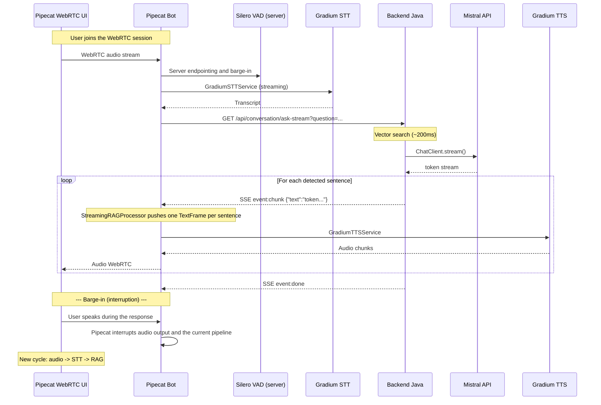
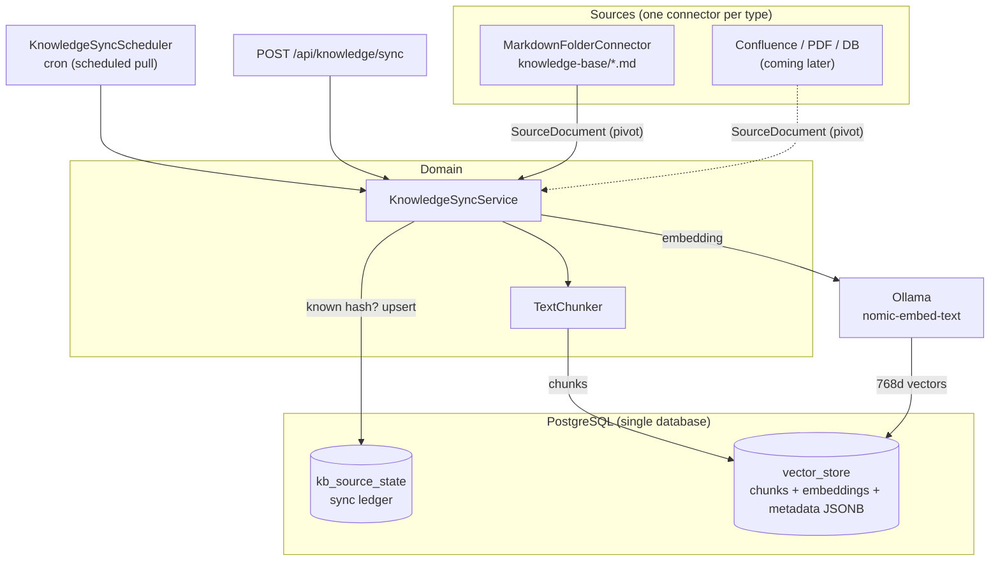

# Architecture — Voice Support Bot

## Overview

Voice Support Bot is an intelligent voice agent that answers customer support
questions in the Telecom/ISP domain. It uses the **RAG**
(Retrieval-Augmented Generation) pattern to provide factual answers based on an
internal knowledge base.

The architecture is **hybrid**:
- A **Java backend** (hexagonal) handles business logic, RAG, and administration
- A **Python Pipecat voice agent** orchestrates the real-time audio pipeline with Gradium (STT/TTS)
- A **Pipecat WebRTC** channel serves the target V1 web journey, with Twilio Media Streams for telephony
- The **React frontend + custom WebSocket bridge** remains available as a historical POC / fallback, but is no longer the target V1 path

The machine/VM target for an operator V1 pilot is detailed in
[`infra-v1.md`](infra-v1.md). The BSS integration plan and contract-compatible
mock are detailed in
[`bss-integration-plan.md`](../integrations/galaxion/bss-integration-plan.md).
Structuring decisions are tracked as ADRs in
[`adrs/`](adrs/).

## Architecture Diagram


> **Legend**: 🟢 = our code · 🔴 = external service

## Outbound Flows

The system calls the following external services:

| Flow | Protocol | Source → Destination | Content |
|------|-----------|---------------------|---------|
| **LLM Generation** | HTTPS (streaming) | `MistralLlmAdapter` → Mistral API | Prompt + RAG context → streamed tokens |
| **LLM Generation (alt)** | HTTP (streaming) | `OllamaLlmAdapter` → Ollama local :11434 | Prompt + context → streamed tokens |
| **Vector Search** | SQL (TCP :5433) | `PgVectorStoreAdapter` → PostgreSQL/pgvector | Query embedding → top-K HNSW chunks |
| **Embedding Generation** | HTTP | Spring AI → Ollama (nomic-embed-text) | Text → 768-dimensional vector |
| **STT Transcription** | Pipecat service / HTTPS | `agent/bot.py` → Gradium STT | WebRTC/Twilio audio → transcription |
| **TTS Synthesis** | Pipecat service / WSS | `agent/bot.py` → Gradium TTS | Text → audio stream |
| **RAG Query (streaming)** | HTTP SSE | `streaming_rag_processor.py` → Backend :8081 `/api/conversation/ask-stream` | Question → SSE token stream |
| **RAG Query (legacy fallback)** | HTTP POST | `bridge_server.py` → Backend :8081 `/api/conversation/ask` | Question → JSON response |
| **Greeting seed** | HTTP POST | `bot.py` → Backend :8081 `/api/conversation/seed` | Pipecat greeting stored in history to avoid greeting again |

## Responsibility Split

| Component | Language | Responsibility |
|-----------|---------|---------------|
| **Pipecat Web UI** | TypeScript / prebuilt | Target V1 WebRTC interface for the web voice journey |
| **Frontend React legacy** | TypeScript | WebSocket POC interface, browser VAD, audio queue playback, text streaming |
| **Voice Agent Pipecat** | Python | WebRTC/Twilio audio orchestration, STT/TTS via Gradium, server VAD, barge-in framework |
| **Custom legacy bridge** | Python | WebSocket POC/fallback path, Gradium STT/TTS, sentence splitting, SSE consumer |
| **Gradium** | Cloud API | STT (transcription) and TTS (speech synthesis) |
| **Backend Java** | Java (Spring Boot) | RAG, LLM streaming (SSE), business logic, escalation, admin |
| **Mistral AI** | Cloud API | LLM generation (default provider, streaming) |
| **Ollama** | Local | Local LLM inference (configurable alternative) |
| **PostgreSQL + pgvector** | — | Vector storage and similarity search |

## Domain Layer (Pure Java)

The domain contains **no Spring annotations**. It is testable with simple fakes.

LLM streaming also remains expressed in the domain language through
`TokenStream`. Spring AI/Reactor adapters convert their technical streams to
this abstraction before returning to the domain.

### Models

| Class | Role |
|--------|------|
| `Conversation` | Multi-turn dialog session (user/assistant history + current agent) |
| `Citation` | Reference to a knowledge-base passage (source, section, score) |
| `ConversationResponse` | Bot response (text + citations) |
| `ConversationEvent` | Tracking event (question, answer, latency, escalation) |
| `KnowledgeChunk` | Knowledge unit indexed in the vector store |
| `GuardrailResult` | Guardrail evaluation result (PASS, OFF_TOPIC, LOW_CONFIDENCE) |
| `AgentProfile` | Specialized agent profile (id, name, system prompt, KB domain, intent keywords) |
| `AgentRegistry` | Registry of available agents with lookup by id and default fallback |
| `SourceDocument` | **Pivot** format for a KB source document (sourceType, sourceId, title, url, content, domain, language, updatedAt, contentHash) — normalizes any heterogeneous source before ingestion |
| `ContentHash` | SHA-256 utility for normalized content (sync idempotency key) |
| `SyncReport` | Result of a KB sync (processed, ingested, skipped, deleted) |

### Services

| Service | Responsibility |
|---------|---------------|
| `ConversationOrchestrator` | Unified RAG pipeline (sync + streaming) with multi-agent routing: intent classification → domain-filtered vector search → generation with dynamic system prompt |
| `ConversationService` | Legacy synchronous RAG pipeline (still functional but replaced by the orchestrator) |
| `StreamingConversationService` | Legacy streaming RAG pipeline (replaced by the orchestrator) |
| `IntentClassifier` | Classifies the user's question to route it to the appropriate agent (keyword scoring with session stickiness) |
| `KnowledgeIngestionService` | One-off ingestion (upload `POST /ingest`): delegates chunking to `TextChunker` and indexes with a domain tag |
| `KnowledgeSyncService` | Idempotent **multi-source** sync: iterates through connectors, compares `contentHash` with the ledger (skip if unchanged), re-ingests modified documents (delete + re-chunk), removes disappeared documents (deletion diff) |
| `TextChunker` | Shared semantic chunking (paragraphs, size/overlap, section extraction) — reused by one-off ingestion and sync |
| `EscalationDetector` | Detects requests requiring human transfer |
| `GuardrailService` | Pre/post-search filter: off-topic (patterns) + low-confidence (score threshold) |
| `QueryReformulator` | Reformulates follow-up questions by including conversation context |

### IN Ports (Use Cases)

| Port | Implemented by |
|------|----------------|
| `AskQuestionUseCase` | `ConversationOrchestrator` |
| `IngestKnowledgeUseCase` | `KnowledgeIngestionService` |
| `SyncKnowledgeSourceUseCase` | `KnowledgeSyncService` |

### OUT Ports (Inverted Dependencies)

| Port | Contract | Adapters |
|------|---------|----------|
| `LlmPort` | Generate a complete response (blocking `.call()`) + variant with dynamic system prompt | `MistralLlmAdapter`, `OllamaLlmAdapter` |
| `LlmStreamingPort` | Stream response tokens (`TokenStream`) + variant with dynamic system prompt | `MistralLlmAdapter`, `OllamaLlmAdapter` |
| `VectorSearchPort` | Search relevant chunks (global or domain-filtered) | `PgVectorStoreAdapter` |
| `VectorStorePort` | Store a chunk (`store` legacy + `storeChunk` with metadata enriched from a `SourceDocument`) and delete by source (`deleteBySource`) | `PgVectorStoreAdapter` |
| `KnowledgeSourceConnector` | List `SourceDocument` entries from a source (`sourceType()` + `fetchAll()`) — one connector per source type | `MarkdownFolderConnector` (reference); Confluence/PDF/DB coming later |
| `KnowledgeSourceStatePort` | Sync ledger: known hash, upsert, id list, deletion | `JpaKnowledgeSourceStateAdapter` (`kb_source_state` table) |
| `ConversationEventStore` | Persist conversation events | `JpaConversationEventStore` in Docker runtime; `InMemoryConversationEventStore` for local/dev/tests |
| `ConversationStore` | Load/save session state (`load`/`save`) | `RedisConversationStore` in Docker runtime; `InMemoryConversationStore` for local/dev/tests |

> **Note**: Each LLM adapter implements **both ports** (`LlmPort` + `LlmStreamingPort`). A single Spring bean satisfies both interfaces.
> The `SpeechToTextPort` and `TextToSpeechPort` ports are no longer used on the Java side — STT/TTS are handled by the Python agent via Gradium.

## Processing Pipeline

### Multi-Agent Routing

```
User question
    │
    ▼
IntentClassifier.classify(question, currentAgentId)
    │
    ├─ Keyword score ≥ 1 → route to the agent with the best score
    │
    ├─ Score = 0 + current agent in session → stay on current agent (stickiness)
    │
    └─ Score = 0 + no current agent → fallback to default agent (support)
```

**Available agents:**

| Agent | KB domain | Trigger keywords (excerpt) |
|-------|-----------|------|
| **Technical support** | `support` | connection, wifi, router, speed, outage, indicator light, reset... |
| **Billing** | `billing` | invoice, payment, direct debit, price, subscription, cancellation... |
| **Sales** | `commercial` | subscribe, fiber, moving, number portability, option, TV, referral... |

### Text Mode (REST — Synchronous)

```
Client → POST /api/conversation/ask
         → ConversationOrchestrator.ask()
           → EscalationDetector.shouldEscalate()  [short-circuit if yes]
           → GuardrailService.checkBeforeSearch()  [greeting → direct response]
                                                   [off-topic → short-circuit]
           → IntentClassifier.classify()           [routing to agent]
           → QueryReformulator.reformulate()       [conversation context]
           → VectorSearchPort.searchRelevant(domain) [domain-filtered retrieval]
           → GuardrailService.checkAfterSearch()   [low-confidence → short-circuit]
           → LlmPort.generateAnswer(systemPrompt)  [generation with agent prompt]
           → ConversationEventStore.save()         [tracking]
         ← JSON { answer, citations, conversationId }
```

### Target V1 Voice Mode (Pipecat WebRTC — Optimized Pipeline)



**Perceived latency gain:** The user hears the first sentence in **~700ms**
instead of ~2.2s in sequential mode.

### Legacy WebSocket Protocol (React Frontend ↔ Bridge)

This protocol remains documented for the historical POC and fallback tests. The
V1 web target is the Pipecat WebRTC transport.

| Direction | Message | Format | When |
|-----------|---------|--------|-------|
| Client → | Audio | Binary (PCM 16kHz mono) | After end-of-speech detection (VAD) |
| Client → | End | Text `"END_OF_SPEECH"` | After sending the audio buffer |
| Client → | Interruption | Text `"BARGE_IN"` | User speaks while the bot is responding |
| Client → | Language | JSON `{"type":"set_language","language":"fr\|en"}` | Language toggle |
| → Client | Transcription | JSON `{"type":"transcription","text":"..."}` | After STT |
| → Client | Text chunk | JSON `{"type":"answer_chunk","text":"..."}` | Each sentence (streaming) |
| → Client | Sentence audio | Binary (WAV 16kHz mono) | After TTS for each sentence |
| → Client | Response end | JSON `{"type":"answer_done","text":"..."}` | End of complete generation |
| → Client | Language ack | JSON `{"type":"language_changed","language":"..."}` | After set_language |

### Target V1 Telephony Mode (Twilio Media Streams → Pipecat + Gradium)

The V1 target serves telephony through `agent/bot.py` and the Twilio transport
created by Pipecat (`create_transport`). WebRTC and Twilio share the same
pipeline: transport input → server VAD → Gradium STT → RAG SSE → Gradium TTS →
transport output.

```
Inbound phone call
  → Twilio → POST /api/twilio/voice (webhook on Java backend)
  ← TwiML <Response><Connect><Stream url="wss://.../ws/twilio"/></Connect></Response>

  → Twilio Media Streams → Pipecat Twilio transport
  → Silero server VAD
  → Gradium STT streaming → transcription
  → GET /api/conversation/ask-stream (SSE) → response streamed by sentence
  → Gradium TTS streaming
  → Pipecat Twilio transport → audio streamed to the caller
```

The `telephony.py`, `audio_codec.py`, `turn_detector.py`, `stt_streaming.py`,
and `bridge_server.py` modules remain useful for the legacy/fallback path and
low-level tests, but they no longer carry the V1 target.

## Chunking Strategy

`KnowledgeIngestionService` chunks documents semantically:

1. **Paragraph-based splitting** (`\n\n`) — respects logical boundaries
2. **Target size: 500 characters** — enough for coherent context
3. **Overlap: 50 characters** — ensures continuity between chunks
4. **Section extraction** — the Markdown heading `## ...` is propagated as metadata
5. **Domain tag** — each chunk is tagged with the agent domain (`support`, `billing`, `commercial`)

Each chunk is then:
- Transformed into a vector through `nomic-embed-text` (768 dimensions)
- Stored in pgvector with an HNSW index for fast search
- Annotated with its metadata (source, section, index, **domain**)
- Filterable by domain during vector search (through `FilterExpression`)

## Two Distinct AI Models: LLM (Generation) vs Embedding (Vectorization)

The system uses **two separate AI models**, which should not be confused:

| Role | Model (default) | Provider | When |
|------|-----------------|-------------|-------|
| **LLM / chat** (writes the response) | `mistral-small-latest` | **Mistral AI** (cloud API) | On every response generation |
| **Embedding** (text → vector) | `nomic-embed-text` (768 dim) | **Ollama** (local) | During ingestion (each chunk) AND on every request (the question) |

> The LLM provider is configurable (`voice-support.llm.provider`: `mistral-api` by default, `ollama` as an alternative). Embedding is currently **always** served by Ollama: `MistralAiEmbeddingAutoConfiguration` is excluded in `VoiceSupportApplication`. Moving embeddings to Mistral (`mistral-embed`, 1024 dim) would require changing `pgvector.dimensions`, recreating the `vector_store` table, and resynchronizing.

## Multi-Source Knowledge Base (Synchronization)

> Dedicated documentation: [`knowledge-base-technical.md`](../knowledge-base/knowledge-base-technical.md)
> (detailed architecture + connector-based extension) and
> [`knowledge-base-guide.md`](../knowledge-base/knowledge-base-guide.md) (writing/publishing
> content for non-dev contributors).

Beyond one-off upload (`POST /api/knowledge/ingest`), the KB is fed by **source
connectors** synchronized into a single **pivot** format (`SourceDocument`). This
makes it possible to add heterogeneous sources (Markdown, Confluence, PDF,
database) without touching the core.



**Sync loop (idempotent) per source:**

1. The connector returns all its `SourceDocument` entries (`fetchAll()`), each carrying a `contentHash` (SHA-256).
2. For each document: if the hash is identical to the ledger value → **skip** (no re-embed). Otherwise → `deleteBySource`, then re-chunk + re-store, and update the ledger.
3. **Deletion diff**: any `sourceId` present in the ledger but absent from the source is removed from the vector store and the ledger.

**Reference connector — `MarkdownFolderConnector`:** reads `knowledge-base/*.md`,
resolves `domain` from **YAML front matter** (`domain: billing`), `sourceId` =
filename, `updatedAt` = file modification date. It replaces manual `curl`
seeding.

**Storage:** everything lives in **a single Postgres** (image
`pgvector/pgvector`). The `vector_store` table (managed by Spring AI) stores
content + embeddings + metadata as **JSONB** (so enriching metadata requires no
`ALTER`). The `kb_source_state` table (JPA, Hibernate `ddl-auto: update`) stores
only sync accounting (hash, counters), not content.

**Scheduling:** `KnowledgeSyncScheduler` runs `syncAll()` via cron
(`voice-support.knowledge.sync-cron`, hourly by default). Setting
`KB_SYNC_CRON=-` disables scheduled sync.

## Escalation Detection

`EscalationDetector` is a pure domain component that short-circuits the RAG pipeline:

```
User question
    │
    ▼
EscalationDetector.shouldEscalate()
    │
    ├─ YES → predefined message + event escalated=true + STOP
    │
    └─ NO → normal RAG pipeline
```

Trigger keywords: cancellation, complaint, refund, technician, GDPR, hacking,
explicit frustration.

Escalation is **instantaneous** (<1ms) because it goes through neither the vector
store nor the LLM.

## Conversation Memory Management

Session state is accessed through the `ConversationStore` port (`load(id)` /
`save(id, conversation)`), which makes `ConversationOrchestrator` **stateless at
the JVM level**: it no longer keeps an internal map. The history of the last 6
turns is injected into the LLM prompt to preserve multi-turn coherence.

In local/dev/test, in-memory adapters remain available by default so the system
can start without infrastructure. In Docker runtime, `CONVERSATION_STORE=redis`
and `CONVERSATION_EVENT_STORE=jpa` respectively activate
`RedisConversationStore` for active sessions and `JpaConversationEventStore` for
durable events. The explicit `load` → mutation → `save` pattern remains
compatible with a distributed store without depending on in-memory reference
identity.

## Latency Budget

### Streaming Mode (Optimized Pipeline — Production)

| Step | Time | Component | Perceived impact |
|-------|-------|-----------|-------------|
| Gradium STT (REST batch) | ~200ms | Voice Agent | Blocking |
| Vector search (pgvector HNSW) | ~200ms | Java Backend | Blocking |
| LLM first token (Mistral API) | ~150ms | Java Backend → Mistral | Blocking |
| Sentence detection | ~100ms | Voice Agent (splitter) | Token accumulation |
| TTS first sentence | ~200ms | Voice Agent → Gradium | |
| **First audible sentence** | **~700ms** | | |
| Complete LLM response (total) | ~1200ms | Java Backend → Mistral | In parallel with TTS |
| TTS all sentences | ~400ms | Voice Agent → Gradium | Sequential per sentence |

### Synchronous Mode (Fallback / Text Mode)

| Step | Time | Component |
|-------|-------|-----------|
| Gradium STT | ~200ms | Voice Agent |
| Vector search | ~200ms | Java Backend |
| Complete LLM response (Mistral API) | ~1200ms | Java Backend |
| Gradium TTS (full text) | ~300ms | Voice Agent |
| **Total** | **~1.9s** | |

## Configuration LLM

The LLM provider is configurable through `voice-support.llm.provider`:

| Provider | Value | Streaming | First-token latency | Usage |
|----------|--------|-----------|--------------------|----|
| **Mistral API** (default) | `mistral-api` | Yes (SSE) | ~150ms | Production |
| Ollama local | `ollama` | Yes (SSE) | ~500ms | Offline development |

Both adapters implement `LlmPort` (blocking) and `LlmStreamingPort`. The domain
exposes a `TokenStream`; adapters may use Reactor or the provider's streaming
API internally, but that dependency does not cross the port.

## Extensibility

### Replacing the LLM

To add a new LLM provider (for example OpenAI):

1. Create `OpenAILlmAdapter implements LlmPort, LlmStreamingPort` in `adapter/out/llm/`
2. Add a conditional `@Bean` in `DomainServiceConfig` (for example `@ConditionalOnProperty`)
3. Add configuration in `application.yml`
4. No domain change required

### Replacing Gradium (STT/TTS)

Modify `voice-agent/agent/gradium_stt.py` and `gradium_tts.py` to call another
provider. The internal contract (functions `transcribe_audio()` and
`synthesize_speech()`) remains the same.

### Adding a Transport

The bridge server handles browser clients (ws:8765, PCM 16kHz) and Twilio Media
Streams telephony (ws:8766, μ-law 8kHz) through two WebSocket servers launched
together in `main()`. Both channels share the same pipeline (turn detector + STT
streaming + RAG SSE + TTS); only the audio format (`pcm_16000` vs `ulaw_8000`)
and envelope protocol (WAV binary vs Twilio JSON media frames) differ. To add a
new transport (for example native SIP, LiveKit), create a dedicated WebSocket
handler that reuses `create_stt_session(...)`, `TurnDetector`, and
`synthesize_speech(...)` with the correct `output_format`.

## Architecture Decisions

The canonical architecture decisions are the formal ADRs in [`adrs/`](adrs/).
This page no longer maintains inline ADRs to avoid numbering conflicts and
contradictory decisions.

The former inline ADRs from this page were migrated as follows:

| Former inline ADR | Status in the formal registry |
|---|---|
| ADR-001 Modular pipeline rather than Realtime API | Covered by [ADR-0012](adrs/ADR-0012-modular-voice-pipeline-over-realtime-api.md) |
| ADR-002 Gradium for STT/TTS via Pipecat | Covered by [ADR-0002](adrs/ADR-0002-pipecat-gradium-target-voice-path.md) |
| ADR-003 Hybrid Java + Python architecture | Covered by [ADR-0001](adrs/ADR-0001-java-backend-owns-conversation-domain.md), [ADR-0002](adrs/ADR-0002-pipecat-gradium-target-voice-path.md), and [ADR-0012](adrs/ADR-0012-modular-voice-pipeline-over-realtime-api.md) |
| ADR-004 In-memory event store rather than JPA | Superseded by [ADR-0008](adrs/ADR-0008-redis-active-sessions-postgres-durable-events.md) |
| ADR-005 Inter-step streaming | Covered by [ADR-0013](adrs/ADR-0013-tokenstream-and-backend-sse-streaming-contract.md) |
| ADR-006 Legacy browser VAD | Covered as a legacy path by [ADR-0016](adrs/ADR-0016-legacy-bridge-is-fallback-and-comparison-path.md) |
| ADR-007 Guardrails | Covered by [ADR-0014](adrs/ADR-0014-domain-guardrails-before-and-after-rag.md) |
| ADR-008 Multi-agent routing | Covered by [ADR-0015](adrs/ADR-0015-keyword-routing-with-session-stickiness.md) |
| ADR-009 Custom bridge latency optimization | Covered as a legacy path by [ADR-0016](adrs/ADR-0016-legacy-bridge-is-fallback-and-comparison-path.md) |
| ADR-010 Pipecat V1 target | Covered by [ADR-0002](adrs/ADR-0002-pipecat-gradium-target-voice-path.md) |
| ADR-011 Multi-source KB ingestion | Covered by [ADR-0007](adrs/ADR-0007-source-document-knowledge-sync.md) |
