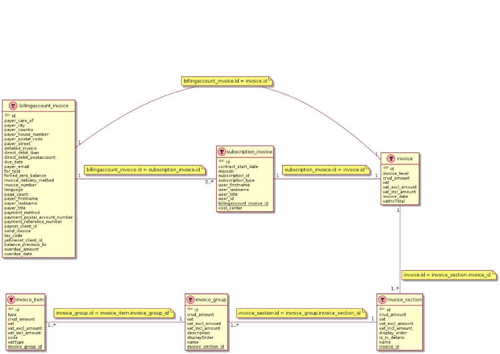

# BSS Billing Module — Data Model (reference)

## Objective

Capture the **real BSS billing-module data model** shared by the BSS owner
(2026-09-08) so the V1 billing domain (`Invoice`, `InvoiceLine`,
`InvoiceComparison`, `BillingCause`, `Evidence`), the invoice-extraction contract
(`invoice-extraction-json.md`) and the deterministic comparison engine are grounded
in the actual structure instead of guessed shapes.

This is an **input document**: it records what the diagram shows and marks every
unknown as an open point. It does **not** assert an access method — whether these
tables are queryable read-only (and via which `billing-api` route) is an open
question (OQ-003).

> Source of truth for access routing stays `bss-integration-plan.md` and
> `galaxion-billing-contracts.md`. This document only describes the **shape** of the
> billing data.

## Source

Entity-relationship diagram of the BSS billing module (real model), provided by
the BSS owner on 2026-09-08.



## Entities

### `invoice` (hierarchy root)

The polymorphic root of the invoice line hierarchy.

| Field | Notes |
|-------|-------|
| `id` | PK; shared 1:1 with either `billingaccount_invoice.id` or `subscription_invoice.id` |
| `invoice_level` | discriminates the header level (billing-account vs subscription) |
| `crud_amount` | amount (semantics to confirm — see open points) |
| `vat` | tax value/rate (to confirm) |
| `vat_excl_amount` | tax-excluded amount |
| `vat_incl_amount` | tax-included amount |
| `invoice_date` | invoice date |
| `vatIncTotal` | tax-included total |

### `billingaccount_invoice` (account-level header)

Payer, address, payment and balance information. 1:1 with `invoice`
(`billingaccount_invoice.id = invoice.id`).

Notable fields: `invoice_number`, `due_date`, `payer_*` (care_of, title, firstname,
lastname, street, house_number, postal_code, city, country, email),
`invoice_delivery_method`, `detailed_invoice`, `language`, `page_count`,
`payment_method`, `payment_postal_account_number`, `payment_reference_number`,
`direct_debit_iban`, `direct_debit_postaccount`, `paynet_client_id`,
`yellownet_client_id`, `tax_code`, `send_invoice`, `for_test`,
`forced_zero_balance`, **`balance_previous_bc`**, **`overdue_amount`**,
**`overdue_date`**.

### `subscription_invoice` (subscription-level header)

Per-subscription header. 1:1 with `invoice` (`subscription_invoice.id = invoice.id`)
and linked to an account via `billingaccount_invoice_id` (one account → **0..\***
subscriptions).

Notable fields: `msisdn`, `subscription_id`, `subscription_type`,
`contract_start_date`, `user_title`, `user_firstname`, `user_lastname`, `user_id`,
`billingaccount_invoice_id`, `cost_center`.

### `invoice_section` (level 1 of the line tree)

| Field | Notes |
|-------|-------|
| `id` | PK; `invoice_id` FK → `invoice.id` |
| `crud_amount`, `vat`, `vat_excl_amount`, `vat_incl_amount` | section-level amounts |
| `display_order` | presentation order |
| `is_in_details` | whether the section belongs to the detailed breakdown |
| `name` | section label |

### `invoice_group` (level 2)

| Field | Notes |
|-------|-------|
| `id` | PK; `invoice_section_id` FK → `invoice_section.id` |
| `crud_amount`, `vat`, `vat_excl_amount`, `vat_incl_amount` | group-level amounts |
| `description`, `name`, `displayOrder` | labels / presentation order |

### `invoice_item` (level 3 — the actual billed line)

| Field | Notes |
|-------|-------|
| `id` | PK; `invoice_group_id` FK → `invoice_group.id` |
| `type` | line type (classifier — value set to confirm) |
| `code` | product/charge code (classifier — value set to confirm) |
| `vatType` | tax type (classifier — value set to confirm) |
| `crud_amount`, `vat`, `vat_excl_amount`, `vat_incl_amount` | line-level amounts |

## Relationships

```text
billingaccount_invoice 1───1 invoice          (billingaccount_invoice.id = invoice.id)
subscription_invoice   1───1 invoice          (subscription_invoice.id   = invoice.id)
billingaccount_invoice 1───0..* subscription_invoice
                                               (via subscription_invoice.billingaccount_invoice_id)

invoice          1───1..* invoice_section      (invoice.id          = invoice_section.invoice_id)
invoice_section  1───1..* invoice_group        (invoice_section.id   = invoice_group.invoice_section_id)
invoice_group    1───1..* invoice_item         (invoice_group.id     = invoice_item.invoice_group_id)
```

The line detail is therefore a **4-level tree** with monetary amounts at every
level, which allows a deterministic roll-up: `invoice_item` → `invoice_group` →
`invoice_section` → `invoice`.

## Mapping to the V1 billing domain

| V1 target (TASK-BE-038) | BSS source |
|-------------------------|-----------|
| `Invoice` | `invoice` + header (`billingaccount_invoice` or `subscription_invoice`, by `invoice_level`) |
| `InvoiceLine` | `invoice_item` (carrying its `invoice_group` / `invoice_section` context) |
| grouping for presentation | `invoice_section` → `invoice_group` (`name`, `display_order`, `is_in_details`) |
| `BillingCause` | derived from `invoice_item.type` + `code` + `vatType` (needs a code→cause catalogue) |
| `Evidence` | the structured line itself (traceable); PDF is the fallback evidence path |
| monetary inputs | `crud_amount`, `vat_excl_amount`, `vat_incl_amount`, `vat`, `vatIncTotal` |

## Impact on the strategy (structured source vs PDF — OQ-003 / ADR-0005)

This model exposes **line-level invoice detail in a structured form** (the
`invoice → section → group → item` tree with amounts). This is exactly the OQ-003
sub-question *"whether any structured invoice-line endpoint can replace PDF
extraction later"*.

If this billing model is reachable **read-only** (e.g. through `billing-api`), then
the deterministic comparison engine can consume structured lines **directly**, and
**PDF extraction (ADR-0005) becomes a fallback rather than the primary evidence
path** — a significant reliability gain (no fragile PDF parsing on the critical
path). This does **not** overturn ADR-0005; it records a candidate that could make
the extractor secondary. The decision is deferred until the access route and the
field semantics below are confirmed.

## Open Points (to confirm with the BSS owner)

1. **Access route (blocking for the structured-source option):** are these tables
   exposed read-only, and via which `billing-api` route(s)? Or are they internal
   billing storage only (in which case PDF stays the evidence path)?
2. **Amount semantics:** prices are **tax-included (TTC)** — confirmed by the BSS
   owner 2026-09-09 → the customer-facing comparison basis is `vat_incl_amount` /
   `vatIncTotal` (aligns with `invoice-extraction-json.md` `basis: tax_included`);
   `vat_excl_amount` / `vat` are kept for audit. Still pending: the **unit** (euros
   vs cents) to map onto the extraction contract's integer-cents convention, and
   **what `crud_amount` means** (raw/gross? before discount?).
3. **Line classifier catalogue:** the full value sets of `invoice_item.type`,
   `code` and `vatType`, and how each maps to a V1 business cause (discount expiry,
   overage, option change, proration, tax, one-off fee, adjustment).
4. **Discounts / proration representation:** negative `invoice_item` lines, a
   dedicated `type`/`code`, or a section-level reduction?
5. **Period / invoice enumeration:** how to list the comparable invoices for one
   account (the two latest periods) — via `invoice_date`, `invoice_number`, or a
   bill-run identifier? No explicit billing-period entity is visible here.
6. **Previous balance / overdue:** confirm that `balance_previous_bc`,
   `overdue_amount` must be **excluded** from the period-line comparison (they are
   carry-over, not current-period charges).

## Related Documents

- `docs/integrations/galaxion/bss-integration-plan.md` (access routing, microservices)
- `docs/integrations/galaxion/galaxion-billing-contracts.md` (billing-api contracts)
- `docs/integrations/galaxion/invoice-extraction-json.md` (extraction JSON contract)
- `docs/integrations/galaxion/missing-inputs.md` (inputs to request)
- `docs/architecture/adrs/ADR-0004-bss-integration-through-typed-domain-ports.md`
- `docs/architecture/adrs/ADR-0005-invoice-pdf-extraction-before-llm-explanation.md`
- `product-backlog/open-questions/v1-open-questions.md` (OQ-003)
