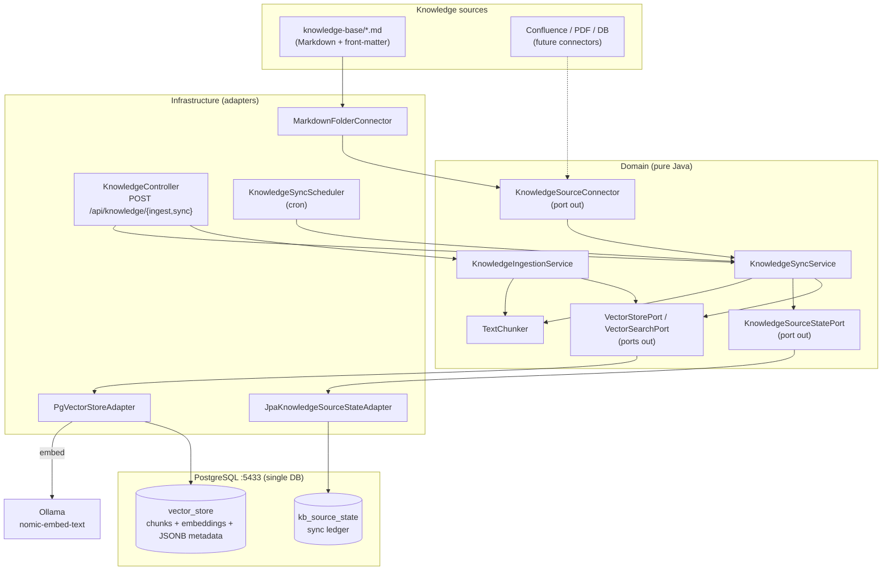
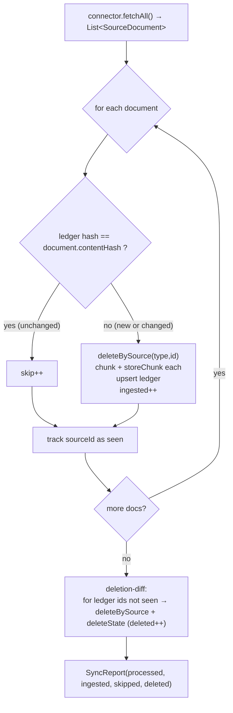

# Knowledge Base — Technical Documentation

> Audience: backend developers and architects.
> For a non-technical guide on **adding and editing content**, see
> [`knowledge-base-guide.md`](./knowledge-base-guide.md).

> **Branch state (`feat/restart-from-scratch`, 2026-07-10):** this document
> describes the **target** KB/RAG architecture as implemented on the `main`
> reference. **None of it runs on this branch** — there is no Java backend, no
> `pgvector`, no Ollama embeddings, no `KnowledgeSyncService`/`KnowledgeController`
> and no `ConversationOrchestrator` here. The only code on this branch is the
> Python STT-validation slice. Present-tense wording below ("the bot answers…",
> "embeddings are served by Ollama today", `cd backend && mvn test`,
> `POST /api/knowledge/sync`) refers to the target/`main` system, not this checkout.

This document describes how the bot's Knowledge Base (KB) works: its
architecture, the data model, the ingestion and synchronization pipelines, the
storage layout, and how to extend it with new content sources.

---

## 1. What the KB is

The bot answers questions using **Retrieval-Augmented Generation (RAG)**. Raw
knowledge (FAQ documents) is split into **chunks**, each chunk is turned into a
**vector embedding**, and the vectors are stored in PostgreSQL (`pgvector`). At
query time the user question is embedded the same way and the closest chunks are
retrieved and injected into the LLM prompt as context.

The KB never "trains" the model. It is a searchable index that grounds the LLM's
answers in approved content, which is what keeps answers accurate and on-topic.

For billing explanations, the KB is explanatory context only: tariff rules,
offer descriptions, support procedures, and wording guidance. Invoice amounts,
line deltas, discounts, usage, and billing events must come from BSS evidence or
deterministic invoice PDF extraction, not from retrieved KB passages.

### Two distinct AI models

The system uses **two different models** with different roles. Do not confuse
them.

| Role | Model | Provider | When it runs |
|------|-------|----------|--------------|
| **Generation** (text → answer) | `mistral-small-latest` (default) or a local Ollama chat model | Mistral API (default) / Ollama | On every answered question |
| **Embedding** (text → vector) | `nomic-embed-text` (768 dimensions) | **Ollama (local)** | At ingestion (each chunk) **and** on every query (the question) |

- The generation provider is configurable via `voice-support.llm.provider`
  (`mistral-api` default, `ollama` alternative).
- Embeddings are **always** served by Ollama today. `MistralAiEmbeddingAutoConfiguration`
  is excluded at startup. Switching embeddings to Mistral (`mistral-embed`, 1024
  dim) would require changing `pgvector.dimensions` and recreating the
  `vector_store` table, then re-syncing everything.

---

## 2. Architecture overview

The KB follows the project's **hexagonal architecture** (ports & adapters). The
domain layer is pure Java with no Spring annotations; Spring beans are wired in
`DomainServiceConfig`.



### Key classes

| Class | Layer | Responsibility |
|-------|-------|----------------|
| `SourceDocument` | domain/model | **Pivot format** for any source document (normalizes heterogeneous sources before ingestion) |
| `ContentHash` | domain/model | SHA-256 of the content — the idempotency key for sync |
| `SyncReport` | domain/model | Result of a sync run (`processed`, `ingested`, `skipped`, `deleted`) |
| `KnowledgeSourceConnector` (port) | domain/port/out | Lists `SourceDocument`s for one source type (`sourceType()` + `fetchAll()`) |
| `KnowledgeSourceStatePort` (port) | domain/port/out | Sync ledger access (known hash, upsert, list ids, delete) |
| `VectorStorePort` (port) | domain/port/out | Write side: `storeChunk(...)`, `deleteBySource(...)`, legacy `store(...)` |
| `VectorSearchPort` (port) | domain/port/out | Read side: `searchRelevant(query, topK[, domain])` |
| `KnowledgeSyncService` | domain/service | Idempotent multi-source synchronization |
| `KnowledgeIngestionService` | domain/service | One-shot upload ingestion (`POST /ingest`) |
| `TextChunker` | domain/service | Shared semantic chunking + section extraction |
| `MarkdownFolderConnector` | infra/adapter/out/source | Reference connector reading `knowledge-base/*.md` |
| `JpaKnowledgeSourceStateAdapter` | infra/adapter/out/persistence | Ledger backed by `kb_source_state` table |
| `PgVectorStoreAdapter` | infra/adapter/out/vectorstore | Implements both vector ports over Spring AI `VectorStore` |
| `KnowledgeSyncScheduler` | infra/scheduler | Cron-triggered `syncAll()` |
| `KnowledgeController` | infra/adapter/in/rest | REST entry points |

---

## 3. The pivot model: `SourceDocument`

Every source — Markdown today, Confluence/PDF/DB tomorrow — is normalized into a
single canonical record before it touches the rest of the pipeline:

```java
public record SourceDocument(
        String sourceType,   // e.g. "markdown" — identifies the connector
        String sourceId,     // stable id within the source (e.g. file name)
        String title,
        String url,          // optional deep link back to the source
        String content,      // the full raw text to be chunked
        String domain,       // routing domain (defaults to "general")
        String language,
        Instant updatedAt,
        String contentHash   // SHA-256 of content — set by create(...)
) { ... }
```

`SourceDocument.create(...)` computes the `contentHash` and defaults `domain` to
`"general"` when none is provided. The `(sourceType, sourceId)` pair is the
**primary identity** of a document across the whole pipeline (used by the ledger
and for deletion).

---

## 4. Ingestion paths

There are **two ways** content enters the vector store. They share `TextChunker`
and the same `vector_store` table, but serve different purposes.

### 4.1 One-shot upload — `KnowledgeIngestionService`

`POST /api/knowledge/ingest` (multipart file upload). Use for ad-hoc indexing of
a single document. It does **not** record anything in the sync ledger, so it is
not idempotent across re-uploads — re-uploading the same file adds new chunks.

```
POST /api/knowledge/ingest
  file=<the document>
  source=<optional logical name, defaults to filename>
  domain=<optional, defaults to "general">
→ { "status": "ingested", "source": "...", "domain": "...", "chunks_created": N }
```

### 4.2 Multi-source sync — `KnowledgeSyncService` (recommended)

`POST /api/knowledge/sync` (all sources) or `POST /api/knowledge/sync/{sourceType}`
(one source). Also runs automatically on a cron. This is the **idempotent**,
self-healing path and the recommended way to manage KB content.

---

## 5. The synchronization loop

`KnowledgeSyncService.syncConnector(...)` runs per connector:



Properties:

- **Idempotent.** Re-running a sync with no content changes produces
  `ingested=0` (everything is `skipped`) and makes no writes to `vector_store`.
- **Change detection** is by `contentHash` (SHA-256 of `content`), compared
  against the value stored in the ledger for `(sourceType, sourceId)`.
- **Re-ingest = delete + re-chunk.** A changed document first has all its old
  chunks removed via `deleteBySource(sourceType, sourceId)`, then is re-chunked
  and re-stored. This avoids stale/duplicate chunks.
- **Deletion-diff.** Any `sourceId` present in the ledger but absent from
  `fetchAll()` is removed from both `vector_store` and the ledger. Deleting a
  source document (or renaming a Markdown file) therefore cleans itself up.

---

## 6. Chunking — `TextChunker`

`TextChunker(chunkSize, chunkOverlap)` (configured at 500 / 50):

1. Splits content on blank lines (`\n\n+`) into paragraphs.
2. Greedily packs paragraphs into a chunk until adding the next would exceed
   `chunkSize`, then starts a new chunk carrying a `chunkOverlap`-char tail of
   the previous one for context continuity.
3. For each chunk, `section` is the first Markdown heading (`#` / `##`) found
   inside it, falling back to the previously seen section (or `"default"`).

The `section` becomes part of each chunk's metadata and is surfaced in citations,
so **headings matter** for traceability.

---

## 7. Storage layout

Everything lives in **one PostgreSQL instance** (`pgvector/pgvector` image, port
`5433`).

### `vector_store` (managed by Spring AI)

Stores content + embedding + metadata as **JSONB**. Because metadata is JSONB,
enriching metadata requires **no schema migration / no `ALTER`**. Index: HNSW;
distance: cosine; dimensions: 768.

Metadata written by `PgVectorStoreAdapter.storeChunk(...)`:

| Key | Source |
|-----|--------|
| `source` | `SourceDocument.sourceId` (also surfaced as the citation source) |
| `section` | chunk section (heading) |
| `chunk_index` | position of the chunk within the document |
| `domain` | routing domain |
| `source_type` | connector type — used by `deleteBySource` |
| `source_id` | stable id — used by `deleteBySource` |
| `content_hash` | document hash at write time |
| `title`, `url`, `language`, `updated_at` | added when present |

### `kb_source_state` (JPA, the sync ledger)

Composite primary key `(source_type, source_id)`. Holds **only sync bookkeeping**,
never content:

| Column | Meaning |
|--------|---------|
| `source_type`, `source_id` | document identity (PK) |
| `content_hash` | last ingested hash (drives skip/re-ingest) |
| `updated_at` | document timestamp at last sync |
| `chunk_count` | number of chunks produced |

Schema is created by Hibernate (`spring.jpa.hibernate.ddl-auto: update`).

---

## 8. Retrieval at query time

`PgVectorStoreAdapter.searchRelevant(query, topK, domain)`:

- `topK = 5`, `similarityThreshold = 0.5`.
- If a `domain` is given, results are filtered to
  `domain == <agentDomain> OR domain == "general"`. Content tagged `general` is
  therefore visible to **every** agent; domain-specific content is scoped to its
  agent. (A `null` domain means no filter.)
- Each result becomes a `Citation(source, section, relevantText, score)`.

The retrieved chunks feed `ConversationOrchestrator`'s RAG prompt. See
[`architecture.md`](../architecture/architecture.md) for the full conversation pipeline,
guardrails, and multi-agent routing.

---

## 9. Scheduling

`KnowledgeSyncScheduler.scheduledSync()` calls `syncAll()` on a cron:

```
voice-support.knowledge.sync-cron   (default: "0 0 * * * *" — top of every hour)
```

Failures are caught and logged (`[KB-SYNC] scheduled sync failed: ...`); a bad
run never crashes the app. Set `KB_SYNC_CRON=-` to disable scheduled sync (manual
/REST sync still works).

---

## 10. REST API

| Method & path | Body / params | Returns |
|---------------|---------------|---------|
| `POST /api/knowledge/ingest` | multipart `file`, optional `source`, `domain` | `{status, source, domain, chunks_created}` |
| `POST /api/knowledge/sync` | — | `SyncReport` for all connectors |
| `POST /api/knowledge/sync/{sourceType}` | path `sourceType` (e.g. `markdown`) | `SyncReport` for that source |

`SyncReport` JSON: `{ "processed": N, "ingested": N, "skipped": N, "deleted": N }`.

Example:

```bash
# Sync all sources
curl -X POST http://localhost:8081/api/knowledge/sync

# Sync only the Markdown connector
curl -X POST http://localhost:8081/api/knowledge/sync/markdown
```

---

## 11. Configuration reference

All keys live under `voice-support.knowledge` in `application.yml`:

| Key | Env var | Default | Purpose |
|-----|---------|---------|---------|
| `chunk-size` | — | `500` | Max characters per chunk |
| `chunk-overlap` | — | `50` | Overlap characters between consecutive chunks |
| `markdown-path` | `KB_MARKDOWN_PATH` | `../knowledge-base` | Folder scanned by `MarkdownFolderConnector` |
| `default-language` | `KB_DEFAULT_LANGUAGE` | `fr` | Language tag applied to Markdown docs |
| `sync-cron` | `KB_SYNC_CRON` | `0 0 * * * *` | Scheduled sync cron (`-` to disable) |

Related vector store / model keys: `spring.ai.vectorstore.pgvector.*`
(dimensions 768, HNSW, cosine), `spring.ai.ollama.embedding.model`
(`nomic-embed-text`), `voice-support.llm.provider`.

---

## 12. Extending: adding a new source connector

The pipeline is source-agnostic. To add a new source (e.g. Confluence):

1. **Implement `KnowledgeSourceConnector`** in
   `infrastructure/adapter/out/source/`:
   - `sourceType()` returns a unique string (e.g. `"confluence"`).
   - `fetchAll()` returns `List<SourceDocument>` — call
     `SourceDocument.create(...)` so the `contentHash` is computed consistently.
   - Choose a **stable `sourceId`** per document (page id, file path, primary
     key). Stability is what lets the sync detect changes vs. recreations.
2. **Register it as a `@Bean`** in `DomainServiceConfig`. `KnowledgeSyncService`
   receives `List<KnowledgeSourceConnector>` by injection, so the new connector
   is picked up by `syncAll()` automatically.
3. **No other changes needed.** The ledger, chunking, vector store, deletion-diff
   and `POST /api/knowledge/sync/{sourceType}` all work generically.

Guidelines:
- Map a meaningful `domain` (`support` / `billing` / `commercial` / `general`)
  so retrieval routing works; default to `general` when unsure.
- Keep `fetchAll()` resilient: log and skip individual unreadable documents
  rather than failing the whole sync (see `MarkdownFolderConnector.toDocument`).
- Populate `url` when the source has a canonical link — it flows into chunk
  metadata for traceability.

---

## 13. Testing

- `KnowledgeSyncServiceTest` — sync logic: skip-unchanged, re-ingest-changed,
  deletion-diff, multi-connector aggregation (manual fakes, no Mockito).
- `TextChunkerTest` — splitting, overlap, section extraction.
- `MarkdownFolderConnectorTest` — front-matter parsing, missing folder, etc.

Run: `cd backend && mvn test`.

---

## 14. Design decisions (see `../architecture/adrs/` for the full ADRs)

- **ADR-0007 — multi-source ingestion.** A pivot `SourceDocument` + per-source
  connectors + an idempotent sync ledger decouple the core from any specific
  source, enabling staged addition of Confluence/PDF/DB connectors without
  touching the RAG pipeline.
- **Single Postgres for vectors and ledger.** Co-locating `vector_store` and
  `kb_source_state` keeps operations simple; JSONB metadata avoids migrations.
- **Embeddings on Ollama.** Local, free, and decoupled from the chat provider;
  the dimension (768) is pinned to `nomic-embed-text`.
