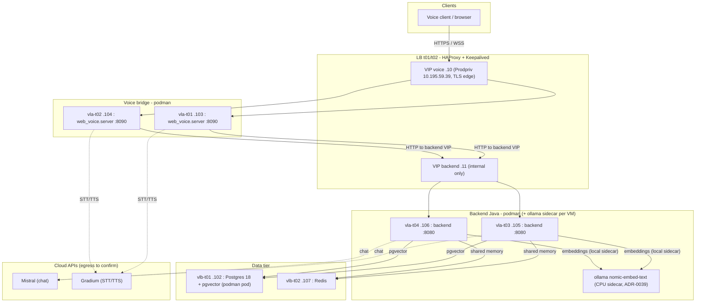

# Deployment - eir-ai4cc-tst pilot environment

Concrete deployment reference for the first remote environment,
**eir-ai4cc-tst** (Rocky Linux EL9, cloud-provisioner). This document is the
operational source of truth for the environment inventory, the component-to-VM
mapping, ports, and the configuration/secrets each tier needs. Architecture
rationale lives in
[`ADR-0038`](../architecture/adrs/ADR-0038-pilot-deployment-architecture-eir-ai4cc-tst.md);
the generic target topology lives in
[`../architecture/infra-v1.md`](../architecture/infra-v1.md).

> Status: environment provisioned (2026-08-03). Remaining inputs are tracked with
> owner + status + gate in [Open inputs needed](#open-inputs-needed) (TASK-INFRA-006):
> all self-owned items are closed; the residual gates are platform-owned. Sprint 11
> (`product-backlog/sprints/sprint-11-remote-deployment.md`) delivers the images,
> compose stacks, HAProxy config, Redis-backed memory, CI and release process.

## Topology



## Network

- Tenant subnet: `192.168.0.0/24` (`EIR-AI4CC-SUBNET`).
- Gateways: Internet `.1`, Prodpriv `.254`, Admin `.253`.
- Exposure per VM: Admin (`VL1422` / `.mt.lan`) and/or Prodpriv (`VL2909` / `.prod.lan`).
- SSH access: `ssh grimaud@<hostname>.prod.lan` then `sudo su -` (public key for
  `thomas.grimaud` is installed on all VMs).
- Ingress flows opened on the Prodpriv network (VLAN 2909, flow request 2026-08-13),
  from two client sources — `10.195.80.81` (`EXT_H_NAT-ITSF-Nice_Users`) and
  `10.195.29.11` (`EXT_H_NAT-ITSF-WireguardUsr`, VLAN 456):
  - **SSH `:22/TCP`** to every VM's Prod IP (`10.195.x.x`, see the VM inventory) — the
    control node running Ansible must sit behind one of these sources (Nice office NAT
    or the Wireguard VPN).
  - **HTTPS/HTTP `:443` + `:80` TCP** to the voice VIP `vip-ai4cc-voice-t01`
    (`10.195.59.39`).
  - ⚠️ **TCP only.** The WebRTC **media is UDP** (RTP/SRTP, peer-to-peer to a bridge) and
    is **not** in this request — remote-client audio still needs UDP media flows to the
    bridges' Prod IPs **and** a TURN relay (open input #12), not just these TCP flows.
    The media flow request (TURN-relay option + direct-candidate fallback) and the
    Genesys Audio Connector note are in
    [`flow-requests-eir-ai4cc-tst.md`](flow-requests-eir-ai4cc-tst.md).

## VIPs

| VIP | Private IP | Prod IP | Exposure | Usage | Target port |
|-----|-----------|---------|----------|-------|-------------|
| `vip-ai4cc-voice-t01` | `192.168.0.10` | `10.195.59.39` | Prodpriv | Voice bridge LB (t01/t02), TLS edge | `:443` (TLS) → bridge `:8090` |
| `vip-ai4cc-backend-t01` | `192.168.0.11` | - | Internal only | Backend Java LB (t03/t04) | `:8080` → backend `:8080` |

> Ports finalized in TASK-INFRA-002: voice VIP terminates TLS on `:443` and
> proxies to the bridges on `:8090`; backend VIP proxies `:8080` → `:8080`.
> HAProxy/Keepalived config: [`deploy/haproxy/`](../../deploy/haproxy/). Note:
> HAProxy carries only the WebRTC **signaling** (HTTPS) + UI; the RTP/SRTP
> **media** is UDP and peer-to-peer to the answering bridge (needs STUN/TURN,
> open input), not proxied.

## VM inventory

| Role | Hostname | Flavor (vCPU/RAM/disk) | Private IP | Admin IP | Prod IP | AZ |
|------|----------|------------------------|-----------|----------|---------|----|
| LB / HAProxy | `vlp-ai4cc-t01.prod.lan` | 1/2/20 | `192.168.0.100` | `172.23.16.244` | `10.195.56.56` | costa-dc1 |
| LB / HAProxy | `vlp-ai4cc-t02.prod.lan` | 1/2/20 | `192.168.0.101` | `172.23.16.137` | `10.195.56.147` | fontvieille-dc3 |
| PostgreSQL 18 (+ pgvector) | `vlb-ai4cc-t01.prod.lan` | 4/16/160 | `192.168.0.102` | `172.23.18.103` | `10.195.58.234` | costa-dc1 |
| Voice bridge | `vla-ai4cc-t01.prod.lan` | 2/4/40 | `192.168.0.103` | `172.23.18.131` | `10.195.59.127` | costa-dc1 |
| Voice bridge | `vla-ai4cc-t02.prod.lan` | 2/4/40 | `192.168.0.104` | `172.23.16.102` | `10.195.56.240` | fontvieille-dc3 |
| Backend Java | `vla-ai4cc-t03.prod.lan` | 4/8/80 | `192.168.0.105` | `172.23.19.87` | `10.195.56.102` | costa-dc1 |
| Backend Java | `vla-ai4cc-t04.prod.lan` | 4/8/80 | `192.168.0.106` | `172.23.16.59` | `10.195.56.39` | fontvieille-dc3 |
| Redis | `vlb-ai4cc-t02.prod.lan` | 2/4/40 | `192.168.0.107` | `172.23.19.159` | `10.195.56.100` | fontvieille-dc3 |

HA is split across two availability zones (costa-dc1 / fontvieille-dc3) per tier.

## Component-to-VM mapping

| Component | VMs | Runtime | Notes |
|-----------|-----|---------|-------|
| HAProxy + Keepalived | `vlp-t01`/`t02` (`.100`/`.101`) | native (platform) | Two VIPs, health checks, TLS termination at the voice edge |
| Voice bridge (`voice-agent/`) | `vla-t01`/`t02` (`.103`/`.104`) | podman + compose | `python -m web_voice.server --host 0.0.0.0 --port 8090`; WebRTC live path |
| Backend Java (`backend/`) | `vla-t03`/`t04` (`.105`/`.106`) | podman + compose | Spring Boot `:8080`; RAG, guardrails, memory |
| PostgreSQL 18 + pgvector | `vlb-t01` (`.102`) | podman pod (`podpg`) | `CREATE EXTENSION vector`; `vector_store` 768 dim |
| Redis | `vlb-t02` (`.107`) | podman (`redis:7-alpine`, auth, AOF, no internal TLS) | Shared conversation memory (ADR-0008, TASK-BE-021) |
| Embeddings (`nomic-embed-text`) | `vla-t03`/`t04` (co-located) | podman (ollama sidecar) | CPU sidecar per backend VM (ADR-0039); 768 dim, model pulled at deploy |
| Mistral (chat), Gradium (STT/TTS) | cloud | managed | Require controlled internet egress |

## Network model & name resolution

Each VM has a **single NIC on the tenant mesh `192.168.0.0/24`** (`eth0`); the Prod and
Admin addresses are routed/NAT representations, not local interfaces. A hostname resolves
to a **different address per suffix**, and reachability differs sharply:

| Name form | Example → IP | Network | Reachability |
|-----------|--------------|---------|--------------|
| short (`vla-ai4cc-t02`) | `192.168.0.104` | tenant mesh `192.168.0.0/24` | **VM↔VM only — fully open, incl. UDP** (firewalld inactive on the app VMs; verified 2026-08-14 by a VM↔VM UDP round-trip on an ephemeral port) |
| `*.prod.lan` | `10.195.56.240` (VLAN 2909) | Prodpriv (external) | via NAT/route; **filtered** — only the flows in [`flow-requests-eir-ai4cc-tst.md`](flow-requests-eir-ai4cc-tst.md) are open |
| `*.mt.lan` | `172.23.16.102` | Admin | management, routed |

Consequences:

- **Inter-VM / service traffic** (HAProxy VIP→tier, backend→Postgres/Redis/Ollama, the LB
  admin socket) runs on the mesh via **short names / `192.168.0.x`** and needs **no
  firewall flow request** — the mesh is open between VMs (UDP included).
- **Control-node→VM SSH/Ansible** must use **`*.prod.lan`**: the `192.168.0.x` mesh is not
  routable from outside, so the Ansible inventory stays on `.prod.lan` FQDNs.
- **WebRTC media (UDP) is open only VM↔VM.** An **external** client (Prodpriv → voice VIP
  `10.195.59.39`) crosses the filtered boundary and the bridge's only ICE candidate is its
  private `192.168.0.x`, so **external clients still require the TURN relay (open input
  #12)**. The mesh openness does **not** remove that blocker — it only enables an
  **internal** VM↔VM voice-turn validation (headless client on a mesh node → bridge, no TURN).

## Port matrix

| From | To | Port | Protocol | Purpose |
|------|----|------|----------|---------|
| Client (Prodpriv) | voice VIP `.10` | 443 | HTTPS/WSS | WebRTC signaling + UI (TLS edge) |
| Client (Prodpriv) | answering bridge | UDP (STUN/TURN) | SRTP | WebRTC **media** — P2P, not via HAProxy (needs TURN) |
| Voice VIP `.10` | bridges `.103`/`.104` | 8090 | HTTP | LB to voice bridge |
| Voice bridge | backend VIP `.11` | 8080 (confirm) | HTTP | Conversation API |
| Voice bridge | Gradium (cloud) | 443 | HTTPS/WSS | STT/TTS |
| Backend VIP `.11` | backends `.105`/`.106` | 8080 | HTTP | LB to backend |
| Backend | Postgres `.102` | 5432 | TCP | pgvector + JPA |
| Backend | Redis `.107` | 6379 | TCP | Shared session memory (auth, no TLS) |
| Backend | ollama sidecar (same VM) | 11434 | HTTP | Embeddings (compose network, not published) |
| Backend | Mistral (cloud) | 443 | HTTPS | Chat LLM |
| Backend / voice VMs | compose-provider source (`github.com` releases by default, or an internal mirror) + Rocky EL9 mirrors | 443 | HTTPS | **Provisioning only** — Docker Compose v2 provider binary + OS/podman packages (`prereqs.yml`, TASK-OPS-003/004, TASK-INFRA-008) |
| Backend / voice VMs | `ghcr.io` + `pkg-containers.githubusercontent.com` | 443 | HTTPS | Deploy — image pulls (private GHCR, read-only token) |
| Backend VMs | `registry.ollama.ai` | 443 | HTTPS | Deploy — one-time `nomic-embed-text` model pull (ADR-0039) |
| Admin | all VMs | 22 | SSH | Ops (source range to confirm) |

> **Flow-request scope (see the network model above).** Rows within the tenant mesh
> (`192.168.0.x` — voice/backend VIP→tier, backend→Postgres/Redis/Ollama) are open VM↔VM
> and need **no** flow request. Only the **external** rows require one: client→voice VIP
> `:443/:80` (TCP) and WebRTC **media UDP via TURN** (open input #12). The egress rows are
> provisioning/runtime internet access. Full external-flow detail:
> [`flow-requests-eir-ai4cc-tst.md`](flow-requests-eir-ai4cc-tst.md).

## Configuration per tier (environment variables)

All configuration is environment-driven; Ansible renders a `.env` per tier that
the compose stack (`podman compose`) consumes. Defaults below are the code defaults - override on tst.

### Backend Java (`vla-t03`/`t04`)

| Variable | tst value | Default / notes |
|----------|-----------|-----------------|
| `DB_URL` | `jdbc:postgresql://192.168.0.102:5432/<db>` | default `...localhost:5433/voicesupport` |
| DB user / password | from secrets | default `voicesupport`/`voicesupport` |
| `OLLAMA_BASE_URL` | `http://ollama:11434` (co-located CPU sidecar, ADR-0039) | model `nomic-embed-text` (768 dim) pulled at deploy; no cloud egress for embeddings |
| `MISTRAL_API_KEY` | from secrets | chat LLM (cloud) |
| `CONVERSATION_API_KEY` | from secrets (non-empty) | `x-api-key` gate; empty = open (dev only) |
| `CONVERSATION_STORE` | `redis` | Redis-backed memory (TASK-BE-021); default `memory` (in-process) |
| `REDIS_HOST` / `REDIS_PORT` | `192.168.0.107` / `6379` | Redis for shared memory (TASK-BE-021) |
| `REDIS_PASSWORD` / `REDIS_TIMEOUT` | from secrets / `2s` | Redis auth (if enabled) + command timeout |
| `CONVERSATION_MEMORY_TTL_SECONDS` | `3600` | sliding idle TTL of a conversation's Redis history |
| `REDIS_HEALTH_ENABLED` | `true` (redis tier only) | enable the Actuator Redis health indicator; MUST stay `false` (default) in `memory` mode or `/actuator/health` flips DOWN (TASK-BE-021 review) |
| `OTEL_*` | unset ⇒ OFF; set `otel_collector_endpoint` to enable | Ansible derives `OTEL_METRICS_EXPORT_ENABLED`, `OTEL_EXPORTER_OTLP_{METRICS,TRACES}_ENDPOINT` and `OTEL_TRACES_SAMPLER_ARG` from `otel_collector_endpoint` (base URL) + `otel_traces_sampler_arg` (default `1.0`). Centralized pilot collector, ADR-0028 addendum / TASK-OPS-007 |

Server port `8080`, health `/actuator/health` and `/api/health` (both ungated).
`REDIS_HEALTH_ENABLED=true` is only safe where Redis is actually deployed; otherwise leave it unset/`false`.

### Voice bridge (`vla-t01`/`t02`)

| Variable | tst value | Default / notes |
|----------|-----------|-----------------|
| `--host` / bind | `0.0.0.0` | default `127.0.0.1` (must change for remote) |
| `--port` | `8090` | default `8090` |
| `VOICE_BACKEND` | `http` | default `stub` |
| `VOICE_BACKEND_URL` | `http://192.168.0.11:8080` (backend VIP) | required for `http` backend |
| `VOICE_BACKEND_API_KEY` | from secrets | matches backend `CONVERSATION_API_KEY` |
| `GRADIUM_API_KEY` | from secrets | STT/TTS (cloud) |
| `VOICE_STUN` | STUN URLs (confirm) | Comma-separated; NAT discovery for Prodpriv clients |
| `VOICE_TURN` | TURN URLs (confirm) | Comma-separated; relayed media when host candidates are unreachable |
| `VOICE_TURN_USERNAME` | from platform | TURN relay username (config) |
| `VOICE_TURN_CREDENTIAL` | from secrets (`vault_turn_credential`) | TURN relay credential (never committed) |
| `VOICE_BACKEND_STREAM` | `1` (pilot GO) | lever 1; **code default now ON** (TASK-WEB-022) — set `0` to force the blocking path |
| `VOICE_END_OF_TURN_SILENCE_MS` | unset ⇒ 350 ms | lever 3; validated tuned hold is the code default (TASK-WEB-022); override to retune |
| `VOICE_BACKEND_WARMUP` | on | connect-time warm-up (TASK-WEB-021) |
| `VOICE_STT_PREWARM` | evaluate | opt-in; validate idle-socket behaviour live |
| `OTEL_EXPORTER_OTLP_ENDPOINT` | unset ⇒ OFF; set `otel_collector_endpoint` to enable | per-turn spans → centralized collector; `voice.turn` trace stitches to backend via derived `traceparent` (TASK-OPS-007) |

## Release and deploy (summary)

First-time bring-up (host provisioning, Postgres bootstrap, initial RAG sync):
[`first-deploy-runbook.md`](first-deploy-runbook.md). Repeatable per-version
promote/deploy/rollback: [`release-process.md`](release-process.md) (TASK-OPS-002).

1. **GitHub Actions** runs the gates (`mvn test`; voice-agent `unittest` +
   `behave`), builds both images, and pushes them to the registry with an
   immutable version tag.
2. **Ansible over SSH** renders the per-tier `.env` from secrets, then
   `podman compose pull && podman compose up -d` on the target VMs, draining
   active voice sessions before restarting a bridge.
3. **Rollback** = redeploy the previous image tag.

## PostgreSQL bootstrap

Confirmed 2026-08-04: **PostgreSQL 18.4, single instance** on `vlb-ai4cc-t01`
(`.102`), root access via `podpg`; the `vector` extension is available to install.
DB name / app user are `voicesupport` (matches the backend defaults and the Ansible
`db_url`/`db_username`); the app-user password is `vault_db_password` (ansible-vault).
Run once as superuser:

```sql
podpg
psql
>> CREATE DATABASE voicesupport;
>> \c voicesupport
>> CREATE EXTENSION vector;                                   -- superuser
>> CREATE USER voicesupport WITH PASSWORD '<vault_db_password>';
>> GRANT ALL PRIVILEGES ON DATABASE voicesupport TO voicesupport;
>> GRANT ALL ON SCHEMA public TO voicesupport;                -- PG15+ locks public
```

The backend runs with `ddl-auto: update` and `initialize-schema: true`, so the
`vector_store` (768 dim) and JPA tables are created on first start by the app user
(hence the `SCHEMA public` grant). Reveal the real password with
`ansible-vault view group_vars/all/vault.yml` in `deploy/ansible/`.

## Open inputs needed

These block or shape the Sprint 11 tickets; provide them incrementally.

### Tracker (owner + status + gate — TASK-INFRA-006)

Status legend: 🟢 Resolved · 🟡 Self-owned / decision pending · 🔴 Blocked on the
platform team. "Owner" is who must act next; "Gate" is the milestone it blocks.
Calendar due dates are set with the platform team at hand-off — the Gate column is
the hard sequencing constraint. Detail + resolution evidence per item below.

| # | Input | Owner | Status | Gate (must close before) |
|---|-------|-------|--------|--------------------------|
| 1a | SSH source CIDR allowlist (`:22` ingress) | Platform (netsec) | 🟢 Resolved (2026-08-13) — `:22/TCP` opened from `10.195.80.81` (ITSF Nice NAT) + `10.195.29.11` (ITSF Wireguard) to every VM Prod IP on VLAN 2909 | — |
| 1b | Voice-VIP client reachability + confirmed VIP ports (backend `:8080` is a placeholder) | Platform | 🟢 Resolved (2026-08-13) — `:443`+`:80/TCP` opened from both sources to voice VIP `10.195.59.39`; backend VIP stays internal-only (not in ingress list, correct) | — |
| 2 | Internet egress (Mistral/Gradium/GHCR/Ollama) | VSB + Platform | 🟢 Resolved (2026-08-04) | — |
| 3 | Embeddings placement (local Ollama sidecar) | VSB / Arch | 🟢 Resolved (ADR-0039) | — |
| 4 | TLS certificate + public FQDN for the voice VIP | Platform (PKI) | 🔴 Blocked | live HTTPS at `.10:443` |
| 5 | Container registry (private GHCR + read-only token) | VSB | 🟢 Resolved (2026-08-05) | — |
| 6 | Secrets store + delivery (ansible-vault) | VSB | 🟢 Resolved (2026-08-04) | — |
| 7 | PostgreSQL 18 + `vector` extension | Platform + VSB | 🟢 Resolved (2026-08-04) | — |
| 8 | Redis (Docker, auth, AOF) | VSB | 🟢 Resolved (2026-08-04) | — |
| 9 | Frontend: built-in mic UI vs separate static host | Product | 🟡 Decision | UAT |
| 10 | LB apply: NIC name, `virtual_router_id` uniqueness, VRRP secret, run/access on `[lb]` | Platform (config + apply path owned by VSB) | 🟡 Partial | HA failover test |
| 11 | Prod IP `10.195.59.39` → private VIP `.10` NAT mapping | Platform | 🟡 Partial (2026-08-13) — ingress `:443`+`:80` to `10.195.59.39` requested; the `.39 → 192.168.0.10` NAT still to confirm | external client reachability |
| 12 | STUN/TURN relay endpoint(s) + credentials for WebRTC media **+ UDP media flows** | Platform (wiring owned by VSB) | 🔴 Blocked | remote-client media (audio) |
| 13 | Observability collector host placement (which VM runs `deploy/observability/` + set `otel_collector_endpoint`) | VSB (host = platform decision) | 🟡 Decision | centralized p50/p95/p99 + cross-tier traces on tst |

**Readiness (2026-08-05).** Every **VSB-owned** input is closed: registry (#5),
secrets (#6), Redis (#8), egress/embeddings (#2/#3), the HAProxy/Keepalived config +
a documented manual **apply path** ([`deploy/haproxy/README.md`](../../deploy/haproxy/README.md),
#10), the **STUN/TURN env wiring** (`VOICE_TURN`/`VOICE_TURN_USERNAME`/
`VOICE_TURN_CREDENTIAL` → runtime `build_ice_servers`, #12), and the **centralized
observability pipeline** (collector + Prometheus stack, W3C `traceparent` voice→backend,
one-variable `otel_collector_endpoint` enablement — TASK-OPS-007, #13). The stack is
code-complete for a live smoke test. **SSH ingress (#1a) and voice-VIP client reachability
(#1b) are resolved** by the 2026-08-13 VLAN-2909 flow request (`:22` to every VM Prod IP,
`:443`+`:80` to the voice VIP, from the ITSF Nice-NAT + Wireguard sources). The **remaining
gates are platform-owned**: TLS cert + FQDN (#4), the Prod→VIP NAT mapping (#11), a TURN
relay endpoint + credentials **and UDP media flows** (#12 — the flow request is TCP-only, so
remote-client audio is still blocked), and the platform-side LB apply/NIC/VRID/secret
confirmation (#10). The frontend-host decision (#9) and the observability collector host (#13) are
VSB/Product decisions, not code blockers. No further self-owned code is required to
attempt the first live smoke test.

1. ~~**Ingress flows to authorize**~~ ✅ **Resolved (2026-08-13, VLAN-2909 flow
   request).** `:22/TCP` from `10.195.80.81` (ITSF Nice NAT) and `10.195.29.11` (ITSF
   Wireguard, VLAN 456) to every VM Prod IP (`10.195.x.x`); `:443`+`:80/TCP` from both
   sources to the voice VIP `10.195.59.39`. Ansible therefore runs from a Nice-NAT or
   Wireguard-connected control node and reaches the VMs by `.prod.lan` DNS. The backend
   VIP stays internal-only (not exposed), as intended. **Caveat:** the request is
   **TCP-only** — WebRTC media is **UDP** (RTP/SRTP, peer-to-peer to the bridges), so
   remote-client audio still needs UDP media flows to the bridge Prod IPs plus a TURN
   relay (#12).
2. ~~**Internet egress from tst**~~ ✅ **Resolved (2026-08-04): DIRECT `:443`
   egress** (no proxy) to the destinations the pilot needs (ADR-0039):
   `api.mistral.ai` (chat, runtime), the Gradium API (STT/TTS, runtime), **GHCR**
   `ghcr.io` + `pkg-containers.githubusercontent.com` (image pulls, deploy - #5), and
   `registry.ollama.ai` (one-time `nomic-embed-text` model pull at deploy). The runtime
   is **podman** (no Docker daemon / container proxy configuration required). Embedding
   inference needs no egress (local sidecar).
   **Provisioning-time egress (one-time host bootstrap, `prereqs.yml` / TASK-OPS-003 +
   OPS-004 + TASK-INFRA-008):** the app VMs (`backend` + `voice` tiers) are podman-native,
   so the bootstrap only needs `:443` to the **compose-provider source** (the Docker
   Compose v2 binary — `github.com` releases by default, `compose_provider_url`-overridable
   to an internal mirror) and to the **Rocky Linux EL9 OS mirrors** used by `dnf`
   (`dl.rockylinux.org` / the configured mirrorlist, plus EPEL if enabled) for
   `podman`/`podman-docker`. This is a bootstrap-only dependency: once the provider is
   installed the app tiers no longer need it, and the Redis/DB/LB hosts are not `prereqs`
   targets. If a package proxy/mirror is mandated, point the VMs' `dnf` and
   `compose_provider_url` at it instead of the public hosts.
3. ~~**Embeddings placement**~~ ✅ **Resolved (ADR-0039, 2026-08-04):** Ollama
   `nomic-embed-text` CPU sidecar co-located per backend VM (768 dim, no
   `vector_store` recreation, no cloud egress). Mistral embeddings rejected for the pilot.
4. **TLS at the voice edge.** Certificate provisioning and the public FQDN for
   the voice VIP (`.prod.lan` / `10.195.59.39`).
5. ~~**Container registry**~~ ✅ **Resolved (2026-08-05): GHCR, PRIVATE packages**
   `ghcr.io/tgrimaud/voice-support-backend` and `ghcr.io/tgrimaud/voice-support-voice`
   (pushed by TASK-OPS-001 with immutable tags `X.Y.Z` — no `v`; git tag `vX.Y.Z` →
   image tag `X.Y.Z` — plus `sha-<short>`; `latest` on the mainline only). Private → the
   VMs authenticate with a **read-only token**: `registry_login_required: true` +
   `vault_registry_username` (GitHub user `tgrimaud`) / `vault_registry_token` (PAT with
   `read:packages`) in the ansible-vault; the `compose_tier` role runs `podman login`
   before pull. Egress dependency: the VMs need `:443` to `ghcr.io` **and**
   `pkg-containers.githubusercontent.com` (GHCR blob CDN) - see #2.
6. ~~**Secrets store and delivery**~~ ✅ **Resolved (2026-08-04):** local
   **ansible-vault** at `deploy/ansible/group_vars/all/vault.yml` (encrypted, master
   password in git-ignored `.vault_pass`, auto-loaded via `ansible.cfg`). Mistral +
   Gradium keys sourced from the local `.env`; `CONVERSATION_API_KEY` and the DB
   password generated. Ansible renders each tier's `.env` from it at deploy.
7. ~~**PostgreSQL**~~ ✅ **Resolved (2026-08-04):** PostgreSQL **18.4**, single
   instance on `.102`; DB + app user `voicesupport` (password = `vault_db_password`);
   `CREATE EXTENSION vector` available. Bootstrap SQL in the PostgreSQL section above.
8. ~~**Redis**~~ ✅ **Resolved (2026-08-04):** we run Redis ourselves as a
   **podman** container on `.107` (`redis:7-alpine`, already wired in
   `deploy/compose/redis/`): **auth ON** (`requirepass` = `vault_redis_password`,
   shared with the backend), **AOF persistence**, `noeviction` (active sessions never
   silently dropped), `maxmemory 2gb`. **No TLS on the internal link** (tenant-internal
   `.107:6379`); revisit if the security policy requires encrypting the internal hop.
9. **Frontend.** Is the voice bridge's built-in mic UI (`index.html`) sufficient
   for the pilot, or is a separate static host expected?
