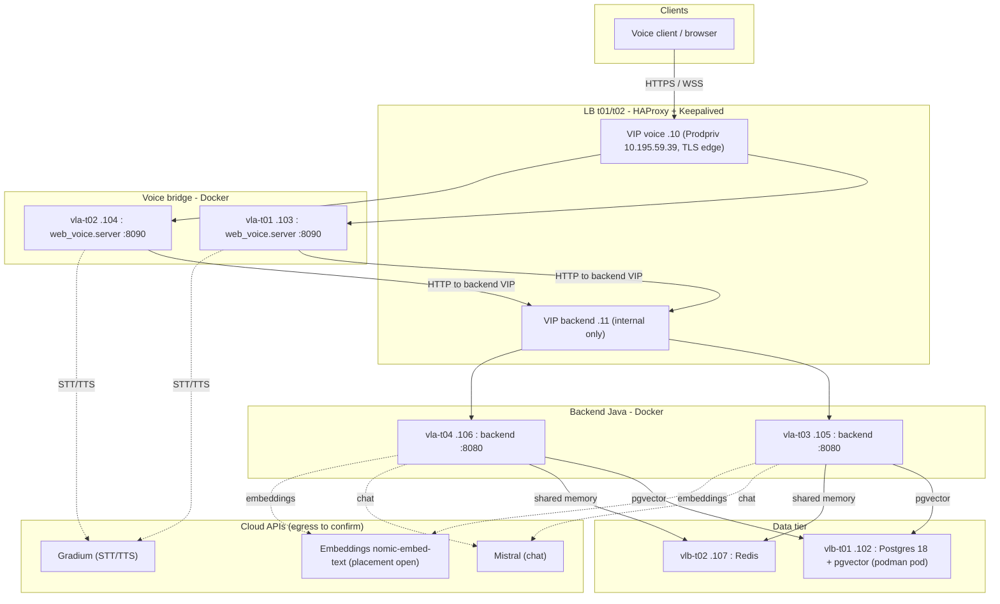

# Deployment - eir-ai4cc-tst pilot environment

Concrete deployment reference for the first remote environment,
**eir-ai4cc-tst** (Rocky Linux EL9, cloud-provisioner). This document is the
operational source of truth for the environment inventory, the component-to-VM
mapping, ports, and the configuration/secrets each tier needs. Architecture
rationale lives in
[`ADR-0038`](../architecture/adrs/ADR-0038-pilot-deployment-architecture-eir-ai4cc-tst.md);
the generic target topology lives in
[`../architecture/infra-v1.md`](../architecture/infra-v1.md).

> Status: environment provisioned (2026-08-03). Several inputs are still open -
> see [Open inputs needed](#open-inputs-needed). Sprint 11
> (`product-backlog/sprints/sprint-11-remote-deployment.md`) delivers the images,
> compose stacks, HAProxy config, Redis-backed memory, CI and release process.

## Topology



## Network

- Tenant subnet: `192.168.0.0/24` (`EIR-AI4CC-SUBNET`).
- Gateways: Internet `.1`, Prodpriv `.254`, Admin `.253`.
- Exposure per VM: Admin (`VL1422` / `.mt.lan`) and/or Prodpriv (`VL2909` / `.prod.lan`).
- SSH access: `ssh grimaud@<hostname>.mt.lan` then `sudo su -` (public key for
  `thomas.grimaud` is installed on all VMs).

## VIPs

| VIP | Private IP | Prod IP | Exposure | Usage | Target port |
|-----|-----------|---------|----------|-------|-------------|
| `vip-ai4cc-voice-t01` | `192.168.0.10` | `10.195.59.39` | Prodpriv | Voice bridge LB (t01/t02), TLS edge | bridge `:8090` (confirm) |
| `vip-ai4cc-backend-t01` | `192.168.0.11` | - | Internal only | Backend Java LB (t03/t04) | backend `:8080` (confirm) |

> The platform-side VIP port placeholder is `8080`; the real target ports are
> finalized in TASK-INFRA-002.

## VM inventory

| Role | Hostname | Flavor (vCPU/RAM/disk) | Private IP | Admin IP | Prod IP | AZ |
|------|----------|------------------------|-----------|----------|---------|----|
| LB / HAProxy | `vlp-ai4cc-t01.mt.lan` | 1/2/20 | `192.168.0.100` | `172.23.16.244` | `10.195.56.56` | costa-dc1 |
| LB / HAProxy | `vlp-ai4cc-t02.mt.lan` | 1/2/20 | `192.168.0.101` | `172.23.16.137` | `10.195.56.147` | fontvieille-dc3 |
| PostgreSQL 18 (+ pgvector) | `vlb-ai4cc-t01.mt.lan` | 4/16/160 | `192.168.0.102` | `172.23.18.103` | - | costa-dc1 |
| Voice bridge | `vla-ai4cc-t01.mt.lan` | 2/4/40 | `192.168.0.103` | `172.23.18.131` | - | costa-dc1 |
| Voice bridge | `vla-ai4cc-t02.mt.lan` | 2/4/40 | `192.168.0.104` | `172.23.16.102` | - | fontvieille-dc3 |
| Backend Java | `vla-ai4cc-t03.mt.lan` | 4/8/80 | `192.168.0.105` | `172.23.19.87` | - | costa-dc1 |
| Backend Java | `vla-ai4cc-t04.mt.lan` | 4/8/80 | `192.168.0.106` | `172.23.16.59` | - | fontvieille-dc3 |
| Redis | `vlb-ai4cc-t02.mt.lan` | 2/4/40 | `192.168.0.107` | `172.23.19.159` | - | fontvieille-dc3 |

HA is split across two availability zones (costa-dc1 / fontvieille-dc3) per tier.

## Component-to-VM mapping

| Component | VMs | Runtime | Notes |
|-----------|-----|---------|-------|
| HAProxy + Keepalived | `vlp-t01`/`t02` (`.100`/`.101`) | native (platform) | Two VIPs, health checks, TLS termination at the voice edge |
| Voice bridge (`voice-agent/`) | `vla-t01`/`t02` (`.103`/`.104`) | Docker + compose | `python -m web_voice.server --host 0.0.0.0 --port 8090`; WebRTC live path |
| Backend Java (`backend/`) | `vla-t03`/`t04` (`.105`/`.106`) | Docker + compose | Spring Boot `:8080`; RAG, guardrails, memory |
| PostgreSQL 18 + pgvector | `vlb-t01` (`.102`) | podman pod (`podpg`) | `CREATE EXTENSION vector`; `vector_store` 768 dim |
| Redis | `vlb-t02` (`.107`) | Docker (planned) | Shared conversation memory (ADR-0008, TASK-BE-021) |
| Embeddings (`nomic-embed-text`) | TBD | TBD | No dedicated host provisioned - see open inputs |
| Mistral (chat), Gradium (STT/TTS) | cloud | managed | Require controlled internet egress |

## Port matrix

| From | To | Port | Protocol | Purpose |
|------|----|------|----------|---------|
| Client (Prodpriv) | voice VIP `.10` | 443 (confirm) | HTTPS/WSS | WebRTC signaling + UI |
| Voice VIP `.10` | bridges `.103`/`.104` | 8090 (confirm) | HTTP | LB to voice bridge |
| Voice bridge | backend VIP `.11` | 8080 (confirm) | HTTP | Conversation API |
| Voice bridge | Gradium (cloud) | 443 | HTTPS/WSS | STT/TTS |
| Backend VIP `.11` | backends `.105`/`.106` | 8080 (confirm) | HTTP | LB to backend |
| Backend | Postgres `.102` | 5432 | TCP | pgvector + JPA |
| Backend | Redis `.107` | 6379 (confirm) | TCP | Shared session memory |
| Backend | embeddings host | 11434 (if Ollama) | HTTP | Embeddings |
| Backend | Mistral (cloud) | 443 | HTTPS | Chat LLM |
| Admin | all VMs | 22 | SSH | Ops (source range to confirm) |

## Configuration per tier (environment variables)

All configuration is environment-driven; Ansible renders a `.env` per tier that
docker-compose consumes. Defaults below are the code defaults - override on tst.

### Backend Java (`vla-t03`/`t04`)

| Variable | tst value | Default / notes |
|----------|-----------|-----------------|
| `DB_URL` | `jdbc:postgresql://192.168.0.102:5432/<db>` | default `...localhost:5433/voicesupport` |
| DB user / password | from secrets | default `voicesupport`/`voicesupport` |
| `OLLAMA_BASE_URL` | embeddings host (TBD) | default `http://localhost:11434` |
| `MISTRAL_API_KEY` | from secrets | chat LLM (cloud) |
| `CONVERSATION_API_KEY` | from secrets (non-empty) | `x-api-key` gate; empty = open (dev only) |
| `CONVERSATION_STORE` | `redis` | Redis-backed memory (TASK-BE-021); default in-memory |
| Redis connection | `192.168.0.107:6379` | new for TASK-BE-021 |
| `OTEL_*` | unset (opt-in) | OTLP off by default (ADR-0028) |

Server port `8080`, health `/actuator/health` and `/api/health` (both ungated).

### Voice bridge (`vla-t01`/`t02`)

| Variable | tst value | Default / notes |
|----------|-----------|-----------------|
| `--host` / bind | `0.0.0.0` | default `127.0.0.1` (must change for remote) |
| `--port` | `8090` | default `8090` |
| `VOICE_BACKEND` | `http` | default `stub` |
| `VOICE_BACKEND_URL` | `http://192.168.0.11:8080` (backend VIP) | required for `http` backend |
| `VOICE_BACKEND_API_KEY` | from secrets | matches backend `CONVERSATION_API_KEY` |
| `GRADIUM_API_KEY` | from secrets | STT/TTS (cloud) |
| `VOICE_STUN` | STUN/TURN URLs (confirm) | WebRTC NAT traversal for Prodpriv clients |
| `VOICE_BACKEND_STREAM` | `1` (pilot GO) | lever 1; code default OFF (TASK-WEB-020) |
| `VOICE_BACKEND_WARMUP` | on | connect-time warm-up (TASK-WEB-021) |
| `VOICE_STT_PREWARM` | evaluate | opt-in; validate idle-socket behaviour live |

## Release and deploy (summary)

Full runbook: `docs/operations/release-process.md` (TASK-OPS-002).

1. **GitHub Actions** runs the gates (`mvn test`; voice-agent `unittest` +
   `behave`), builds both images, and pushes them to the registry with an
   immutable version tag.
2. **Ansible over SSH** renders the per-tier `.env` from secrets, then
   `docker compose pull && docker compose up -d` on the target VMs, draining
   active voice sessions before restarting a bridge.
3. **Rollback** = redeploy the previous image tag.

## PostgreSQL bootstrap

On `vlb-ai4cc-t01` (`.102`), Postgres runs as a podman pod:

```
podpg
psql
>> create database voicesupport;
>> \c voicesupport
>> CREATE EXTENSION vector;
```

The backend runs with `ddl-auto: update` and `initialize-schema: true`, so the
`vector_store` (768 dim) and JPA tables are created on first start. Confirm the
DB name / user / password to standardize with the secrets.

## Open inputs needed

These block or shape the Sprint 11 tickets; provide them incrementally.

1. **Ingress flows to authorize.** SSH source range(s) (admin bastion / office
   CIDR), who reaches the voice VIP `.10` (browsers on Prodpriv, Genesys, other),
   and the confirmed VIP ports (voice, backend - `8080` is a placeholder).
2. **Internet egress from tst.** Is outbound allowed to `api.mistral.ai`, the
   Gradium API, and the container registry (for image pulls)? Via a proxy?
3. **Embeddings placement** (drives TASK-INFRA-003): run Ollama on CPU
   (co-located on the backend VMs or the DB VM) vs switch to Mistral embeddings
   (1024 dim -> `vector_store` recreation + re-sync + cloud egress).
4. **TLS at the voice edge.** Certificate provisioning and the public FQDN for
   the voice VIP (`.prod.lan` / `10.195.59.39`).
5. **Container registry** reachable from the VMs: GHCR (GitHub) vs an internal
   Nexus/Artifactory, and its credentials.
6. **Secrets store and delivery.** Where `MISTRAL_API_KEY`, `GRADIUM_API_KEY`,
   `CONVERSATION_API_KEY`, DB and Redis credentials live, and how they reach the
   VMs (GitHub Actions secrets -> Ansible vault -> `.env`).
7. **PostgreSQL** database name / user / password to create on `.102`, and
   confirmation the `vector` extension install is permitted.
8. **Redis** run mode on `.107` (Docker container vs native), auth, and whether
   TLS is required on the internal link.
9. **Frontend.** Is the voice bridge's built-in mic UI (`index.html`) sufficient
   for the pilot, or is a separate static host expected?
