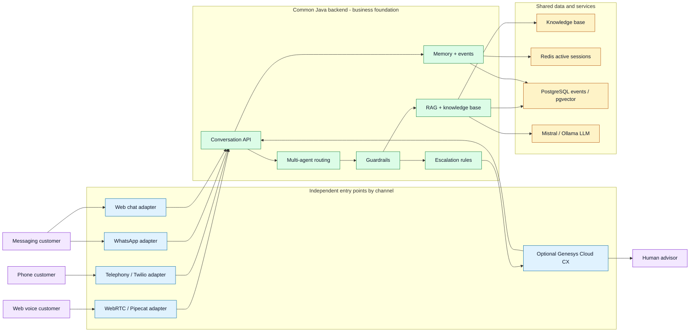

# Functional Specification — Voice Support Bot

> **Current delivery (`feat/restart-from-scratch`, 2026-07-28, Sprint 9):** this is
> the **target** functional spec. Built on this branch: the full web Voice2Voice
> loop (STT + voice-out TTS, batch + streaming WebRTC, barge-in), a RAG-grounded
> Java backend (guardrails, confidence, memory), and a minimal Docker Compose
> (Postgres + Ollama). **Still target-only:** billing/BSS access, invoice PDF
> extraction + deterministic comparison, customer identity, phone (Twilio)
> Voice2Voice, Genesys handoff, and query-time multi-agent routing. The standalone
> React frontend is not rebuilt (the web client is the `web_voice/` static page).

## Document Status

This document describes the broad functional target for Voice Support Bot: a
telecom support assistant with voice, text, RAG, multi-agent routing,
escalation, admin monitoring, and future omnichannel readiness.

It is not the narrow V1 value slice by itself. The canonical V1 scope is
[`v1-scope.md`](v1-scope.md): billing/BSS invoice explanation delivered through
the shared support assistant foundation. This hierarchy is recorded in
[ADR-0017](../architecture/adrs/ADR-0017-billing-v1-with-general-support-foundation.md).

For billing questions in V1, this functional specification must be read together
with:

- [ADR-0003](../architecture/adrs/ADR-0003-billing-v1-uses-read-only-bss-and-deterministic-comparison.md):
  read-only BSS evidence and deterministic invoice comparison;
- [ADR-0004](../architecture/adrs/ADR-0004-bss-integration-through-typed-domain-ports.md):
  typed runtime BSS ports;
- [ADR-0005](../architecture/adrs/ADR-0005-invoice-pdf-extraction-before-llm-explanation.md):
  PDF extraction before LLM explanation when needed;
- [Galaxion BSS integration plan](../integrations/galaxion/bss-integration-plan.md).

## 1. Context and Objectives

Voice Support Bot is a voice-to-voice conversational assistant for the customer support of a Telecom/ISP operator. It allows a customer to ask a question orally or in writing, receive an answer guided by an internal knowledge base, and be routed to a human advisor when the request exceeds the automatable scope.

The main objective is to reduce the load on first-level support while maintaining a natural, fast, and reliable customer experience. The system must answer frequent questions, guide users through simple procedures, and qualify requests that require human intervention.

The project strategy is to start with the current stack, which is mastered and quick to evolve, while keeping an architecture compatible with industrialization through a contact-center platform such as Genesys Cloud CX. This option must be activatable if a customer requests a complete omnichannel solution, advanced advisor management, or integration with an existing contact center.

## 2. Project Scope

The project covers the following journeys:

- real-time web voice conversation via Pipecat/WebRTC;
- text conversation as fallback or test mode;
- phone call via Twilio Media Streams;
- omnichannel conversational channels over time, especially WhatsApp;
- answers based on a Telecom/ISP knowledge base;
- routing to specialized agents: technical support, billing, sales;
- detection of escalation to a human advisor;
- future integration capability with a contact-center platform such as Genesys Cloud CX;
- consultation of indicators and history through an admin dashboard;
- management and synchronization of the knowledge base.

The following are excluded from the initial functional scope:

- full handling of complex management actions in real BSS systems;
- payment, refund, or automatic contractual modification;
- complete self-hosting of STT/TTS/LLM models;
- advanced production supervision with full alerting;
- advanced document connectors beyond the Markdown base, except as a future extension;
- complete replacement of the current stack by a contact-center solution from the MVP onward.

## 3. Stakeholders

The main stakeholders are:

- end customer: user looking for an answer or quick assistance;
- support advisor: takes over escalated or unresolved requests;
- support manager: tracks quality and escalation indicators;
- business contributor: maintains the knowledge base;
- technical administrator: configures services, API keys, and environments.

## 4. Users and Needs

### End Customer

The customer wants to explain their problem naturally, without having to navigate a complex menu. They expect a clear, fast answer adapted to their context: box outage, Wi-Fi problem, abnormal invoice, commercial offer, cancellation request, or need for an advisor.

### Support Advisor

The advisor must receive already qualified requests when the bot cannot solve the problem. The conversation history must help them quickly understand the reason, the answers already given, and the possible level of frustration.

### Support Manager

The support manager must track conversation volume, response times, frequent topics, escalations, and the limits of the knowledge base.

### Business Contributor

The business contributor must be able to enrich or correct the bot's answers through structured knowledge documents, without modifying application code.

## 5. Functional Journeys

### 5.1 Web Voice Conversation

1. The customer opens the web voice interface.
2. The bot plays a welcome message.
3. The customer speaks naturally.
4. The system detects the start and end of speech.
5. Speech is transcribed to text.
6. The question is sent to the conversational backend.
7. The backend identifies the specialized agent, searches for relevant passages, and generates an answer.
8. The answer is streamed sentence by sentence.
9. The bot speaks the answer.
10. The customer can interrupt the bot by speaking.

### 5.2 Text Conversation

1. The customer enters a question in the interface.
2. The backend handles the request as a standard conversation.
3. The text answer is displayed with, when available, citations from the knowledge base.
4. The customer can continue the conversation in the same context.

### 5.3 Phone Call

1. The customer calls a number configured through Twilio.
2. The bot answers and greets the customer.
3. The call audio is transmitted to the voice pipeline.
4. The system transcribes, processes, and synthesizes the answer.
5. The customer hears the answer in the call.
6. In case of escalation, the system must be able to prepare the transfer or signal the need for an advisor.

### 5.4 Escalation to a Human

The bot must trigger an escalation when it detects:

- explicit request to speak to an advisor;
- cancellation;
- complaint, refund, or dispute;
- issue related to personal data or GDPR;
- hacking or suspected compromise;
- request for a technician or field intervention;
- strong frustration or dissatisfaction.
- insufficient billing or BSS evidence, including unavailable account data,
  unusable invoice extraction, low-confidence monetary lines, or an invoice
  comparison that cannot reliably explain the requested delta.

The bot must answer with a clear message indicating that the request requires a human advisor.

In the short term, escalation can be simulated or handled by the project's internal mechanisms. During industrialization, this escalation must be transmissible to a contact-center platform such as Genesys Cloud CX, with useful context defined by [`ADR-0019`](../architecture/adrs/ADR-0019-escalation-rules-and-handoff-contract.md): channel, conversation, external session, reason, specialized agent, summary, evidence status, priority, and recommended next action.

### 5.5 WhatsApp and Messaging Channels

1. The customer contacts the assistant via WhatsApp or an equivalent messaging channel.
2. The text message is transmitted to the same conversational backend as the web and telephony journeys.
3. The system answers in the discussion thread with a short, clear answer adapted to the messaging format.
4. Citations, links, or resolution steps can be summarized or transformed into simple actions.
5. In case of escalation, the bot indicates that a human advisor must take over the conversation.

This channel is a future asynchronous omnichannel extension, not a production
channel in the current V1. It must reuse the same business logic, the same
knowledge base, and the same escalation rules as the other channels through the
channel/backend envelope described in the architecture.

### 5.6 Knowledge Base Management

1. A contributor adds or modifies a knowledge document.
2. The document is associated with a domain: support, billing, commercial, or general.
3. A synchronization ingests new or modified content.
4. Old versions are replaced idempotently.
5. Future bot answers rely on the up-to-date version.

## 6. Functional Requirements

### F1. Conversational Understanding and Processing

- The system must accept questions in French, orally or in writing.
- The system must preserve the context of a multi-turn conversation.
- The system must reformulate or understand follow-up questions when the context is sufficient.
- The system must avoid repeating the welcome message after the first conversation turn.

### F2. Knowledge-Based Answer

- The system must search for relevant passages in the knowledge base.
- The system must answer from the information available in this base.
- The system must indicate lack of certainty when no reliable passage is found.
- The system must be able to provide citations or references to the passages used.

### F3. Multi-Agent Routing

- The system must route each question to a specialized profile.
- The initial profiles are:
  - Technical Support;
  - Billing;
  - Sales.
- The system must maintain agent consistency within the same session when the conversation remains on the same topic.
- The interface must be able to display the name of the responding agent.

### F4. Voice Interaction

- The system must automatically detect speech turns.
- The customer must not have to click to signal the end of their sentence in the target journey.
- The system must support barge-in: if the customer speaks during the answer, playback must stop.
- The system must synthesize the answer in a natural voice.

### F5. Streaming and Responsiveness

- The system must start producing the answer before complete generation ends when streaming mode is available.
- Voice answers must be emitted sentence by sentence to limit waiting time.
- The system must expose useful states to the interface: listening, thinking, answering, error.

### F6. Telephony

- The system must be able to receive a telephone audio stream through Twilio.
- The system must handle the expected telephone audio format.
- The telephone journey must reuse the same business logic as the web journey.

### F6bis. Conversational Messaging

- The system must be extensible to a WhatsApp channel or equivalent messaging channel.
- The messaging channel must reuse the existing conversational backend.
- Answers must be adapted to the short and asynchronous text format.
- The system must retain the channel-specific conversation identifier to maintain context.
- Guardrail, multi-agent routing, and escalation rules must be identical to the other channels.

### F7. Guardrails

- The system must reject or redirect off-topic requests.
- The system must detect low-confidence answers.
- The system must not invent an answer when the knowledge base is insufficient.
- The system must propose escalation when automation is not appropriate.

### F8. Administration and Monitoring

- The system must expose conversation indicators.
- The system must allow consultation of recent events.
- The system must identify the most frequent questions.
- The system must allow analysis of escalation cases and knowledge base limits.

### F9. Conversational Persistence

- Active sessions must be shareable between instances via Redis.
- Conversation events must be persistable for analysis and administration.
- The retention period for active sessions must be configurable.

### F10. Contact-Center Preparation

- The system must allow startup without a mandatory dependency on an external contact-center solution.
- The system must keep business logic, RAG, guardrails, and multi-agent routing in the existing backend.
- The system must provide for future integration with Genesys Cloud CX or an equivalent solution, as an optional contact-center layer.
- Contact-center integration must primarily cover channels, queues, transfer to advisor, agent desktop, and supervision.
- During escalation, the system must be able to transmit context usable by a human advisor.
- The choice to use Genesys Cloud CX must not require rewriting the conversational engine.

## 7. Non-Functional Requirements

### Performance

- The target voice journey must aim for a first audible answer under one second
  in a pre-warmed environment. Per
  [`ADR-0018`](../architecture/adrs/ADR-0018-voice-latency-targets-and-slo-measurement.md),
  the current measurable pilot criterion is `time_to_first_audio` p95 below
  800 ms; production SLOs remain gated by observability and degraded-mode
  readiness.
- Text answers must be streamed when possible.
- Critical components must limit unnecessary calls to external services.

### Availability

- The system must be able to start locally via Docker Compose.
- The backend must remain as stateless as possible, with shared state via Redis.
- External services must be configurable through environment variables.

### Security and Privacy

- API keys must not be hardcoded.
- Conversation data must be treated as potentially sensitive.
- Errors exposed to the user must remain understandable without disclosing internal technical details.

### Maintainability

- Business logic must remain on the Java backend side.
- Audio orchestration must remain on the Python voice-agent side.
- Knowledge documents must be maintainable by non-developer profiles.
- Automated tests must cover critical behavior.
- The architecture must isolate contact channels so Genesys Cloud CX can be added without duplicating business rules.

### Observability

- The system must track the main pipeline latencies by channel: STT, backend
  request, vector search, LLM first token, TTS first audio, channel output, and
  `time_to_first_audio`.
- Escalation and error events must be usable by administration.

## 8. Data Handled

The main functional data are:

- user question;
- voice transcription;
- incoming message from a messaging channel;
- generated answer;
- knowledge citations;
- conversation identifier;
- conversational channel identifier;
- session or conversation identifier on the contact-center side, if applicable;
- current agent;
- conversation events;
- latency metrics;
- escalation status;
- knowledge base documents.

## 9. MVP Acceptance Criteria

The MVP is considered functional if:

- a customer can ask a voice question from the browser;
- the bot answers orally with an answer from the knowledge base;
- the customer can interrupt the bot by speaking;
- a billing question is routed to the Billing agent;
- billing invoice explanations use read-only BSS evidence and deterministic
  comparison before LLM wording;
- invoice PDF extraction status is handled explicitly: `parseable` allows
  comparison, `partial` allows cautious comparison on confirmed lines, and
  `unusable` forbids comparison and triggers clarification or escalation;
- internal monetary comparisons use integer cents (`*_cents`), even when source
  examples are displayed as EUR values to users;
- a sales question is routed to the Sales agent;
- a technical question is routed to the Support agent;
- a request for a human advisor triggers escalation;
- the text journey works as a fallback;
- a Twilio call can be received and handled by the same conversational engine;
- the functional design provides for adding a WhatsApp channel without duplicating business logic;
- the functional design provides for future Genesys Cloud CX integration without replacing the conversational backend;
- the knowledge base can be synchronized after modification;
- conversation events and indicators are consultable on the admin side;
- the complete stack can be launched locally via Docker Compose.

## 10. Functional Roadmap

### Short Term

- Stabilize the Pipecat/WebRTC journey as the main voice path.
- Keep the legacy WebSocket bridge only as a fallback.
- Improve the admin dashboard with latency and usage visualizations.
- Strengthen test coverage for backend and voice-agent modules.
- Implement the ADR-0019 escalation contract toward a contact center: summary, reason, channel, priority, useful history.

### Medium Term

- Add post-MVP knowledge base connectors: generic PDF, Confluence, database.
- Add a WhatsApp channel using the same conversational backend.
- Prepare a Genesys Cloud CX or equivalent integration connector for escalation and omnichannel.
- Improve time-to-first-audio measurement and end-to-end traceability.
- Enrich events reported to the interface: current agent, citations, confidence, escalation.
- Extend business escalation rules and guided answers.

### Long Term

- Deploy in a private cloud or operator environment.
- Industrialize with a contact-center platform if the customer context justifies it.
- Study self-hosting of some models to reduce latency and strengthen sovereignty.
- Add a custom brand voice.
- Gradually connect the bot to business systems, under human control.

### Reflection Area — Independent Omnichannel Inputs

A structuring path for product evolution is to separate entry points by channel
while keeping a common Java backend for the business layer. The system could
therefore have dedicated adapters for WebRTC/Pipecat, Twilio, WhatsApp, web chat,
or Genesys Cloud CX, each responsible for its protocol, lifecycle, and user
experience constraints.

All these channel adapters would call the same conversational backend for RAG,
the knowledge base, guardrails, multi-agent routing, escalation rules,
conversational memory, and event persistence.

This approach would allow:

- preventing an incident on one channel from affecting all the others;
- deploying, testing, and evolving each channel independently;
- keeping business consistency across all journeys;
- connecting a new channel faster without duplicating the conversational engine;
- preparing gradual industrialization with or without a contact-center platform.

The main point of attention is to define stable integration contracts between
channel adapters and the Java backend: exchange formats, conversation
identifiers, timeouts, error handling, rate limiting by channel, and context
transmission in case of human escalation.

### Vision Diagram — Common Business Foundation and Independent Channels

This diagram illustrates the intended separation: each channel can evolve, fail,
or be replaced independently, while business decisions remain centralized and
consistent in the Java backend.
