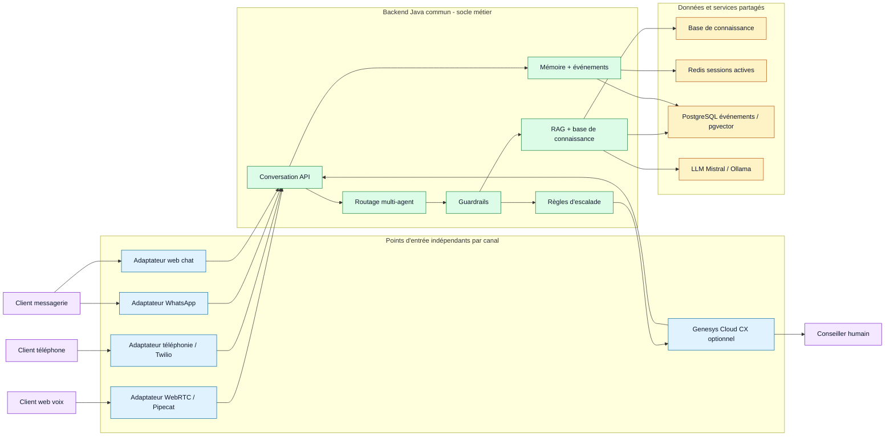

# Cahier des charges fonctionnel — Voice Support Bot

## 1. Contexte et objectifs

Voice Support Bot est un assistant conversationnel voice-to-voice destiné au support client d'un opérateur Telecom/FAI. Il permet à un client de poser une question oralement ou par écrit, d'obtenir une réponse guidée par une base de connaissance interne, et d'être orienté vers un conseiller humain lorsque la demande dépasse le périmètre automatisable.

L'objectif principal est de réduire la charge du support de premier niveau tout en maintenant une expérience client naturelle, rapide et fiable. Le système doit répondre aux questions fréquentes, guider les utilisateurs dans les démarches simples et qualifier les demandes qui nécessitent une intervention humaine.

La stratégie projet consiste à démarrer avec la stack actuelle, maîtrisée et rapide à faire évoluer, tout en gardant une architecture compatible avec une industrialisation via une plateforme de centre de contact comme Genesys Cloud CX. Cette option doit pouvoir être activée si un client demande une solution omnicanale complète, une gestion avancée des conseillers ou une intégration centre de contact déjà en place.

## 2. Périmètre du projet

Le projet couvre les parcours suivants :

- conversation vocale web en temps réel via Pipecat/WebRTC ;
- conversation texte en fallback ou en mode test ;
- appel téléphonique via Twilio Media Streams ;
- canaux conversationnels omnicanaux à terme, notamment WhatsApp ;
- réponses fondées sur une base de connaissance Telecom/FAI ;
- routage vers des agents spécialisés : support technique, facturation, commercial ;
- détection d'escalade vers un conseiller humain ;
- capacité d'intégration future avec une plateforme de centre de contact comme Genesys Cloud CX ;
- consultation d'indicateurs et d'historique via un dashboard admin ;
- gestion et synchronisation de la base de connaissance.

Sont exclus du périmètre fonctionnel initial :

- traitement complet d'actes de gestion complexes dans les systèmes BSS réels ;
- paiement, remboursement ou modification contractuelle automatique ;
- self-hosting complet des modèles STT/TTS/LLM ;
- supervision avancée de production avec alerting complet ;
- connecteurs documentaires avancés hors base Markdown, sauf extension future ;
- remplacement complet de la stack actuelle par une solution centre de contact dès le MVP.

## 3. Parties prenantes

Les principales parties prenantes sont :

- client final : utilisateur cherchant une réponse ou une assistance rapide ;
- conseiller support : reprend les demandes escaladées ou non résolues ;
- responsable support : suit les indicateurs de qualité et d'escalade ;
- contributeur métier : maintient la base de connaissance ;
- administrateur technique : configure les services, les clés API et les environnements.

## 4. Utilisateurs et besoins

### Client final

Le client souhaite expliquer naturellement son problème, sans devoir naviguer dans un menu complexe. Il attend une réponse claire, rapide et adaptée à son contexte : panne de box, problème Wi-Fi, facture anormale, offre commerciale, demande de résiliation ou besoin d'un conseiller.

### Conseiller support

Le conseiller doit recevoir des demandes déjà qualifiées lorsque le bot ne peut pas résoudre le problème. L'historique de conversation doit aider à comprendre rapidement le motif, les réponses déjà données et le niveau de frustration éventuel.

### Responsable support

Le responsable support doit suivre le volume de conversations, les temps de réponse, les sujets fréquents, les escalades et les limites de la base de connaissance.

### Contributeur métier

Le contributeur métier doit pouvoir enrichir ou corriger les réponses du bot via des documents de connaissance structurés, sans modifier le code applicatif.

## 5. Parcours fonctionnels

### 5.1 Conversation vocale web

1. Le client ouvre l'interface web vocale.
2. Le bot joue un message d'accueil.
3. Le client parle naturellement.
4. Le système détecte le début et la fin de parole.
5. La parole est transcrite en texte.
6. La question est envoyée au backend conversationnel.
7. Le backend identifie l'agent spécialisé, recherche les passages pertinents et génère une réponse.
8. La réponse est streamée phrase par phrase.
9. Le bot prononce la réponse.
10. Le client peut interrompre le bot en parlant.

### 5.2 Conversation texte

1. Le client saisit une question dans l'interface.
2. Le backend traite la demande comme une conversation classique.
3. La réponse textuelle est affichée avec, lorsque disponible, les citations de la base de connaissance.
4. Le client peut poursuivre la conversation dans le même contexte.

### 5.3 Appel téléphonique

1. Le client appelle un numéro configuré via Twilio.
2. Le bot décroche et salue le client.
3. L'audio de l'appel est transmis au pipeline vocal.
4. Le système transcrit, traite et synthétise la réponse.
5. Le client entend la réponse dans l'appel.
6. En cas d'escalade, le système doit pouvoir préparer le transfert ou signaler la nécessité d'un conseiller.

### 5.4 Escalade vers un humain

Le bot doit déclencher une escalade lorsqu'il détecte :

- demande explicite de parler à un conseiller ;
- résiliation ;
- réclamation, remboursement ou litige ;
- problème lié aux données personnelles ou au RGPD ;
- piratage ou suspicion de compromission ;
- demande de technicien ou d'intervention terrain ;
- forte frustration ou insatisfaction.

Le bot doit répondre avec un message clair indiquant que la demande nécessite un conseiller humain.

À court terme, l'escalade peut être simulée ou traitée par les mécanismes internes du projet. En phase d'industrialisation, cette escalade doit pouvoir être transmise à une plateforme de centre de contact comme Genesys Cloud CX, avec le contexte utile : canal, conversation, motif, agent spécialisé, résumé et niveau d'urgence.

### 5.5 Canal WhatsApp et messageries

1. Le client contacte l'assistant via WhatsApp ou un canal de messagerie équivalent.
2. Le message texte est transmis au même backend conversationnel que les parcours web et téléphonie.
3. Le système répond dans le fil de discussion avec une réponse courte, claire et adaptée au format messagerie.
4. Les citations, liens ou étapes de résolution peuvent être résumés ou transformés en actions simples.
5. En cas d'escalade, le bot indique qu'un conseiller humain doit reprendre la conversation.

Ce canal est prévu comme extension omnicanale : il doit réutiliser la même logique métier, la même base de connaissance et les mêmes règles d'escalade que les autres canaux.

### 5.6 Gestion de la base de connaissance

1. Un contributeur ajoute ou modifie un document de connaissance.
2. Le document est associé à un domaine : support, billing, commercial ou general.
3. Une synchronisation ingère les contenus nouveaux ou modifiés.
4. Les anciennes versions sont remplacées de manière idempotente.
5. Les futures réponses du bot s'appuient sur la version à jour.

## 6. Exigences fonctionnelles

### F1. Compréhension et traitement conversationnel

- Le système doit accepter des questions en français, à l'oral ou à l'écrit.
- Le système doit conserver le contexte d'une conversation multi-tour.
- Le système doit reformuler ou comprendre les questions de suivi lorsque le contexte est suffisant.
- Le système doit éviter de répéter le message d'accueil après le premier tour de conversation.

### F2. Réponse basée sur connaissance

- Le système doit rechercher les passages pertinents dans la base de connaissance.
- Le système doit répondre à partir des informations disponibles dans cette base.
- Le système doit indiquer une absence de certitude lorsqu'aucun passage fiable n'est trouvé.
- Le système doit pouvoir fournir des citations ou références aux passages utilisés.

### F3. Routage multi-agent

- Le système doit orienter chaque question vers un profil spécialisé.
- Les profils initiaux sont :
  - Support Technique ;
  - Facturation ;
  - Commercial.
- Le système doit conserver une cohérence d'agent dans une même session lorsque la conversation reste sur le même sujet.
- L'interface doit pouvoir afficher le nom de l'agent qui répond.

### F4. Interaction vocale

- Le système doit détecter automatiquement les prises de parole.
- Le client ne doit pas avoir à cliquer pour signaler la fin de sa phrase dans le parcours cible.
- Le système doit supporter le barge-in : si le client parle pendant la réponse, la lecture doit s'interrompre.
- Le système doit synthétiser la réponse en voix naturelle.

### F5. Streaming et réactivité

- Le système doit commencer à produire la réponse avant la fin complète de la génération lorsque le mode streaming est disponible.
- Les réponses vocales doivent être émises phrase par phrase pour limiter l'attente.
- Le système doit exposer les états utiles à l'interface : écoute, réflexion, réponse en cours, erreur.

### F6. Téléphonie

- Le système doit pouvoir recevoir un flux audio téléphonique via Twilio.
- Le système doit gérer le format audio téléphonique attendu.
- Le parcours téléphonique doit réutiliser la même logique métier que le parcours web.

### F6bis. Messageries conversationnelles

- Le système doit pouvoir être étendu à un canal WhatsApp ou messagerie équivalent.
- Le canal messagerie doit réutiliser le backend conversationnel existant.
- Les réponses doivent être adaptées au format texte court et asynchrone.
- Le système doit conserver l'identifiant de conversation propre au canal pour maintenir le contexte.
- Les règles de guardrails, routage multi-agent et escalade doivent être identiques aux autres canaux.

### F7. Guardrails

- Le système doit refuser ou rediriger les demandes hors sujet.
- Le système doit détecter les réponses à faible confiance.
- Le système ne doit pas inventer une réponse lorsque la base de connaissance est insuffisante.
- Le système doit proposer une escalade lorsque l'automatisation n'est pas appropriée.

### F8. Administration et pilotage

- Le système doit exposer des indicateurs de conversation.
- Le système doit permettre de consulter les derniers événements.
- Le système doit identifier les questions les plus fréquentes.
- Le système doit permettre d'analyser les cas d'escalade et les limites de la base de connaissance.

### F9. Persistance conversationnelle

- Les sessions actives doivent pouvoir être partagées entre instances via Redis.
- Les événements de conversation doivent pouvoir être persistés pour analyse et administration.
- La durée de conservation des sessions actives doit être configurable.

### F10. Préparation centre de contact

- Le système doit permettre de démarrer sans dépendance obligatoire à une solution centre de contact externe.
- Le système doit garder la logique métier, le RAG, les guardrails et le routage multi-agent dans le backend existant.
- Le système doit prévoir une intégration future avec Genesys Cloud CX ou une solution équivalente.
- L'intégration centre de contact doit porter principalement sur les canaux, les files d'attente, le transfert vers conseiller, l'agent desktop et la supervision.
- Lors d'une escalade, le système doit pouvoir transmettre un contexte exploitable par un conseiller humain.
- Le choix d'utiliser Genesys Cloud CX ne doit pas obliger à réécrire le moteur conversationnel.

## 7. Exigences non fonctionnelles

### Performance

- Le parcours vocal cible doit viser une première réponse audible inférieure à une seconde dans un environnement préchauffé.
- Les réponses texte doivent être streamées lorsque possible.
- Les composants critiques doivent limiter les appels inutiles aux services externes.

### Disponibilité

- Le système doit pouvoir démarrer localement via Docker Compose.
- Le backend doit rester stateless autant que possible, avec état partagé via Redis.
- Les services externes doivent être configurables par variables d'environnement.

### Sécurité et confidentialité

- Les clés API ne doivent pas être codées en dur.
- Les données de conversation doivent être traitées comme potentiellement sensibles.
- Les erreurs exposées à l'utilisateur doivent rester compréhensibles sans divulguer de détails techniques internes.

### Maintenabilité

- La logique métier doit rester côté backend Java.
- L'orchestration audio doit rester côté agent vocal Python.
- Les documents de connaissance doivent être maintenables par des profils non développeurs.
- Les tests automatisés doivent couvrir les comportements critiques.
- L'architecture doit isoler les canaux de contact afin de pouvoir ajouter Genesys Cloud CX sans dupliquer les règles métier.

### Observabilité

- Le système doit suivre les latences principales du pipeline : STT, recherche, LLM, TTS, temps avant premier audio.
- Les événements d'escalade et d'erreur doivent être exploitables par l'administration.

## 8. Données manipulées

Les principales données fonctionnelles sont :

- question utilisateur ;
- transcription vocale ;
- message entrant depuis un canal de messagerie ;
- réponse générée ;
- citations de connaissance ;
- identifiant de conversation ;
- identifiant de canal conversationnel ;
- identifiant de session ou de conversation côté centre de contact, si applicable ;
- agent courant ;
- événements de conversation ;
- métriques de latence ;
- statut d'escalade ;
- documents de base de connaissance.

## 9. Critères d'acceptation MVP

Le MVP est considéré comme fonctionnel si :

- un client peut poser une question vocale depuis le navigateur ;
- le bot répond oralement avec une réponse issue de la base de connaissance ;
- le client peut interrompre le bot en parlant ;
- une question de facturation est routée vers l'agent Facturation ;
- une question commerciale est routée vers l'agent Commercial ;
- une question technique est routée vers l'agent Support ;
- une demande de conseiller humain déclenche une escalade ;
- le parcours texte fonctionne en fallback ;
- un appel Twilio peut être reçu et traité sur le même moteur conversationnel ;
- le design fonctionnel prévoit l'ajout d'un canal WhatsApp sans duplication de logique métier ;
- le design fonctionnel prévoit une intégration future Genesys Cloud CX sans remplacement du backend conversationnel ;
- la base de connaissance peut être synchronisée après modification ;
- les événements et indicateurs de conversation sont consultables côté admin ;
- la stack complète peut être lancée localement via Docker Compose.

## 10. Roadmap fonctionnelle

### Court terme

- Stabiliser le parcours Pipecat/WebRTC comme chemin vocal principal.
- Conserver le bridge WebSocket legacy uniquement comme fallback.
- Améliorer le dashboard admin avec des visualisations de latence et d'usage.
- Renforcer la couverture de tests des modules backend et voice-agent.
- Définir le contrat minimal d'escalade vers un centre de contact : résumé, motif, canal, priorité, historique utile.

### Moyen terme

- Ajouter des connecteurs de base de connaissance : PDF, Confluence, base de données.
- Ajouter un canal WhatsApp en s'appuyant sur le même backend conversationnel.
- Préparer un connecteur d'intégration Genesys Cloud CX ou équivalent pour l'escalade et l'omnicanal.
- Améliorer la mesure du time-to-first-audio et la traçabilité bout en bout.
- Enrichir les événements remontés à l'interface : agent courant, citations, confiance, escalade.
- Étendre les règles métier d'escalade et les réponses guidées.

### Long terme

- Déployer en cloud privé ou environnement opérateur.
- Industrialiser avec une plateforme de centre de contact si le contexte client le justifie.
- Étudier le self-hosting de certains modèles pour réduire la latence et renforcer la souveraineté.
- Ajouter une voix de marque personnalisée.
- Connecter progressivement le bot aux systèmes métiers, sous contrôle humain.

### Axe de réflexion — Entrées omnicanales indépendantes

Une piste structurante pour l'évolution du produit est de séparer les points
d'entrée par canal tout en conservant un backend Java commun pour le métier. Le
système pourrait ainsi disposer d'adaptateurs dédiés pour WebRTC/Pipecat,
Twilio, WhatsApp, web chat ou Genesys Cloud CX, chacun responsable de son
protocole, de son cycle de vie et de ses contraintes d'expérience utilisateur.

Tous ces adaptateurs canal appelleraient le même backend conversationnel pour le
RAG, la base de connaissance, les guardrails, le routage multi-agent, les règles
d'escalade, la mémoire conversationnelle et la persistance des événements.

Cette approche permettrait :

- d'éviter qu'un incident sur un canal impacte tous les autres ;
- de déployer, tester et faire évoluer chaque canal indépendamment ;
- de garder une cohérence métier sur l'ensemble des parcours ;
- de brancher plus rapidement un nouveau canal sans dupliquer le moteur conversationnel ;
- de préparer une industrialisation progressive avec ou sans plateforme centre de contact.

Le point d'attention principal est de définir des contrats d'intégration stables
entre les adaptateurs canal et le backend Java : formats d'échange, identifiants
de conversation, timeouts, gestion des erreurs, rate limiting par canal et
transmission du contexte en cas d'escalade humaine.

### Diagramme de vision — Socle métier commun et canaux indépendants

Ce schéma illustre la séparation recherchée : chaque canal peut évoluer,
tomber en erreur ou être remplacé indépendamment, tandis que les décisions
métier restent centralisées et cohérentes dans le backend Java.
